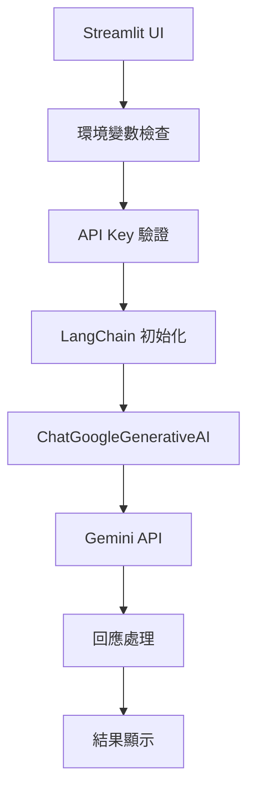

# Gemini 基礎聊天 Demo

這是一個使用 LangChain 整合 Google Gemini API 的完整聊天應用程式。

## 📋 Demo 概述

### 功能特色
- **API 連接測試** - 驗證 Google API Key 有效性
- **多模型支援** - 支援 gemini-1.5-flash、gemini-1.5-pro、gemini-1.0-pro
- **互動式聊天** - 完整的對話介面
- **系統資訊顯示** - 環境變數和版本資訊
- **錯誤處理** - 完善的異常處理機制

### 技術架構


## 🔧 技術實作

### 核心代碼解析

#### 1. 環境設置與檢查
```python
from dotenv import load_dotenv
import os

# 載入環境變數
load_dotenv()

# 檢查 API Key
api_key = os.getenv("GOOGLE_API_KEY")
if api_key:
    st.success(f"✅ 找到API Key (前8字元: {api_key[:8]}...)")
else:
    st.error("❌ 未找到GOOGLE_API_KEY環境變數")
```

#### 2. LangChain 模型初始化
```python
from langchain_google_genai import ChatGoogleGenerativeAI
from langchain.schema import HumanMessage, SystemMessage

# 初始化模型
llm = ChatGoogleGenerativeAI(
    model=model_choice,
    google_api_key=api_key_input,
    temperature=0.7
)
```

#### 3. 訊息處理
```python
# 構建訊息鏈
messages = [
    SystemMessage(content="你是一個有用的AI助手，請用繁體中文詳細回答問題。"),
    HumanMessage(content=user_question)
]

# 發送請求並獲取回應
response = llm.invoke(messages)
```

### 關鍵設計模式

#### 動態導入
```python
# 避免啟動時的導入錯誤
try:
    from langchain_google_genai import ChatGoogleGenerativeAI
    from langchain.schema import HumanMessage, SystemMessage
except ImportError as e:
    st.error(f"導入錯誤: {e}")
```

#### 錯誤處理
```python
try:
    response = llm.invoke(messages)
    st.success("✅ 連接成功！")
    st.write(f"**Gemini回應:** {response.content}")
except Exception as e:
    st.error(f"❌ 連接失敗: {str(e)}")
```

## 🎯 學習重點

### 1. LangChain 基礎概念
- **Language Models** - 如何初始化和配置模型
- **Message Types** - SystemMessage 和 HumanMessage 的使用
- **Model Invoke** - 同步調用模型的方法

### 2. Google Gemini 整合
- **API Key 管理** - 安全的金鑰處理方式
- **模型選擇** - 不同 Gemini 模型的特點
- **參數配置** - temperature 等參數的影響

### 3. Streamlit 應用開發
- **頁面配置** - set_page_config 的使用
- **用戶介面** - 表單元件和互動設計
- **狀態管理** - 會話狀態的處理

### 4. 錯誤處理最佳實踐
- **優雅降級** - 模組導入失敗的處理
- **用戶友好** - 清楚的錯誤訊息顯示
- **偵錯資訊** - 系統資訊的輔助顯示

## 🚀 執行指南

### 步驟 1: 環境準備
```bash
# 確保在專案根目錄
cd /path/to/gemini-langchain-test

# 安裝依賴
pip install -r requirements.txt
```

### 步驟 2: 配置 API Key
```bash
# 創建 .env 檔案
echo "GOOGLE_API_KEY=your_actual_api_key" > .env
```

### 步驟 3: 執行 Demo
```bash
# 進入 Demo 目錄
cd streamlit-demos/01_gemini_basic

# 啟動應用
streamlit run gemini_chat.py
```

### 步驟 4: 測試功能
1. 開啟瀏覽器到 `http://localhost:8501`
2. 檢查系統資訊確認環境正常
3. 點擊「測試連接」驗證 API
4. 在對話區域輸入問題進行測試

## 📊 Demo 截圖

### 主介面
- 系統資訊展開區塊
- API 設置區域
- 模型選擇下拉選單
- 連接測試按鈕

### 對話區域
- 問題輸入文字框
- 發送按鈕
- 回應顯示區域
- 統計資訊展示

## 🔍 進階擴展

### 1. 添加記憶功能
```python
from langchain.memory import ConversationBufferMemory

memory = ConversationBufferMemory()
# 整合到對話鏈中
```

### 2. 自定義系統提示
```python
system_prompts = {
    "助手": "你是一個有用的AI助手...",
    "翻譯": "你是一個專業翻譯...",
    "程式": "你是一個程式設計專家..."
}
```

### 3. 多輪對話支援
```python
if 'conversation' not in st.session_state:
    st.session_state.conversation = []

# 保存對話歷史
st.session_state.conversation.append({
    "user": user_question,
    "assistant": response.content
})
```

## 🐛 除錯技巧

### 常見問題診斷
1. **檢查網路連線**
2. **驗證 API Key 格式**
3. **確認模型可用性**
4. **查看詳細錯誤訊息**

### 日誌記錄
```python
import logging

logging.basicConfig(level=logging.INFO)
logger = logging.getLogger(__name__)

logger.info(f"使用模型: {model_choice}")
logger.info(f"API Key 長度: {len(api_key)}")
```

---

::: tip 提示
這個 Demo 是學習 LangChain 的絕佳起點，建議花時間理解每個元件的作用，並嘗試修改參數觀察變化。
:::