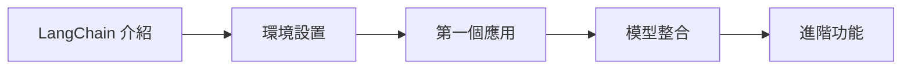

# LangChain 教學網站

::: info 歡迎來到 LangChain 學習中心！
這裡提供完整的 LangChain 學習資源，從基礎概念到進階應用，幫助您快速掌握 AI 應用開發。
:::

## 🎯 學習目標

- 理解 LangChain 的核心概念
- 學會整合各種 AI 模型
- 建構實用的 AI 應用程式  
- 掌握最佳實踐方法

## 🚀 快速開始

### 1. 基礎學習路徑

### 2. 實作體驗
- [📚 教學課程](/tutorials/) - 循序漸進的學習內容
- [💼 實用範例](/examples/) - 真實應用場景
- [🎮 Demo 展示](/demos/) - 互動式體驗

## 🔧 技術特色

  <h3>🔗 完整整合</h3>
  
支援多種 AI 模型，包括 OpenAI、Google Gemini、Anthropic Claude 等

  <h3>📖 實用教學</h3>
  
從基礎到進階，提供完整的學習路徑和實作範例

  <h3>🎮 互動 Demo</h3>
  
可執行的 Streamlit 應用，讓您親手體驗 LangChain 功能

## 📋 環境需求

- Python 3.8+
- Streamlit (用於互動 Demo)
- LangChain
- 相關 AI 模型 API 金鑰

::: warning 注意事項
使用前請確保已取得相關 AI 服務的 API 金鑰，並妥善設置環境變數。
:::

## 🎯 建議學習順序

1. **📖 閱讀基礎教學** - 了解 LangChain 核心概念
2. **🔧 設置開發環境** - 安裝必要套件與配置
3. **🎮 體驗互動 Demo** - 透過實際操作了解功能
4. **💼 研究實用範例** - 學習真實應用場景
5. **🚀 建構自己的應用** - 將所學應用到實際專案

---

