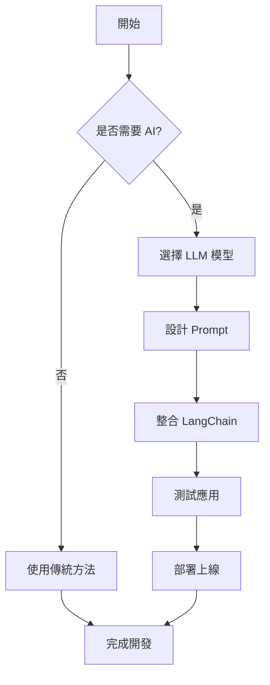
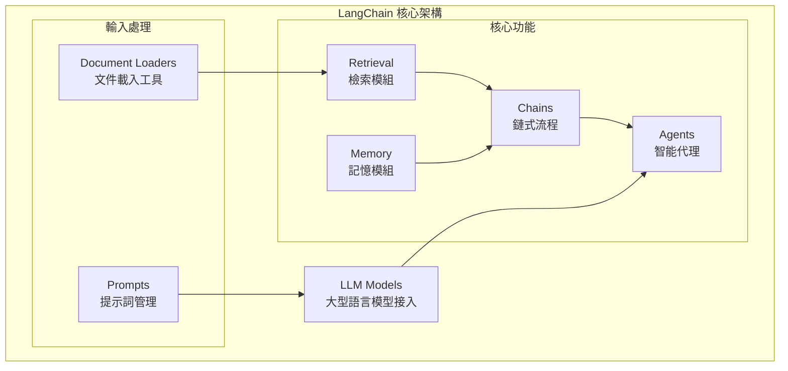
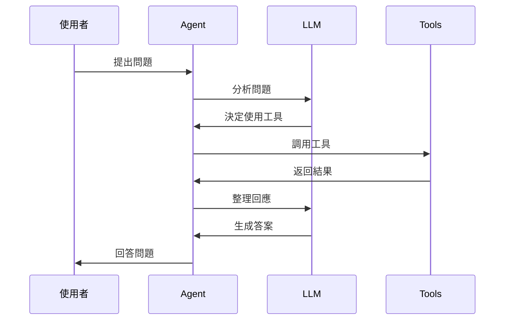

# Mermaid 圖表測試

這是一個測試頁面，用來驗證 Mermaid 圖表是否正常顯示。

## 流程圖測試

```mermaid
graph TB
    A[開始] --> B{是否需要 AI?}
    B -->|是| C[選擇 LLM 模型]
    B -->|否| D[使用傳統方法]
    C --> E[設計 Prompt]
    E --> F[整合 LangChain]
    F --> G[測試應用]
    G --> H[部署上線]
    D --> I[完成開發]
    H --> I
```

## 架構圖測試

```mermaid
graph TB
    subgraph "LangChain 核心架構"
        LLM[LLM Models<br/>大型語言模型接入]
        
        subgraph "輸入處理"
            Prompts[Prompts<br/>提示詞管理]
            DocLoad[Document Loaders<br/>文件載入工具]
        end
        
        subgraph "核心功能"
            Retrieval[Retrieval<br/>檢索模組]
            Memory[Memory<br/>記憶模組]
            Chains[Chains<br/>鏈式流程]
            Agents[Agents<br/>智能代理]
        end
        
        Prompts --> LLM
        DocLoad --> Retrieval
        Retrieval --> Chains
        Memory --> Chains
        Chains --> Agents
        LLM --> Agents
    end
```

## 時序圖測試

```mermaid
sequenceDiagram
    participant U as 使用者
    participant A as Agent
    participant L as LLM
    participant T as Tools
    
    U->>A: 提出問題
    A->>L: 分析問題
    L->>A: 決定使用工具
    A->>T: 調用工具
    T->>A: 返回結果
    A->>L: 整理回應
    L->>A: 生成答案
    A->>U: 回答問題
```

如果你能看到上面的圖表，說明 Mermaid 配置成功！