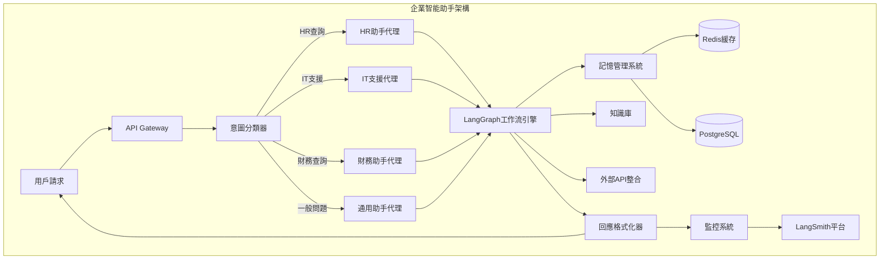

# 進階應用案例

## 企業級智能助手系統

### 案例概述

本案例展示如何建構一個完整的企業級智能助手，整合所有之前學習的核心技術：LCEL、LangGraph、結構化輸出解析、記憶機制和監控系統。

### 系統架構



### 完整實現

#### 1. 核心資料結構

```python
from typing import Dict, List, Optional, Union, Any
from pydantic import BaseModel, Field
from enum import Enum
from datetime import datetime

class QueryType(Enum):
    HR = "hr"
    IT = "it" 
    FINANCE = "finance"
    GENERAL = "general"

class Priority(Enum):
    LOW = "low"
    MEDIUM = "medium"
    HIGH = "high"
    URGENT = "urgent"

class UserRequest(BaseModel):
    """用戶請求結構"""
    user_id: str = Field(description="用戶ID")
    session_id: str = Field(description="會話ID")
    query: str = Field(description="用戶查詢")
    context: Optional[Dict[str, Any]] = Field(default={}, description="額外上下文")
    timestamp: datetime = Field(default_factory=datetime.now)

class AgentResponse(BaseModel):
    """代理回應結構"""
    response_text: str = Field(description="回應文本")
    confidence: float = Field(description="信心度", ge=0, le=1)
    query_type: QueryType = Field(description="查詢類型")
    priority: Priority = Field(description="優先級")
    actions_taken: List[str] = Field(default=[], description="執行的操作")
    references: List[str] = Field(default=[], description="參考資料")
    follow_up_needed: bool = Field(default=False, description="是否需要後續跟進")

class SystemState(BaseModel):
    """系統狀態"""
    user_request: UserRequest
    classified_intent: Optional[QueryType] = None
    agent_responses: Dict[str, Any] = Field(default_factory=dict)
    workflow_status: str = "pending"
    error_count: int = 0
    processing_steps: List[str] = Field(default_factory=list)
```

#### 2. 智能意圖分類系統

```python
from langchain_core.output_parsers import PydanticOutputParser
from langchain_core.prompts import ChatPromptTemplate
from langchain_openai import ChatOpenAI

class IntentClassifier:
    def __init__(self):
        self.llm = ChatOpenAI(model="gpt-4o-mini", temperature=0)
        self.parser = PydanticOutputParser(pydantic_object=QueryType)
        
        self.classification_prompt = ChatPromptTemplate.from_messages([
            ("system", """你是一個專業的意圖分類器。根據用戶查詢，將其分類為以下類別之一：

hr: 人力資源相關（薪資、請假、福利、員工資訊等）
it: IT技術支援（軟硬體問題、系統存取、密碼重置等）
finance: 財務相關（報帳、預算、發票、付款等）
general: 一般性問題（公司政策、會議室預約、其他）

請仔細分析用戶意圖，提供最準確的分類。

{format_instructions}"""),
            ("human", "用戶查詢：{query}\n\n請分類此查詢。")
        ])
    
    def classify(self, query: str) -> QueryType:
        """分類用戶查詢意圖"""
        format_instructions = self.parser.get_format_instructions()
        
        chain = self.classification_prompt | self.llm | self.parser
        result = chain.invoke({
            "query": query,
            "format_instructions": format_instructions
        })
        
        return result

# 使用範例
classifier = IntentClassifier()
intent = classifier.classify("我想查看這個月的薪資明細")
print(intent)  # QueryType.HR
```

#### 3. 專業代理實現

```python
class HRAgent:
    """人力資源專業代理"""
    
    def __init__(self):
        self.llm = ChatOpenAI(model="gpt-4o-mini")
        self.hr_database = HRDatabase()  # 假設的HR數據庫
        
    def handle_query(self, state: SystemState) -> Dict[str, Any]:
        """處理HR相關查詢"""
        query = state.user_request.query
        user_id = state.user_request.user_id
        
        # 從HR系統獲取用戶資料
        employee_info = self.hr_database.get_employee_info(user_id)
        
        hr_prompt = ChatPromptTemplate.from_messages([
            ("system", """你是專業的HR助手，負責處理人力資源相關問題。
            
可用資訊：
- 員工基本資料：{employee_info}
- 公司HR政策：{hr_policies}

請提供準確、友善且符合公司政策的回應。"""),
            ("human", "{query}")
        ])
        
        chain = hr_prompt | self.llm
        
        response = chain.invoke({
            "query": query,
            "employee_info": employee_info,
            "hr_policies": self.get_relevant_policies(query)
        })
        
        return {
            "response": response.content,
            "employee_data_accessed": True,
            "policies_referenced": self.get_policy_references(query)
        }
    
    def get_relevant_policies(self, query: str) -> str:
        """獲取相關HR政策"""
        # 實際實現會查詢政策數據庫
        return "相關HR政策文檔..."
    
    def get_policy_references(self, query: str) -> List[str]:
        """獲取政策參考連結"""
        return ["HR_POLICY_001", "PAYROLL_GUIDE_2024"]

class ITSupportAgent:
    """IT技術支援代理"""
    
    def __init__(self):
        self.llm = ChatOpenAI(model="gpt-4o-mini")
        self.ticketing_system = ITTicketingSystem()
        
    def handle_query(self, state: SystemState) -> Dict[str, Any]:
        """處理IT支援查詢"""
        query = state.user_request.query
        user_id = state.user_request.user_id
        
        # 檢查用戶的IT資產和歷史工單
        user_assets = self.ticketing_system.get_user_assets(user_id)
        recent_tickets = self.ticketing_system.get_recent_tickets(user_id)
        
        it_prompt = ChatPromptTemplate.from_messages([
            ("system", """你是專業的IT技術支援專家，負責解決技術問題。

用戶IT資產：{user_assets}
最近工單記錄：{recent_tickets}

提供步驟清楚的技術支援，必要時創建工單。"""),
            ("human", "{query}")
        ])
        
        chain = it_prompt | self.llm
        
        response = chain.invoke({
            "query": query,
            "user_assets": user_assets,
            "recent_tickets": recent_tickets
        })
        
        # 判斷是否需要創建工單
        ticket_needed = self.should_create_ticket(query, response.content)
        ticket_id = None
        
        if ticket_needed:
            ticket_id = self.ticketing_system.create_ticket({
                "user_id": user_id,
                "description": query,
                "category": self.categorize_issue(query),
                "priority": self.assess_priority(query)
            })
        
        return {
            "response": response.content,
            "ticket_created": ticket_needed,
            "ticket_id": ticket_id,
            "escalation_needed": self.needs_escalation(query)
        }
```

#### 4. LangGraph 企業工作流引擎

```python
from langgraph.graph import Graph, END

class EnterpriseWorkflowEngine:
    """企業級工作流引擎"""
    
    def __init__(self):
        self.hr_agent = HRAgent()
        self.it_agent = ITSupportAgent()
        self.finance_agent = FinanceAgent()
        self.general_agent = GeneralAgent()
        self.memory_manager = EnterpriseMemoryManager()
        self.monitor = EnterpriseMonitor()
        
    def create_workflow(self) -> Graph:
        """創建企業級工作流"""
        workflow = Graph()
        
        # 定義工作流節點
        workflow.add_node("classify_intent", self.classify_intent_node)
        workflow.add_node("route_to_agent", self.route_to_agent_node)
        workflow.add_node("hr_processing", self.hr_processing_node)
        workflow.add_node("it_processing", self.it_processing_node)
        workflow.add_node("finance_processing", self.finance_processing_node)
        workflow.add_node("general_processing", self.general_processing_node)
        workflow.add_node("quality_check", self.quality_check_node)
        workflow.add_node("response_formatting", self.response_formatting_node)
        workflow.add_node("update_memory", self.update_memory_node)
        workflow.add_node("audit_logging", self.audit_logging_node)
        
        # 設定工作流程
        workflow.set_entry_point("classify_intent")
        
        workflow.add_edge("classify_intent", "route_to_agent")
        
        # 條件路由到不同代理
        workflow.add_conditional_edges(
            "route_to_agent",
            self.agent_router,
            {
                "hr": "hr_processing",
                "it": "it_processing", 
                "finance": "finance_processing",
                "general": "general_processing"
            }
        )
        
        # 所有代理處理後進入品質檢查
        for agent_node in ["hr_processing", "it_processing", "finance_processing", "general_processing"]:
            workflow.add_edge(agent_node, "quality_check")
        
        # 品質檢查後的條件路由
        workflow.add_conditional_edges(
            "quality_check",
            self.quality_router,
            {
                "approved": "response_formatting",
                "needs_revision": "route_to_agent",  # 重新處理
                "escalate": "escalation_handler"     # 升級處理
            }
        )
        
        workflow.add_edge("response_formatting", "update_memory")
        workflow.add_edge("update_memory", "audit_logging") 
        workflow.add_edge("audit_logging", END)
        
        return workflow.compile()
    
    def classify_intent_node(self, state: SystemState) -> Dict[str, Any]:
        """意圖分類節點"""
        classifier = IntentClassifier()
        intent = classifier.classify(state.user_request.query)
        
        return {
            "classified_intent": intent,
            "processing_steps": state.processing_steps + ["intent_classified"]
        }
    
    def agent_router(self, state: SystemState) -> str:
        """代理路由決策"""
        return state.classified_intent.value
    
    def hr_processing_node(self, state: SystemState) -> Dict[str, Any]:
        """HR處理節點"""
        result = self.hr_agent.handle_query(state)
        
        return {
            "agent_responses": {**state.agent_responses, "hr": result},
            "processing_steps": state.processing_steps + ["hr_processed"]
        }
    
    def quality_check_node(self, state: SystemState) -> Dict[str, Any]:
        """品質檢查節點"""
        agent_type = state.classified_intent.value
        agent_response = state.agent_responses.get(agent_type, {})
        
        # 品質評估邏輯
        quality_score = self.assess_response_quality(
            state.user_request.query,
            agent_response.get("response", "")
        )
        
        return {
            "quality_score": quality_score,
            "quality_approved": quality_score >= 0.7,
            "processing_steps": state.processing_steps + ["quality_checked"]
        }
    
    def quality_router(self, state: SystemState) -> str:
        """品質路由決策"""
        if state.quality_score >= 0.8:
            return "approved"
        elif state.quality_score >= 0.6:
            return "needs_revision"
        else:
            return "escalate"
```

#### 5. 企業記憶管理系統

```python
class EnterpriseMemoryManager:
    """企業級記憶管理系統"""
    
    def __init__(self):
        self.redis_client = Redis(host='localhost', port=6379)
        self.postgres_session = create_postgres_session()
        self.vector_store = ChromaVectorStore()
        
    def store_conversation(self, user_id: str, session_id: str, 
                         conversation_data: Dict[str, Any]):
        """儲存對話資料"""
        
        # 短期記憶：Redis
        cache_key = f"conversation:{user_id}:{session_id}"
        self.redis_client.setex(
            cache_key, 
            3600,  # 1小時過期
            json.dumps(conversation_data)
        )
        
        # 長期記憶：PostgreSQL
        conversation_record = ConversationRecord(
            user_id=user_id,
            session_id=session_id,
            query=conversation_data["query"],
            response=conversation_data["response"],
            intent=conversation_data["intent"],
            satisfaction_score=conversation_data.get("satisfaction"),
            timestamp=datetime.now()
        )
        
        self.postgres_session.add(conversation_record)
        self.postgres_session.commit()
        
        # 向量記憶：語義搜索
        if conversation_data.get("important", False):
            self.vector_store.add_document(
                text=f"Q: {conversation_data['query']} A: {conversation_data['response']}",
                metadata={
                    "user_id": user_id,
                    "intent": conversation_data["intent"],
                    "timestamp": conversation_data["timestamp"]
                }
            )
    
    def retrieve_user_context(self, user_id: str) -> Dict[str, Any]:
        """檢索用戶上下文"""
        
        # 最近對話
        recent_conversations = self.get_recent_conversations(user_id, limit=5)
        
        # 用戶偏好
        user_preferences = self.get_user_preferences(user_id)
        
        # 相關歷史
        relevant_history = self.vector_store.similarity_search(
            query=f"user:{user_id}",
            k=3
        )
        
        return {
            "recent_conversations": recent_conversations,
            "preferences": user_preferences,
            "relevant_history": relevant_history,
            "interaction_summary": self.generate_interaction_summary(user_id)
        }
```

#### 6. 監控與可觀測性系統

```python
class EnterpriseMonitor:
    """企業級監控系統"""
    
    def __init__(self):
        self.langsmith_client = LangSmithClient()
        self.metrics_collector = PrometheusMetrics()
        self.alert_manager = AlertManager()
        
    @traceable(name="enterprise_query_processing")
    def monitor_query_processing(self, user_request: UserRequest, 
                               response: AgentResponse) -> Dict[str, Any]:
        """監控查詢處理過程"""
        
        # 收集性能指標
        processing_metrics = {
            "user_id": user_request.user_id,
            "query_type": response.query_type.value,
            "response_time": self.calculate_response_time(),
            "confidence_score": response.confidence,
            "satisfaction_predicted": self.predict_satisfaction(response)
        }
        
        # 檢查異常指標
        self.check_anomalies(processing_metrics)
        
        # 更新儀表板
        self.update_dashboard(processing_metrics)
        
        return processing_metrics
    
    def check_anomalies(self, metrics: Dict[str, Any]):
        """檢查異常指標"""
        
        # 回應時間異常
        if metrics["response_time"] > 30:  # 30秒閾值
            self.alert_manager.send_alert(
                "HIGH_RESPONSE_TIME",
                f"查詢處理時間過長：{metrics['response_time']}秒"
            )
        
        # 信心度異常
        if metrics["confidence_score"] < 0.6:
            self.alert_manager.send_alert(
                "LOW_CONFIDENCE",
                f"AI回應信心度過低：{metrics['confidence_score']}"
            )
    
    def generate_analytics_report(self) -> Dict[str, Any]:
        """生成分析報告"""
        
        # 查詢各項統計
        daily_stats = self.get_daily_statistics()
        user_satisfaction = self.calculate_user_satisfaction()
        common_issues = self.identify_common_issues()
        performance_trends = self.analyze_performance_trends()
        
        return {
            "daily_stats": daily_stats,
            "user_satisfaction": user_satisfaction,
            "common_issues": common_issues,
            "performance_trends": performance_trends,
            "recommendations": self.generate_recommendations()
        }
```

#### 7. 主應用程式整合

```python
class EnterpriseAssistant:
    """企業智能助手主應用"""
    
    def __init__(self):
        self.workflow_engine = EnterpriseWorkflowEngine()
        self.memory_manager = EnterpriseMemoryManager()
        self.monitor = EnterpriseMonitor()
        self.security_manager = SecurityManager()
        
        # 編譯工作流
        self.workflow = self.workflow_engine.create_workflow()
    
    async def process_user_request(self, request: UserRequest) -> AgentResponse:
        """處理用戶請求"""
        
        # 安全檢查
        if not self.security_manager.validate_user(request.user_id):
            raise UnauthorizedError("用戶未授權")
        
        # 初始化系統狀態
        state = SystemState(user_request=request)
        
        # 載入用戶上下文
        user_context = self.memory_manager.retrieve_user_context(request.user_id)
        state.agent_responses["user_context"] = user_context
        
        try:
            # 執行工作流
            result = await self.workflow.ainvoke(state.dict())
            
            # 構建回應
            agent_response = AgentResponse(
                response_text=result["formatted_response"],
                confidence=result["confidence_score"],
                query_type=QueryType(result["classified_intent"]),
                priority=Priority(result.get("priority", "medium")),
                actions_taken=result["processing_steps"],
                references=result.get("references", []),
                follow_up_needed=result.get("follow_up_needed", False)
            )
            
            # 儲存對話
            conversation_data = {
                "query": request.query,
                "response": agent_response.response_text,
                "intent": agent_response.query_type.value,
                "confidence": agent_response.confidence,
                "timestamp": request.timestamp,
                "important": agent_response.priority in [Priority.HIGH, Priority.URGENT]
            }
            
            self.memory_manager.store_conversation(
                request.user_id,
                request.session_id, 
                conversation_data
            )
            
            # 監控記錄
            self.monitor.monitor_query_processing(request, agent_response)
            
            return agent_response
            
        except Exception as e:
            # 錯誤處理
            self.monitor.record_error(request, str(e))
            raise ProcessingError(f"請求處理失敗：{str(e)}")
    
    def get_system_health(self) -> Dict[str, Any]:
        """獲取系統健康狀況"""
        return {
            "status": "healthy",
            "active_sessions": len(self.memory_manager.get_active_sessions()),
            "average_response_time": self.monitor.get_average_response_time(),
            "error_rate": self.monitor.get_error_rate(),
            "system_load": self.get_system_load()
        }

# 使用範例
async def main():
    assistant = EnterpriseAssistant()
    
    # 用戶請求
    request = UserRequest(
        user_id="emp_12345",
        session_id="session_abc123", 
        query="我想查看這個月的請假記錄，還有下個月的薪資發放日期"
    )
    
    # 處理請求
    response = await assistant.process_user_request(request)
    
    print(f"回應：{response.response_text}")
    print(f"信心度：{response.confidence}")
    print(f"查詢類型：{response.query_type}")
    print(f"是否需要後續跟進：{response.follow_up_needed}")

# asyncio.run(main())
```

## 智能文檔處理平台

### 案例概述

建構一個企業級文檔處理平台，能夠自動分析、分類、摘要和回答關於上傳文檔的問題。

### 核心功能

1. **智能文檔解析**：支援 PDF、Word、Excel 等格式
2. **自動分類標記**：基於內容自動分類和打標籤
3. **智能問答**：對文檔內容進行問答
4. **摘要生成**：自動生成文檔摘要
5. **知識圖譜**：建立文檔間的關聯關係

### 實現架構

```python
class DocumentProcessingPlatform:
    """智能文檔處理平台"""
    
    def __init__(self):
        self.document_parser = MultiFormatParser()
        self.classifier = DocumentClassifier()
        self.summarizer = DocumentSummarizer()
        self.qa_engine = DocumentQAEngine()
        self.knowledge_graph = KnowledgeGraphBuilder()
        
    def create_processing_workflow(self) -> Graph:
        """創建文檔處理工作流"""
        workflow = Graph()
        
        # 文檔處理節點
        workflow.add_node("parse_document", self.parse_document_node)
        workflow.add_node("classify_document", self.classify_document_node)
        workflow.add_node("generate_summary", self.generate_summary_node)
        workflow.add_node("extract_entities", self.extract_entities_node)
        workflow.add_node("build_qa_index", self.build_qa_index_node)
        workflow.add_node("update_knowledge_graph", self.update_knowledge_graph_node)
        workflow.add_node("quality_validation", self.quality_validation_node)
        
        # 工作流程
        workflow.set_entry_point("parse_document")
        workflow.add_edge("parse_document", "classify_document")
        
        # 並行處理
        workflow.add_edge("classify_document", "generate_summary")
        workflow.add_edge("classify_document", "extract_entities")
        workflow.add_edge("classify_document", "build_qa_index")
        
        # 匯聚處理
        workflow.add_edge("generate_summary", "update_knowledge_graph")
        workflow.add_edge("extract_entities", "update_knowledge_graph")
        workflow.add_edge("build_qa_index", "update_knowledge_graph")
        
        workflow.add_edge("update_knowledge_graph", "quality_validation")
        workflow.add_edge("quality_validation", END)
        
        return workflow.compile()
```

## 多模態AI客服系統

### 案例特色

整合文本、語音、圖片的全方位客服系統，支援：

1. **語音轉文字**：自動處理客戶語音輸入
2. **圖片識別**：分析客戶提供的截圖、照片
3. **情感分析**：理解客戶情感狀態
4. **多輪對話**：維護完整的對話上下文
5. **人工轉接**：智能判斷何時轉接人工

### 核心實現

```python
class MultimodalCustomerService:
    """多模態AI客服系統"""
    
    def __init__(self):
        self.speech_processor = SpeechProcessor()
        self.image_analyzer = ImageAnalyzer()  
        self.text_processor = TextProcessor()
        self.emotion_detector = EmotionDetector()
        self.escalation_manager = EscalationManager()
        
    def process_multimodal_input(self, input_data: MultimodalInput) -> ServiceResponse:
        """處理多模態輸入"""
        
        # 統一處理不同類型輸入
        processed_content = ""
        
        if input_data.audio:
            text_from_speech = self.speech_processor.transcribe(input_data.audio)
            processed_content += f"語音內容：{text_from_speech}\n"
            
        if input_data.image:
            image_description = self.image_analyzer.analyze(input_data.image)
            processed_content += f"圖片描述：{image_description}\n"
            
        if input_data.text:
            processed_content += f"文字內容：{input_data.text}\n"
        
        # 情感分析
        emotion = self.emotion_detector.detect(processed_content)
        
        # 基於情感和內容生成回應
        response = self.generate_contextual_response(
            processed_content, 
            emotion,
            input_data.user_context
        )
        
        return response
```

## 總結

這些進階案例展示了如何將 LangChain 的各項核心技術整合到實際的企業級應用中：

### 關鍵成功因素

1. **模組化設計**：每個組件都可以獨立測試和優化
2. **狀態管理**：使用 LangGraph 管理複雜的工作流狀態
3. **錯誤處理**：完善的錯誤處理和恢復機制
4. **監控觀測**：全面的監控和日誌記錄
5. **可擴展性**：支援水平擴展和負載均衡

### 部署建議

1. **容器化部署**：使用 Docker 和 Kubernetes
2. **微服務架構**：將不同功能模組化
3. **API Gateway**：統一API入口和認證
4. **緩存策略**：使用 Redis 提升性能
5. **安全防護**：實施完整的安全策略

### 維護策略

1. **持續監控**：24/7監控系統健康狀況
2. **性能調優**：定期優化模型和系統性能
3. **更新管理**：安全地進行系統和模型更新
4. **備份恢復**：完整的數據備份和災難恢復計畫

---

::: tip 實踐建議
這些案例提供了完整的實現框架，但在實際部署時需要：
1. **根據具體需求調整**：不同企業有不同的需求和限制
2. **漸進式部署**：從小規模開始，逐步擴展功能
3. **持續優化**：基於實際使用數據不斷改進系統
4. **安全合規**：確保符合相關法規和安全標準
:::

::: warning 重要提醒
- **數據隱私**：確保處理敏感數據時的隱私保護
- **成本控制**：監控API調用成本，設置適當的預算限制
- **依賴管理**：密切關注第三方服務的可用性和變更
- **團隊培訓**：確保團隊充分理解和掌握系統運作原理
:::