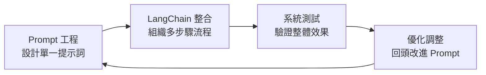

# LangChain 架構與核心概念

## LangChain 架構概覽

LangChain 框架提供了一系列模組化的抽象化功能（modular abstractions），這些是與 LLM 一起工作所必需的，同時也提供了廣泛的實作版本，方便開發者應用。

```mermaid
graph TB
    subgraph "LangChain v0.2+ 現代架構"
        subgraph "模型層"
            LLM[LLM Models<br/>大型語言模型接入<br/>OpenAI, Anthropic, 本地模型等]
        end
        
        subgraph "輸入處理"
            Prompts[Prompts<br/>提示詞模板管理]
            DocLoad[Document Loaders<br/>文件載入工具]
            Splitters[Text Splitters<br/>文本分割器]
        end
        
        subgraph "核心執行引擎 (LCEL)"
            Runnables[Runnables<br/>可執行接口]
            Chains[Chains/Pipelines<br/>組合式流程]
            LCEL[LCEL 語法<br/>| 管道操作符]
        end
        
        subgraph "進階功能"
            Retrieval[Retrieval<br/>檢索增強生成]
            Memory[Memory<br/>對話記憶]
            OutputParsers[Output Parsers<br/>結構化輸出解析]
            Callbacks[Callbacks<br/>LangSmith 追蹤]
        end
        
        subgraph "智能代理框架"
            Agents[Traditional Agents<br/>工具調用代理]
            LangGraph[LangGraph<br/>多代理工作流<br/>狀態機 & 條件路由]
        end
        
        subgraph "套件生態"
            Core[langchain-core<br/>核心抽象]
            Community[langchain-community<br/>第三方整合]
            Integration[langchain-openai<br/>langchain-chroma<br/>專用整合包]
        end
        
        %% 資料流向
        DocLoad --> Splitters
        Splitters --> Retrieval
        Prompts --> Runnables
        LLM --> Runnables
        Retrieval --> Runnables
        Memory --> Runnables
        
        Runnables --> LCEL
        LCEL --> Chains
        Chains --> OutputParsers
        
        Runnables --> Agents
        Runnables --> LangGraph
        
        %% 監控與追蹤
        Chains -.-> Callbacks
        Agents -.-> Callbacks
        LangGraph -.-> Callbacks
        
        %% 套件依賴
        Core --> Runnables
        Community --> DocLoad
        Integration --> LLM
        Integration --> Retrieval
    end
```

### 主要模組說明

| 模組 | 功能說明 | 實際用途 | v0.2+ 新特性 |
|------|----------|----------|------------|
| **LCEL/Runnables** | 可組合的執行介面 | 用 `\|` 操作符連接各組件，建立資料流管道 | 🆕 核心執行引擎 |
| **LangGraph** | 多代理工作流框架 | 複雜的狀態機、條件路由、多 Agent 協作 | 🆕 取代傳統 Agent |
| **Output Parsers** | 結構化輸出解析 | Pydantic 模型、JSON Schema 驗證 | ✅ 加強類型安全 |
| **LLM Models** | 大型語言模型接入 | 支援 OpenAI GPT、Anthropic Claude、本地模型等 | ✅ 獨立整合包 |
| **Prompts** | 提示詞模板管理 | 支援 ChatPromptTemplate、MessagesPlaceholder | ✅ 強化對話支援 |
| **Document Loaders** | 文件載入工具 | 從 PDF、網頁、資料庫等載入並處理資料 | ✅ 移至 community 包 |
| **Retrieval** | 檢索增強生成 | `create_retrieval_chain` 取代舊 RetrievalQA | ✅ LCEL 原生支援 |
| **Memory** | 對話記憶機制 | `RunnableWithMessageHistory` 新架構 | ✅ 持久化與多會話 |
| **Callbacks** | 執行監控追蹤 | LangSmith 整合、Token 計算、效能分析 | 🆕 可觀測性 |
| **Traditional Agents** | 工具調用代理 | `create_react_agent` 取代 `initialize_agent` | ⚠️ 建議遷移至 LangGraph |

## 什麼是「抽象化」？

### 概念解釋

在軟體設計裡，**抽象化（Abstraction）**就是：
> 隱藏細節，只保留最必要的特徵，讓使用者能更簡單地操作。

- **沒有抽象化** → 你要自己處理一大堆雜事（例如直接呼叫 API，要管 Token、格式、回傳 JSON 等）
- **有抽象化** → 框架幫你把雜事包好，給你一個乾淨的介面

### 實際對比

| 場景 | 沒有抽象化 | 有 LangChain 抽象化 |
|------|------------|-------------------|
| 使用不同 LLM | 要為每個 API 寫不同程式碼 | 統一介面，一行程式碼切換模型 |
| 管理對話記憶 | 手動存取資料庫，拼接上下文 | 掛上 Memory 模組自動處理 |
| 多步驟處理 | 自己設計流程控制邏輯 | 用 Chain 描述步驟即可 |

## LangChain 包裝了哪些複雜功能？

### 1. 🔌 LLM 介接統一化

**原本複雜：** 不同廠牌的 LLM API 格式各異，Token、回傳格式、流式處理都不同。

**LangChain 包裝：** 提供統一的介面，可無痛切換模型。

```python
from langchain_openai import ChatOpenAI
from langchain_anthropic import ChatAnthropic

# 換模型只換這行，其他程式不用改
llm = ChatOpenAI(model="gpt-4")  
# 或 llm = ChatAnthropic(model="claude-3-opus")

response = llm.invoke("幫我寫一首詩")
```

### 2. 📝 Prompt 模板管理

**原本複雜：** 要自己拼字串，把上下文、格式、變數全都寫死。

**LangChain 包裝：** 提供 PromptTemplate，可以用變數填入。

```python
from langchain.prompts import PromptTemplate

template = PromptTemplate.from_template(
    "你是一位營養師，請根據這些數據 {health_data} 提供建議"
)

prompt = template.format(health_data="血糖偏高")
```

### 3. 🧠 Memory（對話記憶）

**原本複雜：** LLM 天生無記憶，要自己管理對話歷史，存資料庫，再手動拼接。

**LangChain 包裝：** 內建各種 Memory 類型，掛上就能記住上下文。

```python
# v0.2+ 新版對話記憶做法
from langchain_core.runnables.history import RunnableWithMessageHistory
from langchain_community.chat_message_histories import ChatMessageHistory
from langchain_core.prompts import ChatPromptTemplate
from langchain_openai import ChatOpenAI

# 簡單的對話鏈
llm = ChatOpenAI(model="gpt-4o-mini")
prompt = ChatPromptTemplate.from_messages([
    ("system", "你是一個有用的助手，能記住對話歷史。"),
    ("placeholder", "{chat_history}"),
    ("human", "{input}"),
])
chain = prompt | llm

# 記憶儲存
store = {}
def get_session_history(session_id: str) -> ChatMessageHistory:
    if session_id not in store:
        store[session_id] = ChatMessageHistory()
    return store[session_id]

# 帶記憶的對話
conversation = RunnableWithMessageHistory(
    chain,
    get_session_history,
    input_messages_key="input",
    history_messages_key="chat_history",
)

# 自動記住上下文
config = {"configurable": {"session_id": "user123"}}
conversation.invoke({"input": "我叫小明"}, config=config)
result = conversation.invoke({"input": "我剛才說我叫什麼名字？"}, config=config)
print(result.content)  # 會記得是小明
```

### 4. 🔍 Retrieval + 外部知識庫整合

**原本複雜：** 要自己寫 embedding、存到向量資料庫、再寫檢索邏輯。

**LangChain 包裝：** 提供 Retriever，一句話就能讓 LLM 接外部知識。

```python
from langchain.chains.retrieval import create_retrieval_chain
from langchain.chains.combine_documents import create_stuff_documents_chain
from langchain_core.prompts import ChatPromptTemplate

# 自動檢索相關文件並回答（v0.2+ 新版做法）
prompt = ChatPromptTemplate.from_template("根據以下文件回覆：{context}\n問題：{input}")
stuff_chain = create_stuff_documents_chain(llm, prompt)
qa = create_retrieval_chain(vectorstore.as_retriever(), stuff_chain)

answer = qa.invoke({"input": "公司的請假政策是什麼？"})
print(answer["answer"])
```

### 5. ⛓️ Chains（多步驟流程組裝）

**原本複雜：** 要手動控制流程：先檢索資料 → 再問 LLM → 再格式化結果。

**LangChain 包裝：** 把多步驟組裝成「流程鏈」。

```python
# v0.2+ 新版序列鏈做法：使用 LCEL 管道語法
from langchain_core.output_parsers import StrOutputParser
from langchain_core.prompts import PromptTemplate
from langchain_openai import ChatOpenAI

llm = ChatOpenAI(model="gpt-4o-mini")

# 定義各步驟
prompt_analysis = PromptTemplate.from_template("分析以下健康数據：{health_data}")
prompt_recommendation = PromptTemplate.from_template("基於分析結果 {analysis} 提供具體建議")
prompt_format = PromptTemplate.from_template("將以下建議 {recommendations} 格式化為用戶友好的報告")

# 使用 LCEL 管道語法串接（| 操作符）
analysis_chain = prompt_analysis | llm | StrOutputParser()
recommendation_chain = prompt_recommendation | llm | StrOutputParser()
format_chain = prompt_format | llm | StrOutputParser()

# 完整的健康分析流程
def health_analysis_pipeline(health_data: str):
    analysis = analysis_chain.invoke({"health_data": health_data})
    recommendations = recommendation_chain.invoke({"analysis": analysis})
    final_report = format_chain.invoke({"recommendations": recommendations})
    return final_report

# 使用範例
result = health_analysis_pipeline("血糖 120 mg/dL, BMI 25.5, 運動量少")
print(result)
```

### 6. 🎯 Agents（動態決策 & 工具調用）

**原本複雜：** 要自己寫 if/else 判斷，決定何時該查 API、何時直接回覆。

**LangChain 包裝：** LLM 自主決定該調用哪個工具。

```python
from langchain.agents import AgentExecutor

# LLM 可根據問題決定：
# - 查天氣 API
# - 查資料庫  
# - 或直接回答
agent = AgentExecutor.from_agent_and_tools(
    agent=agent,
    tools=[weather_tool, database_tool]
)
```

## 實際應用場景

### 場景一：健康 AI 助手

**沒有 LangChain 的複雜度：**
- 手動串接 OpenAI API
- 自己寫程式處理上下文
- 自己實作 embedding + 存 Firestore  
- 手寫 prompt 拼接邏輯
- 設計複雜的 API workflow

**使用 LangChain 的簡化：**
- `ChatOpenAI` 抽象層處理 API
- `ConversationBufferMemory` 處理對話
- `RetrievalQA` 連接 BigQuery 或 Firestore
- `PromptTemplate` 管理健康建議格式
- `Agent` 讓 LLM 自動決定要「查詢數據」還是「直接建議」

### 場景二：客服機器人

```python
# 完整的客服機器人（v0.2+ 新版做法）
from langchain.chains.retrieval import create_retrieval_chain
from langchain.chains.combine_documents import create_stuff_documents_chain
from langchain.chains.history_aware_retriever import create_history_aware_retriever
from langchain_core.prompts import ChatPromptTemplate, MessagesPlaceholder
from langchain_core.runnables.history import RunnableWithMessageHistory
from langchain_community.chat_message_histories import ChatMessageHistory

# 建立歷史感知檢索器
contextualize_q_system_prompt = """給定聊天歷史和最新的用戶問題，
如果問題涵及聊天歷史，請重新表述一個獨立的問題。"""
contextualize_q_prompt = ChatPromptTemplate.from_messages([
    ("system", contextualize_q_system_prompt),
    MessagesPlaceholder("chat_history"),
    ("human", "{input}"),
])

# 歷史感知的檢索器
history_aware_retriever = create_history_aware_retriever(
    llm, company_docs.as_retriever(), contextualize_q_prompt
)

# 問答提示詞
qa_system_prompt = """你是一個問答助手。使用以下檢索到的上下文來回答問題。

{context}"""
qa_prompt = ChatPromptTemplate.from_messages([
    ("system", qa_system_prompt),
    MessagesPlaceholder("chat_history"),
    ("human", "{input}"),
])

# 創建問答鏈
question_answer_chain = create_stuff_documents_chain(llm, qa_prompt)
rag_chain = create_retrieval_chain(history_aware_retriever, question_answer_chain)

# 記憶儲存
store = {}

def get_session_history(session_id: str) -> ChatMessageHistory:
    if session_id not in store:
        store[session_id] = ChatMessageHistory()
    return store[session_id]

# 帶記憶的對話鏈
chatbot = RunnableWithMessageHistory(
    rag_chain,
    get_session_history,
    input_messages_key="input",
    history_messages_key="chat_history",
    output_messages_key="answer",
)

# 處理多輪對話
response = chatbot.invoke(
    {"input": "如何申請退貨？"},
    config={"configurable": {"session_id": "user_001"}}
)
print(response["answer"])
```

## 白話理解

**簡單來說**，LangChain 就像是一個「AI 應用程式開發框架」。

它的目的不是讓你只單純問 LLM 問題，而是讓 LLM 可以：
- 📖 讀外部資料
- 🧠 記住上下文  
- 🤔 決定行動
- 🔗 和其他系統互動

### 類比說明

如果把 LangChain 想成 AI 界的「Spring Boot」或「Django」：

- **Spring Boot** 抽象化：不用自己寫 Servlet、處理 Request/Response
- **LangChain** 抽象化：不用自己處理 Prompt、API、Memory、知識庫檢索

## LangChain 與 Prompt 工程的關係

### 層級差異理解

可以把關係理解成：

**Prompt 工程**：是**微觀層級**的技巧，專注於「這個輸入」怎麼寫，才會讓模型給出最佳的輸出。就像是你跟模型的「一句話互動」。

**LangChain**：是**宏觀層級**的框架，幫助你把多個 prompt、上下文、外部資料庫（像向量資料庫）、API 工具、記憶機制等，組織成完整流程。這樣就能把單一 prompt 技巧擴展成產品級應用。

### LangChain 作為進階 Prompt 工程工具

LangChain 可以歸類成「**進階 Prompt 工程工作流**」的核心工具，因為它提供了：

| 功能模組 | Prompt 工程層面 | 實際應用 |
|----------|----------------|----------|
| **Model I/O** | 管理模型輸入輸出 | 統一化不同模型的 prompt 格式 |
| **Retrieval** | 從外部文件取資料再丟進 Prompt | 動態注入相關內容到 prompt 中 |
| **Chains** | 把多個 Prompt 串成流程 | 多步驟推理，層層遞進的 prompt 設計 |
| **Agents** | 讓模型自己決定用什麼工具 | 智能選擇最適合的 prompt 策略 |
| **Memory** | 保留上下文，支持長對話 | 讓 prompt 包含歷史對話記憶 |
| **Callbacks** | 在生成過程中掛勾事件 | Token Streaming、進度追踪等 |

### 簡單比喻

**Prompt 工程**：像是「**一份食譜**」— 怎麼描述食材和步驟，才能煮出你要的菜。

```python
# 單一 Prompt 工程
prompt = "請分析以下健康數據並給出建議：血糖 120 mg/dL"
response = llm.invoke(prompt)
```

**LangChain**：像是「**一個廚房系統**」— 有冰箱（資料檢索）、計時器（回呼）、菜譜集合（Chain）、甚至可以派助手（Agent）去買菜。

```python
# LangChain 系統化流程
from langchain.chains import SequentialChain
from langchain.prompts import PromptTemplate

# 新版 LCEL 管道語法範例：更簡潔的多步驟流程
from langchain_core.runnables import RunnablePassthrough

# 直接用 | 操作符串接多步驟
analysis_prompt = PromptTemplate.from_template("分析健康數據：{health_data}")
recommendation_prompt = PromptTemplate.from_template("基於分析 {analysis} 提供建議")
format_prompt = PromptTemplate.from_template("格式化建議 {recommendation} 為報告")

# LCEL 管道：自動傳遞中間結果
health_pipeline = (
    {"health_data": RunnablePassthrough()}
    | analysis_prompt
    | llm
    | {"analysis": StrOutputParser()}
    | recommendation_prompt
    | llm 
    | {"recommendation": StrOutputParser()}
    | format_prompt
    | llm
    | StrOutputParser()
)

# 使用範例
result = health_pipeline.invoke("血糖偏高 130mg/dL")
print(result)
```

### 互補關係總結

| 層面 | Prompt 工程 | LangChain |
|------|-------------|-----------|
| **層級** | 微觀的「語言技巧」 | 宏觀的「系統框架」 |
| **關注點** | 單一 prompt 的品質 | 整體流程的協調 |
| **應用場景** | 一次性對話優化 | 可重用、可擴展的應用 |
| **技能需求** | 語言表達、邏輯組織 | 系統設計、架構思考 |

### 實際開發流程



**要總結的話：**
- **Prompt 工程** = 微觀的「語言技巧」
- **LangChain** = 宏觀的「系統框架」  
- **兩者是互補關係**，LangChain 讓你把 Prompt 工程從一次性對話升級成可重用、可擴展的應用。

## 總結

LangChain 包裝的就是「LLM 開發的重複繁瑣工作」：

- ✅ **LCEL 管道語法** - 組合式資料流處理
- ✅ **對話記憶機制** - 持久化與多會話支援
- ✅ **檢索增強生成** - 新版 RAG 流程
- ✅ **結構化輸出** - Pydantic 模型驗證
- ✅ **安全工具調用** - 輸入驗證與權限控制
- ✅ **可觀測性** - LangSmith 整合追蹤
- ✅ **模組化架構** - 独立整合包設計

讓你專注在**應用邏輯和 Prompt 設計**，而不是一直「重造輪子」。

---

::: tip 下一步
現在你已經了解 LangChain 的架構與核心概念，接下來可以：
1. [環境設置](/tutorials/setup) - 準備開發環境
2. [免費 LLM 模型指南](/tutorials/free-llm-models) - 了解免費模型選項
3. [第一個應用](/tutorials/first-app) - 動手實作
:::

::: warning 版本相容性提醒
本文檔已更新至 **LangChain v0.2+ 標準**，但框架仍在快速發展中：

- ✅ **已更新**：`create_retrieval_chain`、`create_react_agent`、LCEL 管道語法
- ⚠️ **棄用中**：`RetrievalQA`、`initialize_agent`、`ConversationalRetrievalChain`
- 🆕 **新特性**：LangGraph、更強的 Output Parsers、LangSmith 整合

建議此順序查看最新資訊：
1. [官方文檔](https://python.langchain.com/) - 最新 API 參考
2. [LangGraph 文檔](https://langchain-ai.github.io/langgraph/) - 新一代 Agent 框架
3. [LangSmith](https://smith.langchain.com/) - 可觀測性與調試工具
:::