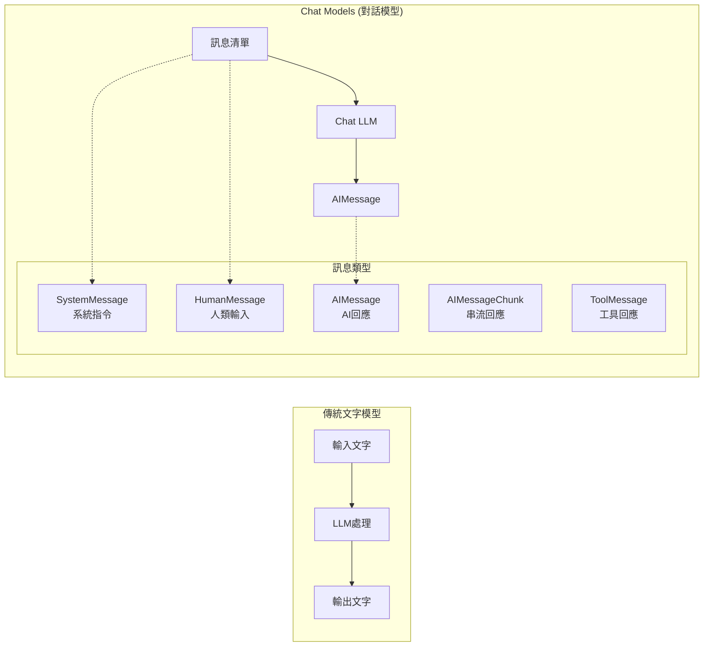

# Chat Models 對話模型

## 什麼是 Chat Models？

像 GPT-4 這樣的聊天模型，已經成為使用 OpenAI API 的主要方式。它不再是單純的「輸入文字 → 輸出文字」模式，而是以**訊息（messages）**作為輸入與輸出的互動方式。

### 傳統模型 vs Chat Models



**主要差異：**

| 特性 | 傳統模型 | Chat Models |
|------|----------|------------|
| **輸入格式** | 純文字字串 | **訊息清單**（System/Human/AI/Tool…） |
| **上下文管理** | 需手動把歷史拼進提示 | **以訊息為單位較好維護**；但**不會自動記住**，仍需顯式提供或用記憶元件 |
| **角色區分** | 無明確角色 | **明確角色**（System/Human/AI；部分供應商還有 Tool/Function） |
| **多輪對話** | 可行，但需自行管理歷史 | **更順手**；**仍需提供歷史或用記憶模組** |
| **工具整合（Function/Tool Calling）** | 多半要自訂格式與解析 | 多數供應商**原生或一階支援**；LangChain 有對應訊息型別與執行器（依模型而定） |
| **串流回應** | 多數供應商支援（token 流） | 多數供應商支援；LangChain 以 `AIMessageChunk` 表示片段 |

## 訊息類型詳解 (LangChain 0.3+)

LangChain 0.3+ 版本支援多種訊息類型，全部匯入路徑已更新為：

```python
from langchain_core.messages import (
    SystemMessage, HumanMessage, AIMessage,
    AIMessageChunk, ToolMessage, ChatMessage
)
```

### 1. SystemMessage 系統訊息

**作用：** 設定 AI 的角色、行為規範和上下文背景

```python
from langchain_core.messages import SystemMessage

system_msg = SystemMessage(content="你是一位專業的 Python 工程師，專精於 Web 開發。")
```

**特點：**
- 🎯 定義 AI 的「身份」和「專業領域」
- 📋 設定回應的風格和格式要求
- 🔒 OpenAI 特別強化了對 SystemMessage 的遵循度
- ✅ Anthropic Claude 現已完全支援 system prompts

### 2. HumanMessage 人類訊息

**作用：** 代表使用者的輸入、問題或請求

```python
from langchain_core.messages import HumanMessage

human_msg = HumanMessage(content="請解釋什麼是 RESTful API 的設計原則？")
```

### 3. AIMessage AI 訊息

**作用：** 代表 AI 系統的回應

```python
from langchain_core.messages import AIMessage

ai_msg = AIMessage(content="RESTful API 設計原則包含以下幾個核心概念...")
```

### 4. AIMessageChunk 串流訊息塊

**用途：** 串流回應時的分段訊息，由 `.stream()` 方法產生

```python
from langchain_core.messages import AIMessageChunk

# 串流回應會產出 AIMessageChunk 物件
chunks: list[AIMessageChunk] = []
for chunk in chat.stream(messages):
    print(chunk.content, end="", flush=True)
    chunks.append(chunk)

# 可以將所有 chunks 組合成完整回應
full_response = "".join(chunk.content for chunk in chunks)
```

### 5. ToolMessage 工具訊息

**用途：** 工具呼叫的回應結果，必須包含正確的 `tool_call_id`

```python
from langchain_core.messages import ToolMessage

# tool_call_id 必須對應模型回傳的 ID
tool_msg = ToolMessage(
    content="計算結果: 42",
    tool_call_id="call_abc123"  # 來自模型的真實 ID
)
```

### 6. ChatMessage 通用對話訊息

**用途：** 自定義角色的靈活訊息類型

```python
from langchain_core.messages import ChatMessage

custom_msg = ChatMessage(
    content="這是來自資料分析師的建議...",
    role="data_analyst"
)
```

## 基本使用範例

### 範例一：專業笑話生成器

```python
from langchain_openai import ChatOpenAI
from langchain_core.messages import SystemMessage, HumanMessage

# 建立 Chat Model（temperature=0.5 增加創意性）
chat = ChatOpenAI(
    model="gpt-4o-mini",
    temperature=0.5
)

# 定義訊息清單
messages = [
    SystemMessage(content="你是一位資深的軟體工程師，擅長用程式設計的角度來說笑話。"),
    HumanMessage(content="請分享一個關於軟體工程師的笑話。")
]

# 呼叫模型（推薦的現代化方式）
response = chat.invoke(messages)
print(response.content)
```

**輸出範例：**
```
為什麼軟體工程師總是搞混聖誕節和萬聖節？
因為 Oct 31 == Dec 25！
（八進位的 31 等於十進位的 25）
```

### 範例二：多輪對話系統

```python
from langchain_openai import ChatOpenAI
from langchain_core.messages import SystemMessage, HumanMessage, AIMessage

chat = ChatOpenAI(model="gpt-4o-mini", temperature=0.1)

# 建立對話歷史
conversation_history = [
    SystemMessage(content="你是一位友善的 Python 教學助手。"),
    HumanMessage(content="什麼是 Python 中的 list comprehension？"),
    AIMessage(content="List comprehension 是 Python 中建立列表的簡潔語法..."),
    HumanMessage(content="可以給我一個實際的例子嗎？")
]

# 繼續對話
response = chat.invoke(conversation_history)
print(response.content)
```

## 現代化的呼叫方式

### 標準 Runnable 介面

LangChain 0.3+ 全面採用 Runnable 介面，提供統一的調用方式：

```python
# ✅ 推薦的現代呼叫方式
response = chat.invoke(messages)           # 同步呼叫
response = await chat.ainvoke(messages)    # 非同步呼叫
responses = chat.batch([messages])         # 批次處理
stream = chat.stream(messages)             # 串流回應

# ❌ 舊版呼叫方式（Legacy，不建議使用）
response = chat(messages)  # 已廢棄
```

### 串流回應範例

```python
from langchain_openai import ChatOpenAI
from langchain_core.messages import SystemMessage, HumanMessage, AIMessageChunk

chat = ChatOpenAI(model="gpt-4o-mini")
messages = [
    SystemMessage(content="你是一位有用的助手。"),
    HumanMessage(content="請詳細解釋什麼是機器學習。")
]

# 串流回應處理
chunks: list[AIMessageChunk] = []
print("AI 回應:", end=" ")

for chunk in chat.stream(messages):
    print(chunk.content, end="", flush=True)
    chunks.append(chunk)

# 組合完整回應
full_response = "".join(chunk.content for chunk in chunks)
print(f"\n\n完整回應長度: {len(full_response)} 字元")
```

### 安全的工具呼叫範例

```python
from langchain_core.tools import tool
from langchain_core.messages import ToolMessage
import re
import ast
import operator

@tool
def safe_calculate(expression: str) -> str:
    """安全的數學計算器（僅支援基本運算：+, -, *, /, **, ()）"""
    
    # 安全檢查：只允許數字、基本運算符號和空白
    if not re.fullmatch(r"[0-9+\-*/.() \t]+", expression):
        return "錯誤: 包含不允許的字元"
    
    try:
        # 使用 ast.literal_eval 的安全替代方案
        # 在生產環境中，建議使用專門的數學表達式解析器
        node = ast.parse(expression, mode='eval')
        
        # 簡化示範：僅允許基本數學運算
        allowed_operators = {
            ast.Add: operator.add,
            ast.Sub: operator.sub,
            ast.Mult: operator.mul,
            ast.Div: operator.truediv,
            ast.Pow: operator.pow,
            ast.USub: operator.neg,
        }
        
        def eval_node(node):
            if isinstance(node, ast.Constant):
                return node.value
            elif isinstance(node, ast.BinOp):
                left = eval_node(node.left)
                right = eval_node(node.right)
                op = allowed_operators.get(type(node.op))
                if op:
                    return op(left, right)
                else:
                    raise ValueError("不支援的運算符")
            elif isinstance(node, ast.UnaryOp):
                operand = eval_node(node.operand)
                op = allowed_operators.get(type(node.op))
                if op:
                    return op(operand)
                else:
                    raise ValueError("不支援的一元運算符")
            else:
                raise ValueError("不支援的表達式類型")
        
        result = eval_node(node.body)
        return f"計算結果: {result}"
        
    except Exception as e:
        return f"計算錯誤: {str(e)}"

# 使用範例（注意：tool_call_id 必須來自模型的實際回應）
def create_tool_message(content: str, call_id: str):
    """創建工具訊息，call_id 應該來自模型的真實 tool_call_id"""
    return ToolMessage(
        content=content,
        tool_call_id=call_id  # 實際使用時必須是模型回傳的 ID
    )

# 範例用法
result = safe_calculate("2 + 3 * 4")
print(result)  # 輸出: 計算結果: 14
```

## 進階功能與最佳實踐

### 1. 使用 ChatPromptTemplate (現代化方式)

LangChain 0.3+ 推薦使用 tuple 格式的現代化模板：

```python
from langchain_core.prompts import ChatPromptTemplate, MessagesPlaceholder
from langchain_openai import ChatOpenAI

# 現代化的 ChatPromptTemplate 寫法
prompt = ChatPromptTemplate.from_messages([
    ("system", "你是一位專精於{domain}的專家，具有{years}年的經驗。"),
    MessagesPlaceholder("chat_history"),  # 用於插入歷史對話
    ("human", "關於{topic}，請提供專業的建議和最佳實踐。"),
])

# 建立模型
model = ChatOpenAI(model="gpt-4o-mini", temperature=0.2)

# 使用模板
response = model.invoke(prompt.format_prompt(
    domain="機器學習",
    years="10",
    topic="模型部署策略",
    chat_history=[]  # 空的歷史對話
))

print(response.content)
```

### 2. 與 LCEL 鏈式組合

結合 LangChain Expression Language 的強大功能：

```python
from langchain_core.prompts import ChatPromptTemplate
from langchain_core.output_parsers import StrOutputParser
from langchain_openai import ChatOpenAI

# 建立處理鏈
prompt = ChatPromptTemplate.from_messages([
    ("system", "你是一位{role}，請用專業且易懂的方式回答問題。"),
    ("human", "{question}")
])

model = ChatOpenAI(model="gpt-4o-mini")
output_parser = StrOutputParser()

# LCEL 鏈式組合
chain = prompt | model | output_parser

# 使用鏈
result = chain.invoke({
    "role": "Python 教學專家",
    "question": "什麼是裝飾器（decorator）？"
})

print(result)
```

### 3. 不同模型的 SystemMessage 支援

```python
from langchain_openai import ChatOpenAI
from langchain_anthropic import ChatAnthropic  
from langchain_ollama import ChatOllama

# OpenAI GPT-4 - 完全原生支援
openai_chat = ChatOpenAI(model="gpt-4o-mini")

# Anthropic Claude - 現已完全支援 system prompts
claude_chat = ChatAnthropic(
    model="claude-3-sonnet-20240229"
    # system prompts 透過 ChatAnthropic 自動處理
)

# 本地模型（Ollama）- 支援工具呼叫和 system prompts
local_chat = ChatOllama(model="llama3.2:1b")  # 推薦教學使用
```

### 4. 錯誤處理與重試機制

```python
from langchain_core.language_models import BaseChatModel  # 更新的匯入路徑
from langchain_core.messages import BaseMessage
from typing import List
import time
import logging

def safe_chat_invoke(
    chat: BaseChatModel, 
    messages: List[BaseMessage], 
    max_retries: int = 3
):
    """安全的聊天模型呼叫，包含指數退避重試機制"""
    
    logger = logging.getLogger(__name__)
    
    for attempt in range(max_retries):
        try:
            response = chat.invoke(messages)
            return response
            
        except Exception as e:
            logger.warning(f"嘗試 {attempt + 1}/{max_retries} 失敗: {e}")
            
            if attempt == max_retries - 1:
                logger.error(f"所有重試都失敗，最後錯誤: {e}")
                raise e
                
            # 指數退避策略
            sleep_time = 2 ** attempt
            logger.info(f"等待 {sleep_time} 秒後重試...")
            time.sleep(sleep_time)

# 使用範例
try:
    response = safe_chat_invoke(chat, messages, max_retries=3)
    print(response.content)
except Exception as e:
    print(f"無法獲得回應: {e}")
```

## 實際應用場景

### 場景一：智能客服助手

```python
from langchain_openai import ChatOpenAI
from langchain_core.messages import SystemMessage, HumanMessage, BaseMessage
from typing import List, Optional

def create_customer_service_bot():
    chat = ChatOpenAI(model="gpt-4o-mini", temperature=0.3)
    
    system_prompt = """你是 TechCorp 的客服代表，具備以下特質：
    1. 友善且專業的溝通風格
    2. 熟悉公司產品和服務
    3. 能夠快速解決客戶問題
    4. 如無法解決，會適時轉介給專業部門
    
    回答格式：
    - 先表達理解客戶問題
    - 提供具體解決方案
    - 確認客戶是否滿意
    """
    
    def respond_to_customer(
        customer_message: str, 
        conversation_history: Optional[List[BaseMessage]] = None
    ) -> str:
        messages = [SystemMessage(content=system_prompt)]
        
        if conversation_history:
            messages.extend(conversation_history)
        
        messages.append(HumanMessage(content=customer_message))
        
        response = chat.invoke(messages)
        return response.content
    
    return respond_to_customer

# 使用範例
customer_service = create_customer_service_bot()
response = customer_service("我的訂單遲遲沒有收到，該怎麼辦？")
print(response)
```

### 場景二：程式碼審查助手

```python
from langchain_openai import ChatOpenAI
from langchain_core.messages import SystemMessage, HumanMessage

def create_code_reviewer():
    chat = ChatOpenAI(model="gpt-4o-mini", temperature=0.1)
    
    system_msg = SystemMessage(content="""
    你是一位資深的程式碼審查專家，專精於：
    - 程式碼品質評估
    - 安全性漏洞檢測
    - 效能優化建議
    - 最佳實踐推薦
    
    審查格式：
    1. 程式碼優點
    2. 需要改進的地方
    3. 具體建議
    4. 風險評估（包括安全性考量）
    """)
    
    def review_code(code: str, language: str = "python") -> str:
        messages = [
            system_msg,
            HumanMessage(content=f"請審查以下 {language} 程式碼：\n\n```{language}\n{code}\n```")
        ]
        
        response = chat.invoke(messages)
        return response.content
    
    return review_code

# 使用範例
code_reviewer = create_code_reviewer()

code_to_review = """
def process_users(users):
    result = []
    for user in users:
        if user['age'] > 18:
            result.append(user['name'])
    return result
"""

review = code_reviewer(code_to_review)
print(review)
```

## 效能優化與成本控制

### 1. 現代化模型選擇策略 (2025 推薦)

```python
from langchain_openai import ChatOpenAI

def get_appropriate_model(task_complexity: str):
    """根據任務複雜度選擇最新的模型"""
    if task_complexity == "simple":
        return ChatOpenAI(model="gpt-4o-mini", temperature=0.2)  # 替代 gpt-3.5-turbo
    elif task_complexity == "medium":
        return ChatOpenAI(model="gpt-4o", temperature=0.3)
    else:  # complex
        return ChatOpenAI(model="gpt-4", temperature=0.4)  # 或使用 gpt-o1 系列
```

### 2. 智能 Token 管理與優化

```python
from langchain_core.messages import SystemMessage, BaseMessage
from langchain_core.messages.utils import count_tokens_approximately
from typing import List

def trim_conversation_to_budget(
    messages: List[BaseMessage], 
    budget: int = 80000  # 現代模型的上下文窗較大
) -> List[BaseMessage]:
    """智能修剪對話，保持在 token 預算內"""
    
    # 保留 SystemMessage（通常在開頭）
    system_messages = [msg for msg in messages if isinstance(msg, SystemMessage)]
    other_messages = [msg for msg in messages if not isinstance(msg, SystemMessage)]
    
    # 使用官方 token 計數工具
    current_tokens = count_tokens_approximately(messages)
    
    if current_tokens <= budget:
        return messages
    
    # 從最舊的對話開始移除（保留最近的對話更重要）
    while current_tokens > budget and len(other_messages) > 2:
        # 移除最舊的一對 Human-AI 對話
        if len(other_messages) >= 2:
            other_messages = other_messages[2:]  # 移除前兩條訊息
        else:
            other_messages = other_messages[1:]  # 移除一條訊息
        
        test_messages = system_messages + other_messages
        current_tokens = count_tokens_approximately(test_messages)
    
    return system_messages + other_messages

# 使用範例
optimized_messages = trim_conversation_to_budget(conversation_history, budget=50000)
response = chat.invoke(optimized_messages)
```

### 3. 官方快取機制

```python
from langchain.globals import set_llm_cache
from langchain.cache import InMemoryCache
from langchain_openai import ChatOpenAI

# 方法一：使用全域快取
set_llm_cache(InMemoryCache())

# 方法二：模型級快取（推薦）
chat_with_cache = ChatOpenAI(
    model="gpt-4o-mini",
    cache=True  # 啟用模型快取
)

# 使用快取的聊天模型
response1 = chat_with_cache.invoke(messages)  # 第一次調用
response2 = chat_with_cache.invoke(messages)  # 從快取返回，相同輸入

# 方法三：自定義快取實作（進階用法）
import hashlib
from typing import Dict, Any

class SmartChatCache:
    def __init__(self, model: ChatOpenAI):
        self.model = model
        self.cache: Dict[str, Any] = {}
    
    def _generate_cache_key(self, messages: List[BaseMessage]) -> str:
        """基於訊息內容和模型參數生成快取鍵"""
        content = str([msg.content for msg in messages])
        model_config = f"{self.model.model_name}_{self.model.temperature}"
        combined = f"{content}_{model_config}"
        return hashlib.sha256(combined.encode()).hexdigest()
    
    def invoke_with_smart_cache(self, messages: List[BaseMessage]):
        cache_key = self._generate_cache_key(messages)
        
        if cache_key in self.cache:
            print(f"💨 從智能快取返回結果 (key: {cache_key[:8]}...)")
            return self.cache[cache_key]
        
        print("🔄 調用模型生成新回應...")
        response = self.model.invoke(messages)
        self.cache[cache_key] = response
        
        return response
    
    def clear_cache(self):
        """清空快取"""
        self.cache.clear()
        print("🗑️ 快取已清空")

# 使用智能快取
smart_cache = SmartChatCache(ChatOpenAI(model="gpt-4o-mini"))
response = smart_cache.invoke_with_smart_cache(messages)
```

## 常見問題與解決方案

### Q1: 如何處理不同模型對 SystemMessage 的支援差異？

現代版本的主要聊天模型都已支援 SystemMessage，包括：

```python
from langchain_openai import ChatOpenAI
from langchain_anthropic import ChatAnthropic
from langchain_ollama import ChatOllama

def create_universal_chat_model(model_provider: str):
    """建立通用的聊天模型（2025 年版本）"""
    
    if model_provider == "openai":
        return ChatOpenAI(model="gpt-4o-mini")  # 完全支援 SystemMessage
    
    elif model_provider == "anthropic":
        return ChatAnthropic(model="claude-3-sonnet-20240229")  # 現已完全支援
    
    elif model_provider == "local":
        return ChatOllama(model="llama3.2:1b")  # 推薦教學使用，支援 SystemMessage
    
    else:
        raise ValueError(f"不支援的模型提供商: {model_provider}")

# 使用範例 - 所有模型都能正常處理 SystemMessage
models = {
    "openai": create_universal_chat_model("openai"),
    "anthropic": create_universal_chat_model("anthropic"),
    "local": create_universal_chat_model("local")
}

# 統一的訊息格式適用於所有模型
from langchain_core.messages import SystemMessage, HumanMessage

messages = [
    SystemMessage(content="你是一位專業的程式設計導師。"),
    HumanMessage(content="請解釋什麼是遞迴？")
]

for provider, model in models.items():
    print(f"\n=== {provider.upper()} 回應 ===")
    response = model.invoke(messages)
    print(response.content[:200] + "...")
```

### Q2: 現代化記憶管理 - LCEL vs 傳統 Memory

推薦使用 LCEL 和 RunnableWithMessageHistory 替代傳統 Memory：

```python
from langchain_core.runnables.history import RunnableWithMessageHistory
from langchain_community.chat_message_histories import ChatMessageHistory
from langchain_core.prompts import ChatPromptTemplate, MessagesPlaceholder
from langchain_openai import ChatOpenAI

# 現代化記憶管理方式
def create_modern_conversation_manager():
    """使用 LCEL 的現代對話管理器"""
    
    # 建立聊天模板
    prompt = ChatPromptTemplate.from_messages([
        ("system", "你是一位友善的助手，能記住我們的對話歷史。"),
        MessagesPlaceholder(variable_name="history"),
        ("human", "{input}"),
    ])
    
    # 建立處理鏈
    model = ChatOpenAI(model="gpt-4o-mini")
    chain = prompt | model
    
    # 記憶儲存
    store = {}
    
    def get_session_history(session_id: str) -> ChatMessageHistory:
        if session_id not in store:
            store[session_id] = ChatMessageHistory()
        return store[session_id]
    
    # 包裝成有記憶的鏈
    conversation_chain = RunnableWithMessageHistory(
        chain,
        get_session_history,
        input_messages_key="input",
        history_messages_key="history",
    )
    
    return conversation_chain

# 使用現代化對話管理
conversation = create_modern_conversation_manager()

# 配置會話
config = {"configurable": {"session_id": "user_abc123"}}

# 多輪對話
response1 = conversation.invoke(
    {"input": "我叫 Alice，是一名軟體工程師"}, 
    config=config
)
print("AI:", response1.content)

response2 = conversation.invoke(
    {"input": "我剛才說我的職業是什麼？"}, 
    config=config
)
print("AI:", response2.content)  # AI 會記得 Alice 是軟體工程師

# 對比：傳統 Memory 方式（不推薦新專案使用）
# 注意：官方建議新專案優先使用 LCEL 和 LangGraph 進行狀態管理
```

### Q3: 如何處理超長對話歷史的現代化方案

```python
from langchain_core.messages import trim_messages
from langchain_core.messages.utils import count_tokens_approximately

def create_smart_conversation_with_trimming():
    """智能對話管理，自動處理長對話"""
    
    prompt = ChatPromptTemplate.from_messages([
        ("system", "你是一位有用的助手。以下是我們的對話歷史摘要和最近的對話。"),
        MessagesPlaceholder(variable_name="history"),
        ("human", "{input}"),
    ])
    
    model = ChatOpenAI(model="gpt-4o-mini")
    
    def smart_trim_messages(messages, token_budget: int = 50000):
        """智能修剪訊息，保持重要對話"""
        
        # 使用官方的 trim_messages 功能
        trimmed = trim_messages(
            messages,
            token_counter=count_tokens_approximately,
            max_tokens=token_budget,
            strategy="last",  # 保留最後的訊息
            allow_partial=False,
        )
        
        return trimmed
    
    # 自定義鏈，包含智能修剪
    def conversation_with_trim(input_data, history):
        # 修剪歷史訊息
        trimmed_history = smart_trim_messages(history)
        
        # 格式化 prompt
        formatted = prompt.invoke({
            "input": input_data,
            "history": trimmed_history
        })
        
        return model.invoke(formatted)
    
    return conversation_with_trim

# 使用智能修剪的對話系統
smart_conversation = create_smart_conversation_with_trimming()
```

## 總結

Chat Models 是現代 AI 應用開發的核心組件，LangChain 0.3+ 提供了更強大和完整的功能：

### 🎯 核心優勢

- 🎭 **多角色支援**：SystemMessage、HumanMessage、AIMessage、AIMessageChunk、ToolMessage 完整覆蓋
- 💬 **原生對話管理**：自動維護多輪對話上下文，無需手動管理
- 🔧 **現代化工具整合**：原生支援工具呼叫和串流回應
- 🔗 **LCEL 無縫整合**：與 LangChain Expression Language 完美結合
- 🛡️ **統一介面抽象**：Runnable 介面提供一致的調用體驗

### 📝 LangChain 0.3+ 最佳實踐

1. **正確的匯入路徑**：
   - ✅ `from langchain_core.messages import SystemMessage, HumanMessage, AIMessage`
   - ✅ `from langchain_core.prompts import ChatPromptTemplate`
   - ✅ `from langchain_core.tools import tool`

2. **現代化呼叫方式**：
   - ✅ 使用 `.invoke()`, `.ainvoke()`, `.stream()`, `.batch()`
   - ❌ 避免舊版 `chat(messages)` 語法

3. **智能 Token 管理**：
   - 使用 `count_tokens_approximately()` 進行精確計數
   - 採用 `trim_messages()` 進行智能修剪
   - 設定合理的 token 預算（現代模型支援更大上下文）

4. **安全性考量**：
   - 🚫 **絕不使用 `eval()`** 處理工具輸入
   - ✅ 使用 `ast.parse()` 和白名單驗證
   - ✅ 實施適當的錯誤處理和重試機制

5. **模型選擇策略**：
   - 簡單任務：`gpt-4o-mini`（替代 gpt-3.5-turbo）
   - 中等複雜度：`gpt-4o`
   - 高複雜度：`gpt-4` 或 o1 系列

### 🔄 遷移檢查清單

如果你正在從舊版本升級，請確認：

- [ ] 更新所有匯入路徑（`langchain.schema` → `langchain_core.messages`）
- [ ] 採用現代化的 ChatPromptTemplate 語法（tuple 格式）
- [ ] 更新工具定義（`@tool` 來自 `langchain_core.tools`）
- [ ] 實施安全的工具執行邏輯
- [ ] 使用官方 token 計數和快取機制
- [ ] 測試所有模型提供商的 SystemMessage 支援

### 🚀 進階應用建議

- **記憶管理**：優先使用 `RunnableWithMessageHistory` 而非傳統 Memory
- **工作流編排**：考慮使用 LangGraph 處理複雜的多步驟任務
- **監控可觀測性**：整合 LangSmith 進行生產環境監控
- **結構化輸出**：結合 Pydantic 輸出解析器確保資料品質

---

::: tip 下一步
掌握了 Chat Models 的現代化用法後，建議按以下順序深入學習：

1. [第一個應用](/tutorials/first-app) - 動手建構完整的聊天應用
2. [LCEL 表達式語言](/tutorials/lcel) - 學習現代鏈式組合方式  
3. [結構化輸出解析](/tutorials/output-parsers) - 確保 AI 回應的資料品質
4. [記憶機制與對話管理](/tutorials/memory-systems) - 實現更智能的對話系統
5. [LangGraph 工作流框架](/tutorials/langgraph) - 建構複雜的多代理系統
:::

::: warning ⚠️ 重要提醒（安全性和合規性）

**安全性**：
- **API 金鑰管理**：使用環境變數，絕不硬編碼金鑰
- **輸入驗證**：對所有用戶輸入進行適當驗證和過濾
- **工具安全**：避免 `eval()` 等危險函數，實施白名單機制

**合規性**：
- **速率限制**：遵守各模型提供商的 API 呼叫限制  
- **內容政策**：確保輸入輸出符合各平台使用條款
- **隱私保護**：妥善處理用戶數據，遵循相關隱私法規

**成本控制**：
- **Token 監控**：定期檢查 API 使用量和費用
- **模型選擇**：根據任務複雜度選擇成本效益最佳的模型
- **快取策略**：合理使用快取減少不必要的 API 呼叫
:::