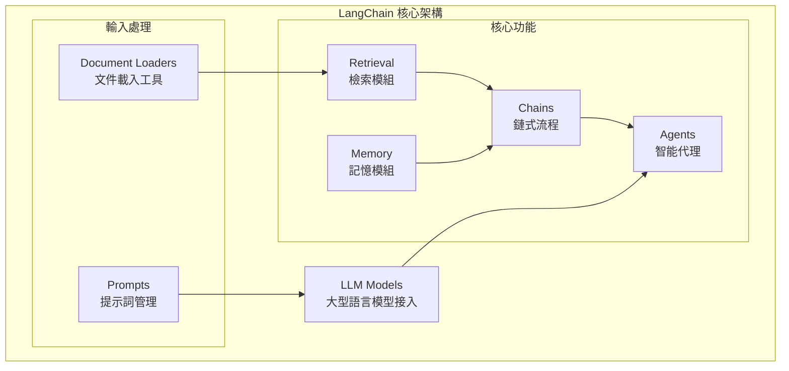
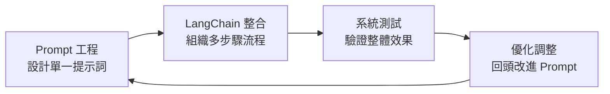

# LangChain 介紹

## 什麼是 LangChain？

LangChain 是一個多功能的框架，可以用來建立利用大型語言模型（LLMs）的應用程式，目前提供 Python 與 TypeScript 版本。

它的核心理念是：最有影響力、最具特色的應用，不應僅僅透過 API 與語言模型互動，而應該同時做到以下兩點：

### 🔍 增強資料感知（Enhance Data Awareness）

**核心概念：** 讓 LLM 不再是「閉門造車」，而是能主動感知、檢索並整合外部資料。

#### 具體實現方式

**1. 檢索增強生成 (RAG)**
```python
from langchain.chains import RetrievalQA
from langchain.vectorstores import Chroma
from langchain.document_loaders import PyPDFLoader

# 載入外部文件
loader = PyPDFLoader("company_handbook.pdf")
documents = loader.load()

# 建立向量資料庫
vectorstore = Chroma.from_documents(documents, embeddings)

# 讓 LLM 感知外部資料
qa_chain = RetrievalQA.from_chain_type(
    llm=llm,
    retriever=vectorstore.as_retriever()
)

# LLM 現在能回答文件中的內容
response = qa_chain.invoke("公司的請假政策是什麼？")
```

**2. 動態資料注入**
```python
from langchain.prompts import PromptTemplate
from datetime import datetime

# 感知當前時間資料
current_time = datetime.now().strftime("%Y-%m-%d %H:%M")

prompt = PromptTemplate.from_template(
    "現在時間是 {current_time}，根據當前時間和歷史資料 {historical_data} 來分析趋勢"
)

# LLM 能感知實時資料
formatted_prompt = prompt.format(
    current_time=current_time,
    historical_data=get_latest_market_data()
)
```

**3. 多源資料整合**
```python
from langchain.agents import create_sql_agent
from langchain.sql_database import SQLDatabase

# 讓 LLM 感知資料庫
db = SQLDatabase.from_uri("sqlite:///sales.db")

# LLM 能查詢資料庫並整合結果
sql_agent = create_sql_agent(llm, db, verbose=True)
response = sql_agent.invoke("分析本月銷售趨勢並與去年同期比較")
```

#### 資料感知的層級

| 層級 | 能力 | 實例 |
|------|------|------|
| **靜態感知** | 預先載入的知識庫 | PDF 文件問答、FAQ 系統 |
| **動態感知** | 實時資料檢索 | 股價查詢、天氣資訊 |
| **上下文感知** | 對話歷史記憶 | 客服機器人、個人助理 |
| **環境感知** | 感知外部系統狀態 | IoT 數據分析、系統監控 |

### 🤖 增強行動力（Enhance Agency）

**核心概念：** 讓 LLM 從被動回答變成主動決策，能自主選擇工具、規劃步驟，並執行複雜任務。

#### 具體實現方式

**1. 工具選擇與調用**
```python
from langchain.agents import AgentExecutor, create_tool_calling_agent
from langchain.tools import Tool

# 定義工具集
def search_web(query):
    return f"搜尋結果：{query}"

def calculate(expression):
    return eval(expression)

def send_email(recipient, content):
    return f"郵件已發送給 {recipient}"

tools = [
    Tool(name="搜尋", func=search_web, description="搜尋網路資訊"),
    Tool(name="計算", func=calculate, description="數學計算"),
    Tool(name="發送郵件", func=send_email, description="發送電子郵件")
]

# LLM 能自主決定使用哪個工具
agent = create_tool_calling_agent(llm, tools)
agent_executor = AgentExecutor(agent=agent, tools=tools)

# 複雜任務自主分解與執行
response = agent_executor.invoke(
    "幫我搜尋最新的AI發展趨勢，計算相關市場規模，然後發送總結報告給經理"
)
```

**2. 多步驟推理與決策**
```python
from langchain.agents import initialize_agent, AgentType

# ReAct 代理：推理-行動-觀察循環
agent = initialize_agent(
    tools=tools,
    llm=llm,
    agent=AgentType.ZERO_SHOT_REACT_DESCRIPTION,
    verbose=True
)

# LLM 會自主進行多輪推理
result = agent.invoke(
    "我需要為新產品制定行銷策略。請分析競爭對手、市場趨勢，並提出建議。"
)

# 執行過程示例：
# 思考：我需要先了解競爭對手情況
# 行動：使用搜尋工具查找競爭對手資訊
# 觀察：獲得競爭對手清單和特色
# 思考：現在分析市場趨勢
# 行動：使用搜尋工具查找市場報告
# 觀察：獲得市場趨勢資料
# 思考：基於資料制定策略建議
# 行動：整合分析並提出建議
```

**3. 條件判斷與流程控制**
```python
from langchain.agents import ConversationalAgent

# 對話式代理，能根據上下文調整行動
conversational_agent = ConversationalAgent.from_llm_and_tools(
    llm=llm,
    tools=tools,
    memory=memory
)

# LLM 能根據條件執行不同行動
response = conversational_agent.invoke(
    "如果今天股價上漲超過5%，就發送慶祝郵件；否則分析下跌原因"
)
```

#### 行動力的層級

| 層級 | 能力 | 實例 |
|------|------|------|
| **反應式行動** | 根據輸入執行對應動作 | 簡單工具調用、API 呼叫 |
| **計劃式行動** | 制定多步驟執行計劃 | 專案規劃、任務分解 |
| **自適應行動** | 根據執行結果調整策略 | 動態優化、錯誤恢復 |
| **創新式行動** | 創造新的解決方案 | 創意發想、問題突破 |

#### 實際應用案例

**智能客服系統：**
```python
# 客服代理能感知客戶資料並自主決定行動
customer_service_agent = AgentExecutor.from_agent_and_tools(
    agent=conversational_agent,
    tools=[
        get_customer_info,      # 查詢客戶資料
        check_order_status,     # 查詢訂單狀態  
        process_refund,         # 處理退款
        escalate_to_human       # 轉人工客服
    ]
)

# 自主處理複雜客服情境
response = customer_service_agent.invoke(
    "客戶抱怨商品有問題要退貨，請幫我處理"
)
```

**智能分析師：**
```python
# 分析代理能整合多源資料並自主產出報告
analyst_agent = AgentExecutor.from_agent_and_tools(
    agent=planning_agent,
    tools=[
        query_database,         # 查詢資料庫
        fetch_market_data,      # 獲取市場資料
        generate_charts,        # 生成圖表
        create_presentation     # 製作簡報
    ]
)

# 自主完成完整分析流程
report = analyst_agent.invoke(
    "製作本季度業績分析報告，包含趨勢分析和改善建議"
)
```

### 總結：資料感知 + 行動力 = 智能應用

**傳統 LLM：** 只能根據訓練資料回答問題
**LangChain 增強後：** 
- 🔍 **感知外部世界**：即時資料、文件、資料庫
- 🤖 **主動採取行動**：調用工具、執行任務、做決策
- 🔄 **持續學習適應**：根據結果調整策略

這就是 LangChain 讓 LLM 從「聊天機器人」進化成「智能助手」的關鍵所在。

## LangChain 架構概覽

LangChain 框架提供了一系列模組化的抽象化功能（modular abstractions），這些是與 LLM 一起工作所必需的，同時也提供了廣泛的實作版本，方便開發者應用。



### 主要模組說明

| 模組 | 功能說明 | 實際用途 |
|------|----------|----------|
| **LLM Models** | 大型語言模型的接入介面 | 支援 OpenAI GPT、Anthropic Claude、本地模型等 |
| **Prompts** | 提示詞管理 | 定義、組裝與優化 LLM 的輸入格式 |
| **Document Loaders** | 文件載入工具 | 從 PDF、網頁、資料庫等載入並處理資料 |
| **Retrieval** | 檢索模組 | 讓 LLM 從外部知識庫或文件中找到需要的資訊 |
| **Memory** | 記憶模組 | 讓 LLM 能「記住」對話或上下文 |
| **Chains** | 鏈式流程 | 將多個模組串連成有邏輯的工作流程 |
| **Agents** | 智能代理 | 能根據需求自主決定要呼叫哪些工具或資料來源 |

## 什麼是「抽象化」？

### 概念解釋

在軟體設計裡，**抽象化（Abstraction）**就是：
> 隱藏細節，只保留最必要的特徵，讓使用者能更簡單地操作。

- **沒有抽象化** → 你要自己處理一大堆雜事（例如直接呼叫 API，要管 Token、格式、回傳 JSON 等）
- **有抽象化** → 框架幫你把雜事包好，給你一個乾淨的介面

### 實際對比

| 場景 | 沒有抽象化 | 有 LangChain 抽象化 |
|------|------------|-------------------|
| 使用不同 LLM | 要為每個 API 寫不同程式碼 | 統一介面，一行程式碼切換模型 |
| 管理對話記憶 | 手動存取資料庫，拼接上下文 | 掛上 Memory 模組自動處理 |
| 多步驟處理 | 自己設計流程控制邏輯 | 用 Chain 描述步驟即可 |

## LangChain 包裝了哪些複雜功能？

### 1. 🔌 LLM 介接統一化

**原本複雜：** 不同廠牌的 LLM API 格式各異，Token、回傳格式、流式處理都不同。

**LangChain 包裝：** 提供統一的介面，可無痛切換模型。

```python
from langchain_openai import ChatOpenAI
from langchain_anthropic import ChatAnthropic

# 換模型只換這行，其他程式不用改
llm = ChatOpenAI(model="gpt-4")  
# 或 llm = ChatAnthropic(model="claude-3-opus")

response = llm.invoke("幫我寫一首詩")
```

### 2. 📝 Prompt 模板管理

**原本複雜：** 要自己拼字串，把上下文、格式、變數全都寫死。

**LangChain 包裝：** 提供 PromptTemplate，可以用變數填入。

```python
from langchain.prompts import PromptTemplate

template = PromptTemplate.from_template(
    "你是一位營養師，請根據這些數據 {health_data} 提供建議"
)

prompt = template.format(health_data="血糖偏高")
```

### 3. 🧠 Memory（對話記憶）

**原本複雜：** LLM 天生無記憶，要自己管理對話歷史，存資料庫，再手動拼接。

**LangChain 包裝：** 內建各種 Memory 類型，掛上就能記住上下文。

```python
from langchain.chains import ConversationChain
from langchain.memory import ConversationBufferMemory

memory = ConversationBufferMemory()
conversation = ConversationChain(llm=llm, memory=memory)

# 自動記住上下文
conversation.invoke("我叫小明")
conversation.invoke("我剛才說我叫什麼名字？")  # 會記得是小明
```

### 4. 🔍 Retrieval + 外部知識庫整合

**原本複雜：** 要自己寫 embedding、存到向量資料庫、再寫檢索邏輯。

**LangChain 包裝：** 提供 Retriever，一句話就能讓 LLM 接外部知識。

```python
from langchain.chains import RetrievalQA

# 自動檢索相關文件並回答
qa = RetrievalQA.from_chain_type(
    llm=llm, 
    retriever=vectorstore.as_retriever()
)

answer = qa.invoke("公司的請假政策是什麼？")
```

### 5. ⛓️ Chains（多步驟流程組裝）

**原本複雜：** 要手動控制流程：先檢索資料 → 再問 LLM → 再格式化結果。

**LangChain 包裝：** 把多步驟組裝成「流程鏈」。

```python
from langchain.chains import SequentialChain

# 自動執行：分析 → 建議 → 格式化
health_chain = SequentialChain(
    chains=[analysis_chain, recommendation_chain, format_chain],
    input_variables=["health_data"],
    output_variables=["final_report"]
)
```

### 6. 🎯 Agents（動態決策 & 工具調用）

**原本複雜：** 要自己寫 if/else 判斷，決定何時該查 API、何時直接回覆。

**LangChain 包裝：** LLM 自主決定該調用哪個工具。

```python
from langchain.agents import AgentExecutor

# LLM 可根據問題決定：
# - 查天氣 API
# - 查資料庫  
# - 或直接回答
agent = AgentExecutor.from_agent_and_tools(
    agent=agent,
    tools=[weather_tool, database_tool]
)
```

## 實際應用場景

### 場景一：健康 AI 助手

**沒有 LangChain 的複雜度：**
- 手動串接 OpenAI API
- 自己寫程式處理上下文
- 自己實作 embedding + 存 Firestore  
- 手寫 prompt 拼接邏輯
- 設計複雜的 API workflow

**使用 LangChain 的簡化：**
- `ChatOpenAI` 抽象層處理 API
- `ConversationBufferMemory` 處理對話
- `RetrievalQA` 連接 BigQuery 或 Firestore
- `PromptTemplate` 管理健康建議格式
- `Agent` 讓 LLM 自動決定要「查詢數據」還是「直接建議」

### 場景二：客服機器人

```python
# 完整的客服機器人，只需要組裝積木
from langchain.chains import ConversationalRetrievalChain
from langchain.memory import ConversationBufferMemory

# 記憶 + 知識庫檢索 + 對話能力
chatbot = ConversationalRetrievalChain.from_llm(
    llm=llm,
    retriever=company_docs.as_retriever(),
    memory=ConversationBufferMemory(memory_key="chat_history")
)

# 就能處理複雜的多輪對話和知識問答
response = chatbot({"question": "如何申請退貨？"})
```

## 白話理解

**簡單來說**，LangChain 就像是一個「AI 應用程式開發框架」。

它的目的不是讓你只單純問 LLM 問題，而是讓 LLM 可以：
- 📖 讀外部資料
- 🧠 記住上下文  
- 🤔 決定行動
- 🔗 和其他系統互動

### 類比說明

如果把 LangChain 想成 AI 界的「Spring Boot」或「Django」：

- **Spring Boot** 抽象化：不用自己寫 Servlet、處理 Request/Response
- **LangChain** 抽象化：不用自己處理 Prompt、API、Memory、知識庫檢索

## LangChain 與 Prompt 工程的關係

### 層級差異理解

可以把關係理解成：

**Prompt 工程**：是**微觀層級**的技巧，專注於「這個輸入」怎麼寫，才會讓模型給出最佳的輸出。就像是你跟模型的「一句話互動」。

**LangChain**：是**宏觀層級**的框架，幫助你把多個 prompt、上下文、外部資料庫（像向量資料庫）、API 工具、記憶機制等，組織成完整流程。這樣就能把單一 prompt 技巧擴展成產品級應用。

### LangChain 作為進階 Prompt 工程工具

LangChain 可以歸類成「**進階 Prompt 工程工作流**」的核心工具，因為它提供了：

| 功能模組 | Prompt 工程層面 | 實際應用 |
|----------|----------------|----------|
| **Model I/O** | 管理模型輸入輸出 | 統一化不同模型的 prompt 格式 |
| **Retrieval** | 從外部文件取資料再丟進 Prompt | 動態注入相關內容到 prompt 中 |
| **Chains** | 把多個 Prompt 串成流程 | 多步驟推理，層層遞進的 prompt 設計 |
| **Agents** | 讓模型自己決定用什麼工具 | 智能選擇最適合的 prompt 策略 |
| **Memory** | 保留上下文，支持長對話 | 讓 prompt 包含歷史對話記憶 |
| **Callbacks** | 在生成過程中掛勾事件 | Token Streaming、進度追踪等 |

### 簡單比喻

**Prompt 工程**：像是「**一份食譜**」— 怎麼描述食材和步驟，才能煮出你要的菜。

```python
# 單一 Prompt 工程
prompt = "請分析以下健康數據並給出建議：血糖 120 mg/dL"
response = llm.invoke(prompt)
```

**LangChain**：像是「**一個廚房系統**」— 有冰箱（資料檢索）、計時器（回呼）、菜譜集合（Chain）、甚至可以派助手（Agent）去買菜。

```python
# LangChain 系統化流程
from langchain.chains import SequentialChain
from langchain.prompts import PromptTemplate

# 多步驟 Prompt 工程
analysis_prompt = PromptTemplate.from_template(
    "分析健康數據：{health_data}"
)
recommendation_prompt = PromptTemplate.from_template(
    "基於分析結果 {analysis} 提供具體建議"
)
format_prompt = PromptTemplate.from_template(
    "將建議 {recommendations} 格式化為用戶友好的報告"
)

# 組織成完整工作流
health_chain = SequentialChain(
    chains=[analysis_chain, recommendation_chain, format_chain],
    input_variables=["health_data"],
    output_variables=["final_report"]
)
```

### 互補關係總結

| 層面 | Prompt 工程 | LangChain |
|------|-------------|-----------|
| **層級** | 微觀的「語言技巧」 | 宏觀的「系統框架」 |
| **關注點** | 單一 prompt 的品質 | 整體流程的協調 |
| **應用場景** | 一次性對話優化 | 可重用、可擴展的應用 |
| **技能需求** | 語言表達、邏輯組織 | 系統設計、架構思考 |

### 實際開發流程



**要總結的話：**
- **Prompt 工程** = 微觀的「語言技巧」
- **LangChain** = 宏觀的「系統框架」  
- **兩者是互補關係**，LangChain 讓你把 Prompt 工程從一次性對話升級成可重用、可擴展的應用。

## 總結

LangChain 包裝的就是「LLM 開發的重複繁瑣工作」：

- ✅ Prompt 管理與模板化
- ✅ 記憶管理與上下文保留
- ✅ 知識檢索與動態注入
- ✅ 多步驟流程與邏輯編排
- ✅ API/工具調用與智能決策
- ✅ LLM 模型切換與統一接口

讓你專注在**應用邏輯和 Prompt 設計**，而不是一直「重造輪子」。

---

::: tip 下一步
現在你已經了解 LangChain 的基本概念，接下來可以：
1. [環境設置](/tutorials/setup) - 準備開發環境
2. [免費 LLM 模型指南](/tutorials/free-llm-models) - 了解免費模型選項
3. [第一個應用](/tutorials/first-app) - 動手實作
:::

::: warning 重要提醒
LangChain 是一個快速發展的框架，API 可能會有變化。建議參考 [官方文檔](https://python.langchain.com/) 獲取最新資訊。
:::