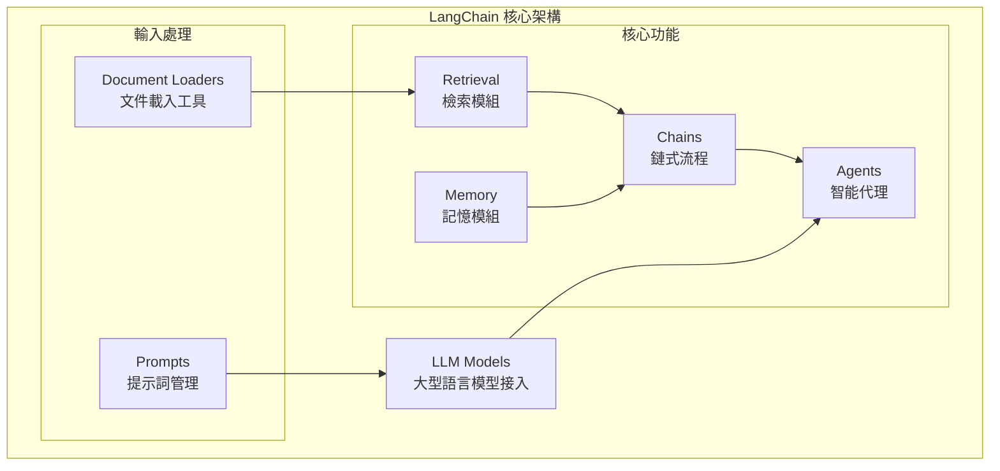

# LangChain 介紹

## 什麼是 LangChain？

LangChain 是一個多功能的框架，可以用來建立利用大型語言模型（LLMs）的應用程式，目前提供 Python 與 TypeScript 版本。

它的核心理念是：最有影響力、最具特色的應用，不應僅僅透過 API 與語言模型互動，而應該同時做到以下兩點：

### 🔍 增強資料感知（Enhance Data Awareness）
這個框架旨在讓語言模型與外部資料來源之間建立無縫的連結。

### 🤖 增強行動力（Enhance Agency）
它的目標是賦予語言模型「與環境互動並影響環境」的能力。

## LangChain 架構概覽

LangChain 框架提供了一系列模組化的抽象化功能（modular abstractions），這些是與 LLM 一起工作所必需的，同時也提供了廣泛的實作版本，方便開發者應用。



### 主要模組說明

| 模組 | 功能說明 | 實際用途 |
|------|----------|----------|
| **LLM Models** | 大型語言模型的接入介面 | 支援 OpenAI GPT、Anthropic Claude、本地模型等 |
| **Prompts** | 提示詞管理 | 定義、組裝與優化 LLM 的輸入格式 |
| **Document Loaders** | 文件載入工具 | 從 PDF、網頁、資料庫等載入並處理資料 |
| **Retrieval** | 檢索模組 | 讓 LLM 從外部知識庫或文件中找到需要的資訊 |
| **Memory** | 記憶模組 | 讓 LLM 能「記住」對話或上下文 |
| **Chains** | 鏈式流程 | 將多個模組串連成有邏輯的工作流程 |
| **Agents** | 智能代理 | 能根據需求自主決定要呼叫哪些工具或資料來源 |

## 什麼是「抽象化」？

### 概念解釋

在軟體設計裡，**抽象化（Abstraction）**就是：
> 隱藏細節，只保留最必要的特徵，讓使用者能更簡單地操作。

- **沒有抽象化** → 你要自己處理一大堆雜事（例如直接呼叫 API，要管 Token、格式、回傳 JSON 等）
- **有抽象化** → 框架幫你把雜事包好，給你一個乾淨的介面

### 實際對比

| 場景 | 沒有抽象化 | 有 LangChain 抽象化 |
|------|------------|-------------------|
| 使用不同 LLM | 要為每個 API 寫不同程式碼 | 統一介面，一行程式碼切換模型 |
| 管理對話記憶 | 手動存取資料庫，拼接上下文 | 掛上 Memory 模組自動處理 |
| 多步驟處理 | 自己設計流程控制邏輯 | 用 Chain 描述步驟即可 |

## LangChain 包裝了哪些複雜功能？

### 1. 🔌 LLM 介接統一化

**原本複雜：** 不同廠牌的 LLM API 格式各異，Token、回傳格式、流式處理都不同。

**LangChain 包裝：** 提供統一的介面，可無痛切換模型。

```python
from langchain_openai import ChatOpenAI
from langchain_anthropic import ChatAnthropic

# 換模型只換這行，其他程式不用改
llm = ChatOpenAI(model="gpt-4")  
# 或 llm = ChatAnthropic(model="claude-3-opus")

response = llm.invoke("幫我寫一首詩")
```

### 2. 📝 Prompt 模板管理

**原本複雜：** 要自己拼字串，把上下文、格式、變數全都寫死。

**LangChain 包裝：** 提供 PromptTemplate，可以用變數填入。

```python
from langchain.prompts import PromptTemplate

template = PromptTemplate.from_template(
    "你是一位營養師，請根據這些數據 {health_data} 提供建議"
)

prompt = template.format(health_data="血糖偏高")
```

### 3. 🧠 Memory（對話記憶）

**原本複雜：** LLM 天生無記憶，要自己管理對話歷史，存資料庫，再手動拼接。

**LangChain 包裝：** 內建各種 Memory 類型，掛上就能記住上下文。

```python
from langchain.chains import ConversationChain
from langchain.memory import ConversationBufferMemory

memory = ConversationBufferMemory()
conversation = ConversationChain(llm=llm, memory=memory)

# 自動記住上下文
conversation.invoke("我叫小明")
conversation.invoke("我剛才說我叫什麼名字？")  # 會記得是小明
```

### 4. 🔍 Retrieval + 外部知識庫整合

**原本複雜：** 要自己寫 embedding、存到向量資料庫、再寫檢索邏輯。

**LangChain 包裝：** 提供 Retriever，一句話就能讓 LLM 接外部知識。

```python
from langchain.chains import RetrievalQA

# 自動檢索相關文件並回答
qa = RetrievalQA.from_chain_type(
    llm=llm, 
    retriever=vectorstore.as_retriever()
)

answer = qa.invoke("公司的請假政策是什麼？")
```

### 5. ⛓️ Chains（多步驟流程組裝）

**原本複雜：** 要手動控制流程：先檢索資料 → 再問 LLM → 再格式化結果。

**LangChain 包裝：** 把多步驟組裝成「流程鏈」。

```python
from langchain.chains import SequentialChain

# 自動執行：分析 → 建議 → 格式化
health_chain = SequentialChain(
    chains=[analysis_chain, recommendation_chain, format_chain],
    input_variables=["health_data"],
    output_variables=["final_report"]
)
```

### 6. 🎯 Agents（動態決策 & 工具調用）

**原本複雜：** 要自己寫 if/else 判斷，決定何時該查 API、何時直接回覆。

**LangChain 包裝：** LLM 自主決定該調用哪個工具。

```python
from langchain.agents import AgentExecutor

# LLM 可根據問題決定：
# - 查天氣 API
# - 查資料庫  
# - 或直接回答
agent = AgentExecutor.from_agent_and_tools(
    agent=agent,
    tools=[weather_tool, database_tool]
)
```

## 實際應用場景

### 場景一：健康 AI 助手

**沒有 LangChain 的複雜度：**
- 手動串接 OpenAI API
- 自己寫程式處理上下文
- 自己實作 embedding + 存 Firestore  
- 手寫 prompt 拼接邏輯
- 設計複雜的 API workflow

**使用 LangChain 的簡化：**
- `ChatOpenAI` 抽象層處理 API
- `ConversationBufferMemory` 處理對話
- `RetrievalQA` 連接 BigQuery 或 Firestore
- `PromptTemplate` 管理健康建議格式
- `Agent` 讓 LLM 自動決定要「查詢數據」還是「直接建議」

### 場景二：客服機器人

```python
# 完整的客服機器人，只需要組裝積木
from langchain.chains import ConversationalRetrievalChain
from langchain.memory import ConversationBufferMemory

# 記憶 + 知識庫檢索 + 對話能力
chatbot = ConversationalRetrievalChain.from_llm(
    llm=llm,
    retriever=company_docs.as_retriever(),
    memory=ConversationBufferMemory(memory_key="chat_history")
)

# 就能處理複雜的多輪對話和知識問答
response = chatbot({"question": "如何申請退貨？"})
```

## 白話理解

**簡單來說**，LangChain 就像是一個「AI 應用程式開發框架」。

它的目的不是讓你只單純問 LLM 問題，而是讓 LLM 可以：
- 📖 讀外部資料
- 🧠 記住上下文  
- 🤔 決定行動
- 🔗 和其他系統互動

### 類比說明

如果把 LangChain 想成 AI 界的「Spring Boot」或「Django」：

- **Spring Boot** 抽象化：不用自己寫 Servlet、處理 Request/Response
- **LangChain** 抽象化：不用自己處理 Prompt、API、Memory、知識庫檢索

## 總結

LangChain 包裝的就是「LLM 開發的重複繁瑣工作」：

- ✅ Prompt 管理
- ✅ 記憶管理  
- ✅ 知識檢索
- ✅ 多步驟流程
- ✅ API/工具調用
- ✅ LLM 模型切換

讓你專注在**應用邏輯**，而不是一直「重造輪子」。

---

::: tip 下一步
現在你已經了解 LangChain 的基本概念，接下來可以：
1. [環境設置](/tutorials/setup) - 準備開發環境
2. [免費 LLM 模型指南](/tutorials/free-llm-models) - 了解免費模型選項
3. [第一個應用](/tutorials/first-app) - 動手實作
:::

::: warning 重要提醒
LangChain 是一個快速發展的框架，API 可能會有變化。建議參考 [官方文檔](https://python.langchain.com/) 獲取最新資訊。
:::