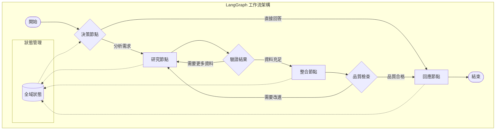

# LangGraph：下一代智能代理框架

## LangGraph 概述

LangGraph 是 LangChain 生態系統中的新一代多代理工作流框架，專門設計來處理複雜的狀態機和條件路由邏輯。它代表了從傳統 Agent 向現代工作流編排的演進。



## 為什麼需要 LangGraph？

### 傳統 Agent 的限制

**問題場景：**
```python
# ❌ 傳統 Agent 問題：線性、難以控制
traditional_agent = AgentExecutor(
    agent=create_react_agent(llm, tools, prompt),
    tools=tools,
    verbose=True
)

# 問題：
# 1. 無法精確控制執行路徑
# 2. 難以處理複雜的條件邏輯  
# 3. 狀態管理困難
# 4. 錯誤恢復機制不足
```

### LangGraph 的解決方案

**核心優勢：**
- 🎯 **精確控制**：明確定義每個執行步驟
- 🔄 **狀態管理**：全域狀態在節點間共享
- 🌊 **條件路由**：基於狀態動態選擇路徑
- 🔧 **錯誤處理**：內建重試和回退機制
- 👥 **多代理協作**：不同專業代理協同工作

## LangGraph 核心概念

### 1. 節點 (Nodes)

每個節點代表一個具體的處理步驟：

```python
from langgraph.graph import Graph, END

def research_node(state):
    """研究節點：收集資訊"""
    query = state["user_query"]
    # 執行研究邏輯
    research_results = search_tool.run(query)
    return {
        "research_data": research_results,
        "step_count": state.get("step_count", 0) + 1
    }

def analysis_node(state):
    """分析節點：處理資訊"""
    data = state["research_data"]
    # 執行分析邏輯
    analysis = llm.invoke(f"分析以下資料：{data}")
    return {
        "analysis_result": analysis.content,
        "is_complete": True
    }
```

### 2. 邊緣 (Edges) 和條件路由

```python
def should_continue_research(state):
    """決定是否需要繼續研究"""
    if state.get("step_count", 0) >= 3:
        return "analysis"  # 達到上限，進入分析
    if len(state.get("research_data", "")) < 100:
        return "research"  # 資料不足，繼續研究
    return "analysis"  # 資料充足，進入分析

def route_based_on_query_type(state):
    """根據查詢類型選擇路徑"""
    query = state["user_query"].lower()
    if "分析" in query or "比較" in query:
        return "deep_analysis"
    elif "快速" in query or "簡單" in query:
        return "quick_response"
    else:
        return "standard_process"
```

### 3. 完整工作流範例

```python
from langgraph.graph import Graph, END

# 建立工作流圖
workflow = Graph()

# 添加節點
workflow.add_node("research", research_node)
workflow.add_node("analysis", analysis_node)
workflow.add_node("synthesis", synthesis_node)
workflow.add_node("validation", validation_node)

# 設定入口點
workflow.set_entry_point("research")

# 添加條件邊緣
workflow.add_conditional_edges(
    "research",
    should_continue_research,
    {
        "research": "research",  # 繼續研究
        "analysis": "analysis"   # 進入分析
    }
)

# 添加普通邊緣
workflow.add_edge("analysis", "synthesis")
workflow.add_edge("synthesis", "validation")

# 添加結束條件
workflow.add_conditional_edges(
    "validation",
    lambda state: "end" if state.get("is_valid") else "research",
    {
        "end": END,
        "research": "research"
    }
)

# 編譯工作流
app = workflow.compile()
```

## 實際應用案例

### 案例一：智能研究助手

```python
# 多階段研究工作流
def create_research_workflow():
    workflow = Graph()
    
    # 研究規劃節點
    def plan_research(state):
        query = state["user_query"]
        plan = llm.invoke(f"制定研究計劃：{query}")
        return {"research_plan": plan.content}
    
    # 資料收集節點
    def collect_data(state):
        plan = state["research_plan"]
        # 使用多種工具收集資料
        web_data = web_search_tool.run(plan)
        academic_data = academic_search_tool.run(plan)
        return {
            "collected_data": {
                "web": web_data,
                "academic": academic_data
            }
        }
    
    # 分析整合節點
    def synthesize_findings(state):
        data = state["collected_data"]
        synthesis = llm.invoke(f"整合研究發現：{data}")
        return {"final_report": synthesis.content}
    
    workflow.add_node("plan", plan_research)
    workflow.add_node("collect", collect_data)
    workflow.add_node("synthesize", synthesize_findings)
    
    workflow.set_entry_point("plan")
    workflow.add_edge("plan", "collect")
    workflow.add_edge("collect", "synthesize")
    workflow.add_edge("synthesize", END)
    
    return workflow.compile()

# 使用範例
research_app = create_research_workflow()
result = research_app.invoke({"user_query": "分析 2024 年 AI 發展趨勢"})
print(result["final_report"])
```

### 案例二：多代理客服系統

```python
def create_customer_service_workflow():
    workflow = Graph()
    
    # 分類代理
    def classify_inquiry(state):
        inquiry = state["customer_inquiry"]
        category = classification_llm.invoke(f"分類客戶問題：{inquiry}")
        return {"inquiry_category": category.content}
    
    # 技術支援代理
    def handle_technical(state):
        inquiry = state["customer_inquiry"]
        solution = technical_llm.invoke(f"提供技術解決方案：{inquiry}")
        return {"response": solution.content, "agent_type": "technical"}
    
    # billing 代理
    def handle_billing(state):
        inquiry = state["customer_inquiry"]
        # 查詢billing系統
        billing_info = billing_system.query(state["customer_id"])
        response = billing_llm.invoke(f"處理帳務問題：{inquiry}，客戶資料：{billing_info}")
        return {"response": response.content, "agent_type": "billing"}
    
    # 路由邏輯
    def route_inquiry(state):
        category = state["inquiry_category"].lower()
        if "技術" in category or "功能" in category:
            return "technical"
        elif "帳單" in category or "付款" in category:
            return "billing"
        else:
            return "general"
    
    workflow.add_node("classify", classify_inquiry)
    workflow.add_node("technical", handle_technical)
    workflow.add_node("billing", handle_billing)
    
    workflow.set_entry_point("classify")
    workflow.add_conditional_edges(
        "classify",
        route_inquiry,
        {
            "technical": "technical",
            "billing": "billing",
            "general": END
        }
    )
    
    workflow.add_edge("technical", END)
    workflow.add_edge("billing", END)
    
    return workflow.compile()
```

### 案例三：內容創作工作流

```python
def create_content_creation_workflow():
    """內容創作的多階段工作流"""
    workflow = Graph()
    
    def brainstorm_ideas(state):
        """創意發想節點"""
        topic = state["topic"]
        angle = state.get("angle", "一般觀點")
        
        brainstorm_prompt = f"""
        主題：{topic}
        角度：{angle}
        請發想 5 個有創意的內容點子，每個點子包含：
        1. 標題
        2. 核心論點
        3. 目標受眾
        """
        
        ideas = creative_llm.invoke(brainstorm_prompt)
        return {"ideas": ideas.content, "status": "ideas_generated"}
    
    def select_best_idea(state):
        """選擇最佳創意節點"""
        ideas = state["ideas"]
        topic = state["topic"]
        
        selection_prompt = f"""
        從以下創意中選擇最適合的一個：
        {ideas}
        
        選擇標準：
        - 新穎性
        - 實用性  
        - 吸引力
        
        請返回選中的創意及理由。
        """
        
        selected = editor_llm.invoke(selection_prompt)
        return {"selected_idea": selected.content, "status": "idea_selected"}
    
    def create_outline(state):
        """創建大綱節點"""
        idea = state["selected_idea"]
        
        outline_prompt = f"""
        基於以下創意創建詳細大綱：
        {idea}
        
        大綱應包含：
        1. 引言 (吸引讀者注意)
        2. 主要論點 (3-5個要點)
        3. 實例和證據
        4. 結論和行動建議
        """
        
        outline = structure_llm.invoke(outline_prompt)
        return {"outline": outline.content, "status": "outline_created"}
    
    def write_content(state):
        """內容撰寫節點"""
        outline = state["outline"]
        topic = state["topic"]
        
        writing_prompt = f"""
        基於以下大綱撰寫完整文章：
        {outline}
        
        寫作要求：
        - 語調：{state.get('tone', '專業而友善')}
        - 長度：{state.get('length', '800-1200字')}
        - 風格：清晰易懂，結構分明
        """
        
        content = writer_llm.invoke(writing_prompt)
        return {"draft_content": content.content, "status": "content_written"}
    
    def review_content(state):
        """內容審查節點"""
        content = state["draft_content"]
        
        review_prompt = f"""
        審查以下內容的品質：
        {content}
        
        評估標準：
        1. 邏輯性 (1-10分)
        2. 可讀性 (1-10分) 
        3. 準確性 (1-10分)
        4. 吸引力 (1-10分)
        
        如果任何項目低於7分，請提供修改建議。
        總分達到28分以上視為通過。
        """
        
        review = editor_llm.invoke(review_prompt)
        
        # 簡化的評分提取（實際中應使用結構化輸出）
        total_score = extract_score_from_review(review.content)
        
        return {
            "review_result": review.content,
            "quality_score": total_score,
            "needs_revision": total_score < 28,
            "status": "content_reviewed"
        }
    
    def revise_content(state):
        """內容修訂節點"""
        content = state["draft_content"]
        review = state["review_result"]
        
        revision_prompt = f"""
        根據以下審查意見修訂內容：
        
        原內容：
        {content}
        
        審查意見：
        {review}
        
        請提供修訂後的完整內容。
        """
        
        revised = writer_llm.invoke(revision_prompt)
        return {
            "draft_content": revised.content,  # 更新草稿
            "revision_count": state.get("revision_count", 0) + 1,
            "status": "content_revised"
        }
    
    def finalize_content(state):
        """內容定稿節點"""
        content = state["draft_content"]
        
        # 最終格式化和潤色
        final_prompt = f"""
        對以下內容進行最終潤色：
        {content}
        
        最終檢查：
        - 修正語法和拼寫
        - 優化段落結構
        - 確保用詞準確
        - 添加必要的標點符號
        """
        
        final_content = editor_llm.invoke(final_prompt)
        
        return {
            "final_content": final_content.content,
            "status": "completed",
            "word_count": len(final_content.content),
            "creation_summary": create_summary(state)
        }
    
    # 路由決策函數
    def should_continue_revision(state):
        """決定是否需要繼續修訂"""
        if state.get("needs_revision", False):
            revision_count = state.get("revision_count", 0)
            if revision_count < 2:  # 最多修訂2次
                return "revise"
            else:
                return "finalize"  # 達到修訂上限，強制定稿
        else:
            return "finalize"  # 品質合格，直接定稿
    
    def route_after_brainstorm(state):
        """發想後的路由"""
        ideas = state["ideas"]
        if "insufficient" in ideas.lower():
            return "brainstorm"  # 如果創意不足，重新發想
        return "select"
    
    # 構建工作流圖
    workflow.add_node("brainstorm", brainstorm_ideas)
    workflow.add_node("select", select_best_idea) 
    workflow.add_node("outline", create_outline)
    workflow.add_node("write", write_content)
    workflow.add_node("review", review_content)
    workflow.add_node("revise", revise_content)
    workflow.add_node("finalize", finalize_content)
    
    # 設定流程
    workflow.set_entry_point("brainstorm")
    
    workflow.add_conditional_edges(
        "brainstorm",
        route_after_brainstorm,
        {
            "brainstorm": "brainstorm",  # 重新發想
            "select": "select"  # 進入選擇階段
        }
    )
    
    workflow.add_edge("select", "outline")
    workflow.add_edge("outline", "write") 
    workflow.add_edge("write", "review")
    
    workflow.add_conditional_edges(
        "review",
        should_continue_revision,
        {
            "revise": "revise",
            "finalize": "finalize"
        }
    )
    
    workflow.add_edge("revise", "review")  # 修訂後重新審查
    workflow.add_edge("finalize", END)
    
    return workflow.compile()

# 輔助函數
def extract_score_from_review(review_text):
    """從審查文本中提取分數（簡化實現）"""
    import re
    scores = re.findall(r'(\d+)分', review_text)
    if len(scores) >= 4:
        return sum(int(score) for score in scores[:4])
    return 20  # 默認較低分數，觸發修訂

def create_summary(state):
    """創建創作過程摘要"""
    return {
        "topic": state["topic"],
        "total_revisions": state.get("revision_count", 0),
        "final_score": state.get("quality_score", 0),
        "process_steps": state.get("status", "completed")
    }

# 使用範例
async def demo_content_creation():
    content_workflow = create_content_creation_workflow()
    
    # 啟動內容創作流程
    result = await content_workflow.ainvoke({
        "topic": "遠程工作的未來趨勢",
        "angle": "技術和人文結合的觀點", 
        "tone": "專業而引人入勝",
        "length": "1000字左右"
    })
    
    print("=== 內容創作完成 ===")
    print(f"主題：{result['topic']}")
    print(f"字數：{result['word_count']}")
    print(f"修訂次數：{result['creation_summary']['total_revisions']}")
    print(f"最終評分：{result['creation_summary']['final_score']}")
    print("\\n=== 最終內容 ===")
    print(result['final_content'])

# asyncio.run(demo_content_creation())
```

## LangGraph 最佳實踐

### 1. 狀態設計原則

```python
# ✅ 好的狀態設計
class WorkflowState(TypedDict):
    user_input: str
    processed_data: Dict[str, Any]
    step_count: int
    error_count: int
    is_complete: bool
    metadata: Dict[str, str]

# ❌ 避免的設計
# 狀態過於複雜、缺乏類型提示、沒有清晰的資料流向
```

### 2. 錯誤處理機制

```python
def resilient_node(state):
    try:
        # 主要邏輯
        result = process_data(state["input"])
        return {"result": result, "error_count": 0}
    except Exception as e:
        error_count = state.get("error_count", 0) + 1
        if error_count >= 3:
            return {"error": str(e), "should_terminate": True}
        else:
            return {"error_count": error_count, "retry_needed": True}
```

### 3. 可觀測性與監控

```python
def monitored_node(state):
    start_time = time.time()
    
    # 記錄開始
    logger.info(f"Node started: {state.get('current_step', 'unknown')}")
    
    try:
        result = core_logic(state)
        
        # 記錄成功
        duration = time.time() - start_time
        logger.info(f"Node completed in {duration:.2f}s")
        
        return result
    except Exception as e:
        # 記錄錯誤
        logger.error(f"Node failed: {str(e)}")
        raise
```

## LangGraph vs 傳統 Agent 比較

| 特性 | 傳統 Agent | LangGraph |
|------|-----------|----------|
| **控制精度** | 有限 | 完全控制 |
| **狀態管理** | 困難 | 原生支援 |
| **條件邏輯** | 基礎 | 豐富靈活 |
| **多代理協作** | 複雜 | 簡單明確 |
| **錯誤處理** | 基本 | 完整機制 |
| **可觀測性** | 有限 | 完整支援 |
| **學習曲線** | 中等 | 較高 |
| **適用場景** | 簡單任務 | 複雜工作流 |

## 進階特性

### 1. 人機協作節點

```python
def human_approval_node(state):
    """需要人類審批的節點"""
    result = state["processing_result"]
    
    # 顯示結果給人類
    print(f"處理結果：{result}")
    approval = input("是否批准？(y/n): ")
    
    return {
        "human_approved": approval.lower() == 'y',
        "approval_time": datetime.now()
    }

# 在工作流中添加人類決策點
workflow.add_conditional_edges(
    "process_data",
    lambda state: "human_approval" if state.get("requires_approval") else "auto_complete",
    {
        "human_approval": "human_approval",
        "auto_complete": "finalize"
    }
)
```

### 2. 動態節點生成

```python
def create_dynamic_workflow(task_list):
    """根據任務清單動態創建工作流"""
    workflow = Graph()
    
    # 動態添加節點
    for i, task in enumerate(task_list):
        def create_task_node(task_config):
            def task_node(state):
                return process_task(state, task_config)
            return task_node
        
        node_name = f"task_{i}"
        workflow.add_node(node_name, create_task_node(task))
        
        if i == 0:
            workflow.set_entry_point(node_name)
        else:
            workflow.add_edge(f"task_{i-1}", node_name)
    
    workflow.add_edge(f"task_{len(task_list)-1}", END)
    return workflow.compile()
```

### 3. 條件循環控制

```python
def create_iterative_workflow():
    """創建迭代式工作流"""
    workflow = Graph()
    
    def iteration_controller(state):
        """控制迭代次數和條件"""
        current_iteration = state.get("iteration", 0)
        max_iterations = state.get("max_iterations", 5)
        quality_threshold = state.get("quality_threshold", 0.8)
        current_quality = state.get("quality_score", 0.0)
        
        # 檢查終止條件
        if current_quality >= quality_threshold:
            return "complete"
        elif current_iteration >= max_iterations:
            return "max_reached"
        else:
            return "continue"
    
    workflow.add_node("process", process_node)
    workflow.add_node("evaluate", evaluate_node)
    workflow.add_node("improve", improve_node)
    
    workflow.set_entry_point("process")
    workflow.add_edge("process", "evaluate")
    
    workflow.add_conditional_edges(
        "evaluate",
        iteration_controller,
        {
            "continue": "improve",
            "complete": END,
            "max_reached": END
        }
    )
    
    workflow.add_edge("improve", "process")  # 形成循環
    
    return workflow.compile()
```

## 總結

LangGraph 代表了智能代理框架的重大進步：

- 🎯 **精確控制** - 完全掌控執行流程的每個步驟
- 🔄 **狀態管理** - 全域狀態讓複雜邏輯變得可管理
- 🌊 **靈活路由** - 基於狀態的動態決策機制
- 👥 **協作框架** - 支援多個專業代理的無縫協作
- 🛡️ **錯誤恢復** - 內建重試和異常處理機制
- 🔍 **可觀測性** - 完整的執行追蹤和調試支援

LangGraph 特別適合：
- 複雜的多步驟任務處理
- 需要條件邏輯的智能決策
- 多代理協作的企業級應用
- 對執行過程有精確控制需求的場景

它不僅僅是工具的升級，更是對複雜 AI 工作流的重新思考。

---

::: tip 下一步
現在你已經掌握了 LangGraph 的核心概念，接下來可以：
1. [結構化輸出解析](/tutorials/output-parsers) - 在工作流中使用結構化數據
2. [記憶機制與對話管理](/tutorials/memory-systems) - 為工作流添加記憶能力
3. [監控與可觀測性](/tutorials/monitoring) - 深度監控工作流執行
4. [進階應用案例](/tutorials/advanced-examples) - 學習企業級實現
:::

::: warning 開發建議
- **從簡單開始**：先掌握基本的節點→邊緣→條件路由模式
- **狀態設計**：仔細設計狀態結構，這是工作流的基礎
- **測試策略**：為每個節點編寫單元測試，確保邏輯正確
- **監控完備**：在生產環境中充分利用可觀測性功能
- **錯誤處理**：為每個節點設計適當的錯誤恢復策略
:::