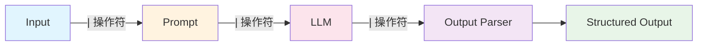

# LCEL (LangChain Expression Language) 表達式語言

## 什麼是 LCEL？

LCEL 是 LangChain v0.2+ 的核心執行引擎，使用 `|` 管道操作符來組合各種組件。它提供了一種聲明式的方式來構建複雜的 AI 應用程式流程。



## LCEL 核心概念

### Runnables 介面

所有 LangChain 組件都實現了 `Runnable` 介面，提供統一的執行方法：

```python
from langchain_core.runnables import Runnable
from langchain_openai import ChatOpenAI
from langchain_core.prompts import PromptTemplate
from langchain_core.output_parsers import StrOutputParser

# 所有組件都是 Runnable
llm = ChatOpenAI(model="gpt-4o-mini")
prompt = PromptTemplate.from_template("翻譯成中文: {text}")
parser = StrOutputParser()

# 使用 | 操作符組合
chain = prompt | llm | parser

# 統一的執行介面
result = chain.invoke({"text": "Hello, world!"})
print(result)  # 你好，世界！
```

### 管道操作符的威力

**傳統做法 vs LCEL 做法對比：**

```python
# ❌ 傳統做法：手動管理中間步驟
def traditional_approach(input_text):
    prompt_result = prompt.format(text=input_text)
    llm_result = llm.invoke(prompt_result)
    final_result = parser.parse(llm_result.content)
    return final_result

# ✅ LCEL 做法：聲明式管道
chain = prompt | llm | parser
result = chain.invoke({"text": input_text})
```

## 進階 LCEL 模式

### 1. 平行處理 (RunnableParallel)

```python
from langchain_core.runnables import RunnableParallel, RunnablePassthrough

# 同時執行多個分析
analysis_chain = RunnableParallel({
    "sentiment": PromptTemplate.from_template("分析情感: {text}") | llm | parser,
    "summary": PromptTemplate.from_template("總結內容: {text}") | llm | parser,
    "keywords": PromptTemplate.from_template("提取關鍵字: {text}") | llm | parser,
    "original": RunnablePassthrough()  # 保留原始輸入
})

# 同時獲得三種分析結果
results = analysis_chain.invoke({"text": "今天天氣真好，心情很愉快！"})
print(results)  # {"sentiment": "正面", "summary": "...", "keywords": "...", "original": "..."}
```

### 2. 條件分支 (RunnableBranch)

```python
from langchain_core.runnables import RunnableBranch

# 根據輸入內容選擇不同處理路徑
branch = RunnableBranch(
    # 條件：如果是問題，走 QA 路徑
    (lambda x: "?" in x.get("text", ""), 
     PromptTemplate.from_template("回答問題: {text}") | llm | parser),
    
    # 條件：如果是翻譯請求，走翻譯路徑  
    (lambda x: "translate" in x.get("text", "").lower(),
     PromptTemplate.from_template("翻譯: {text}") | llm | parser),
    
    # 默認路徑：普通對話
    PromptTemplate.from_template("聊天: {text}") | llm | parser
)

result = branch.invoke({"text": "What is AI?"})
```

### 3. 動態路由 (RunnableLambda)

```python
from langchain_core.runnables import RunnableLambda

def route_by_language(input_dict):
    text = input_dict["text"]
    if any(ord(char) > 127 for char in text):  # 包含中文
        return "chinese_chain"
    else:
        return "english_chain"

router = RunnableLambda(route_by_language)

# 完整的路由鏈
routing_chain = {
    "route": router,
    "input": RunnablePassthrough()
} | RunnableLambda(lambda x: chains[x["route"]].invoke(x["input"]))
```

## LCEL 最佳實踐

### 1. 組合式設計

```python
# 構建可重複使用的組件
sentiment_analyzer = (
    PromptTemplate.from_template("分析以下文本的情感傾向：{text}")
    | llm 
    | StrOutputParser()
)

summarizer = (
    PromptTemplate.from_template("總結以下內容：{text}")
    | llm 
    | StrOutputParser()
)

# 組合成完整流程
content_processor = RunnableParallel({
    "sentiment": sentiment_analyzer,
    "summary": summarizer,
    "original": RunnablePassthrough()
})
```

### 2. 錯誤處理與重試

```python
from langchain_core.runnables import RunnableRetry

# 添加重試機制
resilient_chain = (
    prompt 
    | RunnableRetry(llm, max_attempt_number=3) 
    | parser
)
```

### 3. 異步執行支持

```python
import asyncio

# 所有 LCEL 鏈都支持異步執行
async def async_processing():
    result = await chain.ainvoke({"text": "Hello"})
    return result

# 批量處理
async def batch_processing(inputs):
    results = await chain.abatch(inputs)
    return results
```

## LCEL vs 傳統 Chains 對比

| 特性 | 傳統 Chains | LCEL |
|------|------------|------|
| **語法** | 類別實例化 | 管道操作符 `\|` |
| **組合性** | 固定結構 | 靈活組合 |
| **平行處理** | 需要額外設定 | 原生支持 |
| **異步支持** | 部分支持 | 完整支持 |
| **錯誤處理** | 手動處理 | 內建機制 |
| **可讀性** | 複雜配置 | 直觀流程 |
| **維護性** | 較低 | 較高 |

## 實際應用範例

### 基本文本處理鏈

```python
from langchain_core.prompts import ChatPromptTemplate
from langchain_openai import ChatOpenAI
from langchain_core.output_parsers import StrOutputParser

# 建立基本處理鏈
llm = ChatOpenAI(model="gpt-4o-mini")
prompt = ChatPromptTemplate.from_template("改寫以下文本，使其更專業：\n{text}")
parser = StrOutputParser()

# LCEL 鏈
professional_writer = prompt | llm | parser

# 使用
result = professional_writer.invoke({"text": "這個產品還不錯啦"})
print(result)  # "此產品具有良好的品質表現"
```

### 多步驟分析鏈

```python
# 多步驟健康分析流程
health_prompt_1 = PromptTemplate.from_template("分析健康數據：{health_data}")
health_prompt_2 = PromptTemplate.from_template("基於分析 {analysis} 提供建議")
health_prompt_3 = PromptTemplate.from_template("格式化建議 {recommendation} 為報告")

# 使用 RunnablePassthrough 傳遞數據
from langchain_core.runnables import RunnablePassthrough

health_pipeline = (
    {"health_data": RunnablePassthrough()}
    | health_prompt_1
    | llm
    | {"analysis": StrOutputParser()}
    | health_prompt_2
    | llm 
    | {"recommendation": StrOutputParser()}
    | health_prompt_3
    | llm
    | StrOutputParser()
)

# 使用範例
result = health_pipeline.invoke("血糖偏高 130mg/dL")
print(result)
```

### 條件邏輯處理鏈

```python
from langchain_core.runnables import RunnableBranch

# 智能客服路由鏈
def classify_intent(input_dict):
    text = input_dict["text"].lower()
    if any(word in text for word in ["退貨", "退款", "換貨"]):
        return "refund"
    elif any(word in text for word in ["送貨", "物流", "配送"]):
        return "shipping"
    elif any(word in text for word in ["技術", "故障", "問題"]):
        return "technical"
    else:
        return "general"

intent_router = RunnableLambda(classify_intent)

# 不同意圖的處理鏈
refund_chain = PromptTemplate.from_template(
    "處理退款請求：{text}\n請提供退款流程和所需資料"
) | llm | parser

shipping_chain = PromptTemplate.from_template(
    "處理物流查詢：{text}\n請提供物流狀態和預計送達時間"
) | llm | parser

technical_chain = PromptTemplate.from_template(
    "處理技術問題：{text}\n請提供技術支援和解決方案"
) | llm | parser

general_chain = PromptTemplate.from_template(
    "一般客服回應：{text}\n請提供友善且有幫助的回答"
) | llm | parser

# 組合智能客服系統
customer_service = RunnableBranch(
    (lambda x: classify_intent(x) == "refund", refund_chain),
    (lambda x: classify_intent(x) == "shipping", shipping_chain),
    (lambda x: classify_intent(x) == "technical", technical_chain),
    general_chain  # 默認處理
)

# 測試不同類型的客服請求
queries = [
    {"text": "我要退貨，商品有問題"},
    {"text": "我的包裹什麼時候會到？"},
    {"text": "產品無法開機，怎麼辦？"},
    {"text": "你們的營業時間是？"}
]

for query in queries:
    response = customer_service.invoke(query)
    print(f"客戶：{query['text']}")
    print(f"客服：{response}\n")
```

## 性能優化技巧

### 1. 批量處理優化

```python
# 單個處理 vs 批量處理
texts = ["文本1", "文本2", "文本3", "文本4", "文本5"]

# ❌ 效率較低：逐個處理
results = []
for text in texts:
    result = chain.invoke({"text": text})
    results.append(result)

# ✅ 高效：批量處理
results = chain.batch([{"text": text} for text in texts])
```

### 2. 異步並行處理

```python
import asyncio

async def parallel_processing():
    tasks = [
        chain.ainvoke({"text": f"處理文本 {i}"}) 
        for i in range(10)
    ]
    
    # 並行執行所有任務
    results = await asyncio.gather(*tasks)
    return results

# 運行異步處理
results = asyncio.run(parallel_processing())
```

### 3. 流式處理

```python
# 流式輸出，適合長文本生成
for chunk in chain.stream({"text": "寫一篇長文章關於 AI 的未來"}):
    print(chunk, end="", flush=True)
```

## 調試和監控

### 1. 鏈的結構檢查

```python
# 檢查鏈的結構
print("輸入 Schema:", chain.input_schema)
print("輸出 Schema:", chain.output_schema)

# 獲取鏈的配置資訊
print("鏈配置:", chain.config)
```

### 2. 中間結果監控

```python
# 添加中間步驟的輸出監控
def debug_step(step_name):
    def _debug(x):
        print(f"[DEBUG] {step_name}: {x}")
        return x
    return RunnableLambda(_debug)

# 在鏈中插入監控點
debug_chain = (
    prompt 
    | debug_step("Prompt 輸出")
    | llm 
    | debug_step("LLM 輸出")
    | parser
    | debug_step("最終結果")
)
```

## 總結

LCEL 表達式語言是 LangChain v0.2+ 的核心創新，它提供了：

- 🔗 **直觀的管道語法** - 用 `|` 操作符輕鬆組合組件
- 🚀 **原生異步支持** - 高性能的並行處理能力
- 🔄 **靈活的條件邏輯** - 支持複雜的分支和路由
- 🛡️ **內建錯誤處理** - 自動重試和異常恢復
- 📊 **統一的介面抽象** - 所有組件都遵循相同的 Runnable 協議
- 🔍 **易於調試監控** - 清晰的中間狀態和執行追蹤

掌握 LCEL 是使用現代 LangChain 的關鍵，它讓 AI 應用的開發變得更加簡潔、強大和可維護。

---

::: tip 下一步
現在你已經掌握了 LCEL 的核心概念，接下來可以：
1. [LangGraph 工作流](/tutorials/langgraph) - 學習更複雜的狀態機和多代理協作
2. [結構化輸出解析](/tutorials/output-parsers) - 在 LCEL 中使用結構化輸出
3. [記憶機制與對話管理](/tutorials/memory-systems) - 結合記憶系統建構對話應用
:::

::: warning 實踐建議
- **從簡單開始**：先掌握基本的 `prompt | llm | parser` 模式
- **善用組合**：將複雜邏輯分解為可重用的小組件
- **異步優先**：在處理大量數據時優先使用異步方法
- **監控調試**：在開發階段充分利用調試和監控功能
:::