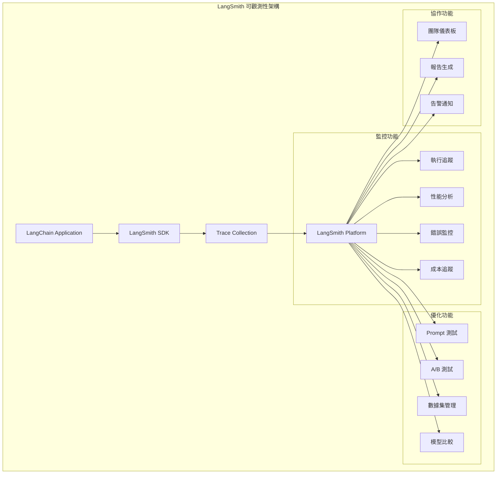

# 監控與可觀測性 (LangSmith Integration)

## LangSmith 概述

LangSmith 是 LangChain 官方的可觀測性平台，提供完整的 AI 應用程式監控、調試和優化功能。



## LangSmith 基本設置

### 環境配置

```python
import os
from langchain_openai import ChatOpenAI
from langchain_core.prompts import ChatPromptTemplate

# 設置 LangSmith 追蹤
os.environ["LANGCHAIN_TRACING_V2"] = "true"
os.environ["LANGCHAIN_ENDPOINT"] = "https://api.smith.langchain.com"
os.environ["LANGCHAIN_API_KEY"] = "your_langsmith_api_key"  # 從環境變數獲取
os.environ["LANGCHAIN_PROJECT"] = "your_project_name"  # 專案名稱

# 所有後續的 LangChain 執行都會被自動追蹤
llm = ChatOpenAI(model="gpt-4o-mini")
prompt = ChatPromptTemplate.from_template("回答問題：{question}")
chain = prompt | llm

# 這個執行會被追蹤到 LangSmith
result = chain.invoke({"question": "什麼是機器學習？"})
```

### 自定義追蹤標籤

```python
from langsmith import traceable
from langchain.callbacks import LangChainTracer

# 方法一：使用 @traceable 裝飾器
@traceable(name="custom_analysis")
def analyze_sentiment(text: str) -> dict:
    """自定義函數追蹤"""
    chain = sentiment_prompt | llm | sentiment_parser
    result = chain.invoke({"text": text})
    
    return {
        "sentiment": result.sentiment,
        "confidence": result.confidence,
        "processing_time": time.time()  # 自定義指標
    }

# 方法二：使用 LangChainTracer
tracer = LangChainTracer(
    project_name="sentiment_analysis",
    tags=["production", "v2.0"]  # 自定義標籤
)

chain_with_tracer = chain.with_config({
    "callbacks": [tracer],
    "tags": ["sentiment", "batch_processing"]
})

result = chain_with_tracer.invoke({"question": "分析這段文字的情感"})
```

## 進階監控功能

### 1. 性能監控與分析

```python
from langsmith import Client
import time
from typing import Dict, Any

class PerformanceMonitor:
    def __init__(self, project_name: str):
        self.client = Client()
        self.project_name = project_name
    
    @traceable(name="monitored_chain_execution")
    def execute_with_monitoring(self, chain, inputs: Dict[str, Any]):
        """帶性能監控的鏈執行"""
        start_time = time.time()
        
        try:
            # 執行鏈
            result = chain.invoke(inputs)
            
            # 記錄成功指標
            execution_time = time.time() - start_time
            self._log_performance_metrics({
                "execution_time": execution_time,
                "status": "success",
                "input_length": len(str(inputs)),
                "output_length": len(str(result))
            })
            
            return result
            
        except Exception as e:
            # 記錄錯誤指標
            self._log_error_metrics({
                "error_type": type(e).__name__,
                "error_message": str(e),
                "execution_time": time.time() - start_time
            })
            raise
    
    def _log_performance_metrics(self, metrics: dict):
        """記錄性能指標"""
        # 發送自定義指標到 LangSmith
        pass
    
    def _log_error_metrics(self, metrics: dict):
        """記錄錯誤指標"""
        # 發送錯誤指標到 LangSmith
        pass

# 使用範例
monitor = PerformanceMonitor("production_analysis")
result = monitor.execute_with_monitoring(analysis_chain, {"data": input_data})
```

### 2. 自動化測試與評估

```python
from langsmith.evaluation import evaluate
from langsmith.schemas import Dataset, Example

# 建立測試資料集
def create_evaluation_dataset():
    examples = [
        Example(
            inputs={"question": "什麼是人工智慧？"},
            outputs={"answer": "人工智慧是一門讓機器能夠模擬人類智慧的技術..."},
            metadata={"category": "definition", "difficulty": "easy"}
        ),
        Example(
            inputs={"question": "解釋深度學習的原理"},
            outputs={"answer": "深度學習是一種機器學習方法..."},
            metadata={"category": "technical", "difficulty": "hard"}
        )
    ]
    
    return Dataset(
        name="ai_qa_evaluation",
        description="AI 問答系統評估數據集",
        examples=examples
    )

# 定義評估函數
def accuracy_evaluator(run, example) -> dict:
    """準確性評估器"""
    expected = example.outputs["answer"]
    actual = run.outputs["answer"]
    
    # 使用 LLM 評估答案相似性
    evaluation_prompt = f"""
    評估以下兩個答案的相似性（0-1 分）：
    期望答案：{expected}
    實際答案：{actual}
    """
    
    eval_llm = ChatOpenAI(model="gpt-4o-mini")
    score = eval_llm.invoke(evaluation_prompt)
    
    return {"score": float(score.content), "key": "accuracy"}

# 執行評估
dataset = create_evaluation_dataset()
results = evaluate(
    lambda inputs: qa_chain.invoke(inputs),  # 要測試的函數
    data=dataset,
    evaluators=[accuracy_evaluator],
    experiment_prefix="qa_system_v2",
    metadata={"version": "2.0", "model": "gpt-4o-mini"}
)

print(f"平均準確性：{results['accuracy']}")
```

### 3. A/B 測試框架

```python
import random
from enum import Enum

class ModelVariant(Enum):
    VARIANT_A = "gpt-4o-mini"
    VARIANT_B = "gpt-4o"

class ABTestFramework:
    def __init__(self, split_ratio=0.5):
        self.split_ratio = split_ratio
        self.results = {"A": [], "B": []}
    
    @traceable(name="ab_test_execution")
    def execute_ab_test(self, user_input: str, session_id: str):
        """執行 A/B 測試"""
        
        # 決定使用哪個變體
        variant = self._assign_variant(session_id)
        
        # 根據變體建立不同的鏈
        if variant == "A":
            llm = ChatOpenAI(model=ModelVariant.VARIANT_A.value)
            chain = prompt | llm
        else:
            llm = ChatOpenAI(model=ModelVariant.VARIANT_B.value)
            chain = prompt | llm
        
        # 執行並記錄結果
        result = chain.invoke({"input": user_input})
        
        # 記錄到 LangSmith（包含變體資訊）
        self._log_ab_result(variant, user_input, result, session_id)
        
        return result
    
    def _assign_variant(self, session_id: str) -> str:
        """基於 session_id 穩定地分配變體"""
        hash_value = hash(session_id)
        return "A" if hash_value % 2 == 0 else "B"
    
    @traceable(name="ab_test_logging")
    def _log_ab_result(self, variant: str, input_data: str, 
                      result: Any, session_id: str):
        """記錄 A/B 測試結果"""
        log_data = {
            "variant": variant,
            "session_id": session_id,
            "input_length": len(input_data),
            "output_length": len(str(result)),
            "timestamp": time.time()
        }
        
        # 發送到 LangSmith 進行分析
        self.results[variant].append(log_data)

# 使用 A/B 測試
ab_tester = ABTestFramework()
result = ab_tester.execute_ab_test(
    "解釋量子計算的基本原理", 
    "user_12345"
)
```

## 生產環境監控最佳實踐

### 1. 告警系統設置

```python
from langsmith import Client
from typing import Callable
import logging

class ProductionMonitor:
    def __init__(self, alert_thresholds: dict):
        self.client = Client()
        self.thresholds = alert_thresholds
        self.logger = logging.getLogger(__name__)
    
    @traceable(name="production_execution_monitor")
    def monitor_execution(self, chain_func: Callable, inputs: dict):
        """生產環境執行監控"""
        start_time = time.time()
        
        try:
            result = chain_func(inputs)
            execution_time = time.time() - start_time
            
            # 檢查性能告警
            self._check_performance_alerts(execution_time)
            
            # 檢查輸出品質
            self._check_output_quality(result)
            
            return result
            
        except Exception as e:
            self._handle_error_alert(e)
            raise
    
    def _check_performance_alerts(self, execution_time: float):
        """檢查性能告警"""
        if execution_time > self.thresholds.get("max_execution_time", 30):
            self._send_alert(
                "PERFORMANCE",
                f"執行時間過長：{execution_time:.2f}秒"
            )
    
    def _check_output_quality(self, result: Any):
        """檢查輸出品質"""
        output_text = str(result)
        
        # 檢查空輸出
        if len(output_text.strip()) == 0:
            self._send_alert("QUALITY", "檢測到空輸出")
        
        # 檢查錯誤關鍵字
        error_keywords = ["錯誤", "失敗", "無法", "不知道"]
        if any(keyword in output_text for keyword in error_keywords):
            self._send_alert("QUALITY", f"檢測到問題輸出：{output_text[:100]}...")
    
    def _handle_error_alert(self, error: Exception):
        """處理錯誤告警"""
        self._send_alert(
            "ERROR",
            f"系統錯誤：{type(error).__name__} - {str(error)}"
        )
    
    def _send_alert(self, alert_type: str, message: str):
        """發送告警"""
        self.logger.error(f"[{alert_type}] {message}")
        # 這裡可以整合 Slack、Email、webhook 等告警通道
        # 例如：send_slack_alert(alert_type, message)

# 生產環境使用
monitor = ProductionMonitor({
    "max_execution_time": 10.0,
    "min_output_length": 10
})

result = monitor.monitor_execution(
    lambda inputs: production_chain.invoke(inputs),
    {"user_query": "幫我分析市場趨勢"}
)
```

### 2. 成本控制與監控

```python
class CostMonitor:
    def __init__(self, budget_limits: dict):
        self.budget_limits = budget_limits
        self.current_costs = {"daily": 0.0, "monthly": 0.0}
    
    @traceable(name="cost_aware_execution")
    def execute_with_cost_control(self, chain, inputs: dict, 
                                user_tier: str = "basic"):
        """帶成本控制的執行"""
        
        # 檢查成本限制
        if not self._check_budget_limits(user_tier):
            raise Exception(f"預算超限，無法執行請求")
        
        # 估算執行成本
        estimated_cost = self._estimate_execution_cost(inputs, user_tier)
        
        # 執行並追蹤實際成本
        result = chain.invoke(inputs)
        actual_cost = self._calculate_actual_cost(inputs, result)
        
        # 更新成本計數器
        self._update_cost_counters(actual_cost)
        
        # 記錄成本資訊到 LangSmith
        self._log_cost_metrics({
            "estimated_cost": estimated_cost,
            "actual_cost": actual_cost,
            "user_tier": user_tier,
            "input_tokens": self._count_tokens(str(inputs)),
            "output_tokens": self._count_tokens(str(result))
        })
        
        return result
    
    def _check_budget_limits(self, user_tier: str) -> bool:
        """檢查預算限制"""
        daily_limit = self.budget_limits.get(f"{user_tier}_daily", float('inf'))
        return self.current_costs["daily"] < daily_limit
    
    def _estimate_execution_cost(self, inputs: dict, user_tier: str) -> float:
        """估算執行成本"""
        input_tokens = self._count_tokens(str(inputs))
        # 基於歷史數據估算輸出 tokens
        estimated_output_tokens = input_tokens * 2  # 簡化估算
        
        # 根據用戶等級應用不同的定價
        pricing = {
            "basic": {"input": 0.0001, "output": 0.0002},
            "premium": {"input": 0.00005, "output": 0.0001}
        }
        
        rate = pricing.get(user_tier, pricing["basic"])
        return (input_tokens * rate["input"] + 
                estimated_output_tokens * rate["output"])
    
    def _count_tokens(self, text: str) -> int:
        """計算 token 數量（簡化實現）"""
        return len(text.split()) * 1.3  # 粗略估算
    
    def _calculate_actual_cost(self, inputs: dict, result: Any) -> float:
        """計算實際成本"""
        # 實際應用中，可以通過 LLM provider 的 API 獲得精確的 token 使用量
        input_tokens = self._count_tokens(str(inputs))
        output_tokens = self._count_tokens(str(result))
        
        return input_tokens * 0.0001 + output_tokens * 0.0002
    
    def _update_cost_counters(self, cost: float):
        """更新成本計數器"""
        self.current_costs["daily"] += cost
        self.current_costs["monthly"] += cost
    
    @traceable(name="cost_logging")
    def _log_cost_metrics(self, metrics: dict):
        """記錄成本指標到 LangSmith"""
        # LangSmith 會自動追蹤這些自定義指標
        pass

# 使用成本監控
cost_monitor = CostMonitor({
    "basic_daily": 10.0,    # 基礎用戶每日 $10
    "premium_daily": 50.0   # 高級用戶每日 $50
})

result = cost_monitor.execute_with_cost_control(
    expensive_analysis_chain,
    {"data": large_dataset},
    user_tier="premium"
)
```

## 總結

LangSmith 可觀測性平台提供了：

- 📊 **全面監控** - 執行追蹤、性能分析、錯誤監控
- 🧪 **自動化測試** - 數據集管理、評估框架、A/B 測試
- 💰 **成本控制** - 實時成本追蹤、預算管理、使用優化
- 🚨 **智能告警** - 自定義閾值、多通道通知、異常檢測
- 👥 **團隊協作** - 共享儀表板、報告生成、權限管理
- 🔍 **深度洞察** - 調用鏈分析、瓶頸識別、優化建議

在生產環境中整合 LangSmith，能夠顯著提升 AI 應用的可靠性、性能和可維護性。

---

::: tip 下一步
現在你已經掌握了監控與可觀測性，接下來可以：
1. [進階應用案例](/tutorials/advanced-examples) - 查看企業級監控實現
2. 結合其他章節建構完整的監控策略
3. 探索 LangSmith 平台的更多高級功能
:::

::: warning 生產部署建議
- **設置適當的告警閾值**：避免告警疲勞，關注真正重要的指標
- **定期審查監控數據**：從監控數據中獲得持續改進的洞察
- **保護敏感資訊**：確保監控數據不包含敏感的用戶資訊
- **成本意識**：密切關注 API 調用成本，設置合理的預算限制
:::