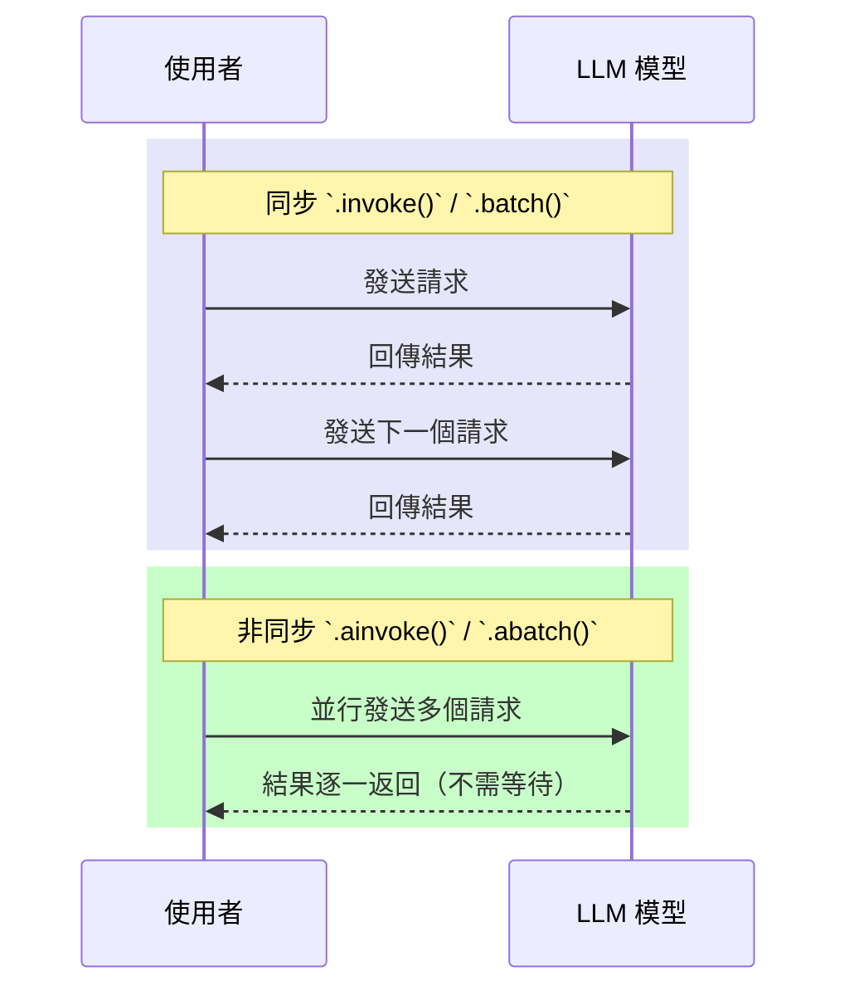

# LangChain 批次請求與非同步函式教學

在使用 LangChain 開發應用時，常見的需求之一是**一次產生多個 LLM 回應**，例如社群貼文生成、答案候選、或 A/B 測試場景。
本文將介紹如何使用 **`.batch()`** 與 **非同步 async API (`.abatch()`, `.ainvoke()`)** 來達成高效能、多回應生成。

---

## 1️⃣ 為什麼要建立多個 LLM 回應？

在一些情境下，我們希望一次產生多個結果，方便比較或挑選：

* **社群媒體貼文**：一次產生 5 則不同版本，挑選最適合的。
* **客服對話候選**：提供多個回答，交由人工或自動 ranking 選出最佳回應。
* **行銷文案**：快速生成多個不同風格的內容。

---

## 2️⃣ `.invoke()` vs `.batch()`

* `.invoke()`：單一請求 → 單一回應。
* `.batch()`：一次多請求 → 多個回應（支援並行）。

**範例：**

```python
# 同步批次請求：一次生成兩個回應
synchronous_llm_result = chat.batch([messages] * 2)
print(synchronous_llm_result)
```

**輸出結果：**

```python
[
  AIMessage(content="Sure, here's a lighthearted joke... Why did the software engineer go broke? Because he kept caching his expenses!"),
  AIMessage(content="Sure, here's a lighthearted joke... Why do software engineers prefer dark mode? Because it has less 'byte' vision!")
]
```

---

## 3️⃣ `RunnableConfig` 與並行設定

在批次請求時，可以透過 **`RunnableConfig`** 調整最大並行數：

```python
from langchain_core.runnables.config import RunnableConfig

# 建立一個 RunnableConfig，設定最大並行數為 5
config = RunnableConfig(max_concurrency=5)

# 使用 batch() 方法，傳入多組訊息清單與設定
results = chat.batch([messages, messages], config)
```

這樣可以避免 API 請求過多造成速率限制，也能提升處理效率。

---

## 4️⃣ 非同步函式 (Async Functions)

### 📌 背景知識

在電腦科學中，**非同步 (asynchronous, async)** 函式能獨立於其他程序運作，允許多個 API 請求同時進行，而不是一個一個等待完成。

這在 LLM 應用中尤其重要：

* **同步**：流程線性，總延遲較長。
* **非同步**：請求並行，總延遲大幅縮短。

### 📌 LangChain 的 async API

LangChain 的非同步函式命名規則很簡單：

* `.invoke()` → `.ainvoke()`
* `.batch()` → `.abatch()`

範例：

```python
# 非同步批次請求
results = await chat.abatch([messages] * 5)
```

這樣能讓多個 LLM 請求同時進行，特別適合**複雜工作流程**或**大量 API 呼叫**的情境。

---

## 5️⃣ 流程比較圖



---

## 6️⃣ 總結

* 使用 **`.batch()`** → 一次產生多個回應，支援並行。
* 使用 **`RunnableConfig`** → 控制最大並行數，避免 API 過載。
* 使用 **非同步 API (`.abatch()` / `.ainvoke()`)** → 多請求同時處理，大幅降低延遲。

👉 建議：

* **小量請求** → `.batch()` 即可。
* **大量請求／高併發場景** → `.abatch()` 搭配 `max_concurrency`。