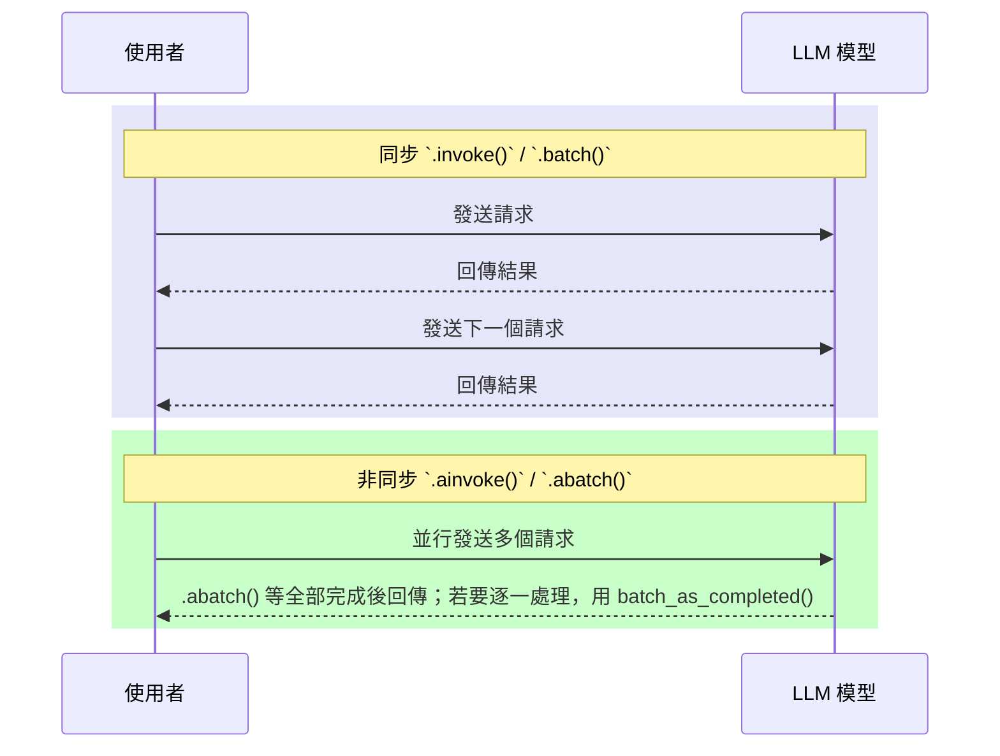

# LangChain 批次請求與非同步函式教學

在使用 LangChain 開發應用時，常見的需求之一是**一次產生多個 LLM 回應**，例如社群貼文生成、答案候選、或 A/B 測試場景。
本文將介紹如何使用 **`.batch()`** 與 **非同步 async API (`.abatch()`, `.ainvoke()`)** 來達成高效能、多回應生成。

---

## 1️⃣ 為什麼要建立多個 LLM 回應？

在一些情境下，我們希望一次產生多個結果，方便比較或挑選：

* **社群媒體貼文**：一次產生 5 則不同版本，挑選最適合的。
* **客服對話候選**：提供多個回答，交由人工或自動 ranking 選出最佳回應。
* **行銷文案**：快速生成多個不同風格的內容。

---

## 2️⃣ `.invoke()` vs `.batch()`

* `.invoke()`：單一請求 → 單一回應。
* `.batch()`：一次多請求 → 多個回應（同步呼叫、內部平行 I/O，可由 `max_concurrency` 控制）。

**範例：**

```python
from copy import deepcopy
from langchain_openai import ChatOpenAI
from langchain_core.messages import HumanMessage, SystemMessage
from langchain_core.runnables.config import RunnableConfig

chat = ChatOpenAI(model="gpt-4o-mini", temperature=0.7, max_retries=3)

messages = [
    SystemMessage(content="你是幽默但精準的助理"),
    HumanMessage(content="講一個工程師的冷笑話")
]

# 建立彼此獨立的輸入（避免參考問題）
inputs = [deepcopy(messages) for _ in range(2)]

# 同步批次請求：一次生成兩個回應
synchronous_llm_result = chat.batch(inputs)
print(synchronous_llm_result)
```

**輸出結果：**

```python
[
  AIMessage(content="Sure, here's a lighthearted joke... Why did the software engineer go broke? Because he kept caching his expenses!"),
  AIMessage(content="Sure, here's a lighthearted joke... Why do software engineers prefer dark mode? Because it has less 'byte' vision!")
]
```

---

## 3️⃣ `RunnableConfig` 與並行設定

在批次請求時，可以透過 **`RunnableConfig`** 調整最大並行數：

```python
from langchain_core.runnables.config import RunnableConfig
from copy import deepcopy

# 建立彼此獨立的輸入
inputs = [deepcopy(messages) for _ in range(2)]

# 方法1：使用 RunnableConfig 類別
config = RunnableConfig(max_concurrency=5)
results = chat.batch(inputs, config=config)

# 方法2：使用字典寫法
results = chat.batch(inputs, config={"max_concurrency": 5})

# 方法3：使用 with_config 方法
results = chat.with_config({"max_concurrency": 5}).batch(inputs)
```

`max_concurrency` 預設值來自 ThreadPoolExecutor；可透過 dict 或 `RunnableConfig` 指定。這樣可以避免 API 請求過多造成速率限制，也能提升處理效率。

---

## 4️⃣ 非同步函式 (Async Functions)

### 📌 背景知識

在電腦科學中，**非同步 (asynchronous, async)** 函式能獨立於其他程序運作，允許多個 API 請求同時進行，而不是一個一個等待完成。

這在 LLM 應用中尤其重要：

* **同步**：流程線性，總延遲較長。
* **非同步**：請求並行，總延遲大幅縮短。

### 📌 LangChain 的 async API

LangChain 的非同步函式命名規則很簡單：

* `.invoke()` → `.ainvoke()`
* `.batch()` → `.abatch()`

**重要：** `.abatch()` 在協程中並行執行，但 **`.abatch()` 會在所有請求完成後一次回傳結果**；若要**先完成先回**請使用 `batch_as_completed()`。

範例：

```python
import asyncio
from langchain_openai import ChatOpenAI
from langchain_core.messages import HumanMessage

chat = ChatOpenAI(model="gpt-4o-mini", temperature=0.7, max_retries=3)

async def main():
    inputs = [[HumanMessage(content=f"變出第{i}個標題")] for i in range(5)]
    # .abatch() 等全部完成後一次回傳結果
    results = await chat.abatch(inputs, config={"max_concurrency": 5})
    for r in results:
        print(r.content)

asyncio.run(main())
```

這樣能讓多個 LLM 請求同時進行，特別適合**複雜工作流程**或**大量 API 呼叫**的情境。

### 📌 容錯與重試機制

批次/高並發應用中，容錯與重試機制非常重要：

```python
# 方法1：在模型層設定重試
chat = ChatOpenAI(model="gpt-4o-mini", max_retries=3)

# 方法2：使用 with_retry 方法
robust_chat = chat.with_retry(stop_after_attempt=3)  # 指數退避預設開啟
results = robust_chat.batch(inputs, {"max_concurrency": 5})

# 方法3：批次處理中的例外收集
results = chat.batch(inputs, config=config, return_exceptions=True)
for r in results:
    if isinstance(r, Exception):
        print(f"呼叫失敗：{r}")
    else:
        print(r.content)
```

這會大幅降低 429/5xx 錯誤對批次處理的影響。

### 📌 先完成先回：`batch_as_completed()`

若需要**先完成先處理**，使用 `batch_as_completed()` 代替 `.abatch()`：

```python
from langchain_core.runnables import Runnable
from copy import deepcopy

# 建立多個獨立輸入
inputs = [deepcopy(messages) for _ in range(5)]

# 任何 Runnable 都支援 batch_as_completed
for finished in chat.batch_as_completed(inputs, config={"max_concurrency": 5}):
    try:
        r = finished.result()  # 每個 Future 先完成先取
        print(f"完成一個回應：{r.content[:50]}...")
    except Exception as e:
        print(f"失敗：{e}")
```

> **說明**：`.abatch()` **一次回整包**；`batch_as_completed()` 才能**逐一**處理先完成的結果。

---

## 5️⃣ 流程比較圖



---

## 6️⃣ 總結

* 使用 **`.batch()`** → 一次產生多個回應，同步呼叫、內部平行 I/O。
* 使用 **`RunnableConfig`** → 控制最大並行數，避免 API 過載。
* 使用 **非同步 API (`.abatch()` / `.ainvoke()`)** → 多請求同時處理，但 `.abatch()` 等全部完成後一次回傳。
* 使用 **`batch_as_completed()`** → 需要先完成先處理時。
* 使用 **`.with_retry()`** → 增強容錯能力，應對速率限制。

👉 建議：

* **小量請求** → `.batch()` 即可。
* **大量請求／高併發場景** → `.abatch()` 搭配 `max_concurrency`。
* **需要逐一處理結果** → `batch_as_completed()`。
* **生產環境** → 加上 `.with_retry()` 和 `return_exceptions=True`。

---

## 📝 實務備註

### 速率限制與流控
* `max_concurrency` 只是限縮同時呼叫數，**不是**自動排隊器；搭配 `.with_retry()` 才能有效應對 429/5xx。

### 觀測性
* 可在 `RunnableConfig` 放 `tags`/`metadata` 方便追蹤。

### 串流需求
* 要 token 級串流顯示用 `.stream()`/`.astream()`；要多輸入並行且逐一接收，用 `batch_as_completed()`。