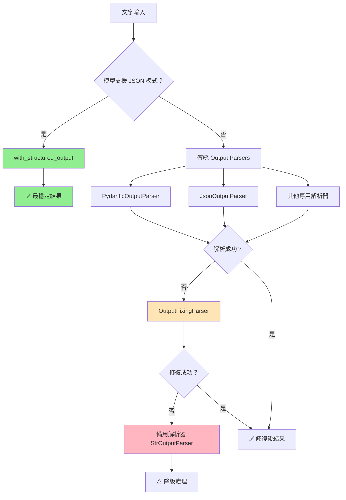

# LangChain Output Parsers 教學：讓 LLM 輸出自動結構化

在使用大型語言模型（LLM，例如 GPT、Claude、Gemini）時，我們經常遇到一個問題：
👉 模型輸出的結果是「純文字」，但我們實際需要的是 **結構化資料**（JSON、清單、時間格式……）。

在傳統方式下，我們可能會使用 **正則表達式（regex）** 來解析，但這不僅繁瑣，也容易出錯。
為了解決這個問題，**LangChain 提供了多種結構化輸出方案**，幫助我們把 LLM 的輸出自動轉換成結構化資料。

---

## 兩分鐘懂：為何要結構化輸出？

LLM 的原始輸出通常是非結構化的文字，但實際應用中我們經常需要結構化資料來進行後續處理。

### ❌ 問題場景：處理純文字輸出

```python
# 傳統方式：LLM 輸出純文字，需要手動解析
from langchain_openai import ChatOpenAI  # ✅ v0.3 正確匯入路徑

llm = ChatOpenAI(model="gpt-4o-mini", temperature=0)
response = llm.invoke("分析這篇文章的情感，並給出 0-10 分的信心指數")

print(response.content)  
# 輸出："這篇文章整體情感偏向正面，信心指數約 85%，主要情感類別是樂觀..."

# 😤 需要手動解析字串，容易出錯且不可靠
if "正面" in response.content:
    sentiment = "positive"
else:
    sentiment = "negative"
# 這種方式非常脆弱！
```

### ✅ 解決方案：結構化輸出

```python
from pydantic import BaseModel, Field
from langchain_core.prompts import ChatPromptTemplate
from langchain_openai import ChatOpenAI

# 定義結構化輸出格式
class SentimentAnalysis(BaseModel):
    sentiment: str = Field(description="情感傾向：positive, negative, neutral")
    confidence: float = Field(description="信心指數 0-1", ge=0, le=1)
    emotions: list[str] = Field(description="檢測到的情感清單")
    summary: str = Field(description="分析總結")

# 使用 with_structured_output（最推薦！）
llm = ChatOpenAI(model="gpt-4o-mini", temperature=0)
structured_llm = llm.with_structured_output(SentimentAnalysis)

prompt = ChatPromptTemplate.from_messages([
    ("system", "你是專業的情感分析師"),
    ("human", "分析以下文字的情感：{text}")
])

chain = prompt | structured_llm
result = chain.invoke({"text": "今天天氣真好！"})

# 取得結構化結果
print(result.sentiment)     # "positive"
print(result.confidence)    # 0.95
print(result.emotions)      # ["happiness", "optimism"]
print(type(result))         # <class 'SentimentAnalysis'>
```

---

## 🏆 首選方案：`with_structured_output`

**在支援 JSON 模式的模型上（OpenAI、Anthropic、Google），這是最穩定且成功率最高的方法。**

### 為什麼推薦 `with_structured_output`？

1. **自動綁定 Schema**：無需手動撰寫格式指示
2. **內建解析**：無需額外的解析器
3. **高成功率**：模型原生支援，穩定性更佳
4. **程式碼最簡潔**：一行綁定即可

### 完整範例：商業名稱生成系統

```python
# 匯入必要模組（v0.3 標準路徑）
from pydantic import BaseModel, Field, field_validator
from langchain_core.prompts import ChatPromptTemplate
from langchain_openai import ChatOpenAI

# 定義單個商業名稱的資料結構
class BusinessName(BaseModel):
    """單個商業名稱的完整資訊"""
    name: str = Field(description="公司名稱")
    rating: float = Field(ge=0, le=10, description="評分 (0 最差, 10 最佳)")
    reason: str = Field(description="評分理由")

# 定義包含多個商業名稱的容器結構
class BusinessNames(BaseModel):
    """商業名稱生成結果的容器"""
    names: list[BusinessName] = Field(description="商業名稱清單")
    industry_analysis: str = Field(description="產業分析總結")

# 建立聊天提示模板
prompt = ChatPromptTemplate.from_messages([
    ("system", "你是資深品牌顧問，精通商業命名。回覆請完全符合指定的結構。"),
    ("human", "請為 {industry} 產業產生 5 個創新的公司名稱，並為每個名稱評分和說明理由。")
])

# 初始化語言模型並綁定結構化輸出
llm = ChatOpenAI(model="gpt-4o-mini", temperature=0.7)
structured_llm = llm.with_structured_output(BusinessNames)

# 建立完整處理鏈（無需手動解析器！）
chain = prompt | structured_llm

# 執行商業名稱生成
try:
    result = chain.invoke({"industry": "人工智慧"})
    
    print(f"產業分析：{result.industry_analysis}")
    print("\n生成的商業名稱：")
    
    for i, business in enumerate(result.names, 1):
        print(f"{i}. {business.name}")
        print(f"   評分: {business.rating}/10")
        print(f"   理由: {business.reason}")
        print()
        
except Exception as e:
    print(f"❌ 處理失敗: {e}")
```

### 範例輸出
```python
# 自動解析為結構化物件
BusinessNames(
    names=[
        BusinessName(name='NeuralSync', rating=9.2, reason='結合神經網路概念，易記且專業'),
        BusinessName(name='CogniFlow', rating=8.8, reason='認知流動的概念，適合AI服務'),
        BusinessName(name='MindForge', rating=8.5, reason='心智鍛造，暗示AI創造力'),
        BusinessName(name='ThinkWave', rating=8.3, reason='思維波動，現代感強'),
        BusinessName(name='LogiCore', rating=9.0, reason='邏輯核心，突出AI本質')
    ],
    industry_analysis="人工智慧產業注重創新、技術深度和信任感..."
)
```

---

## 傳統方案：Output Parsers

當模型不支援 `with_structured_output` 或需要更細緻控制時，可以使用傳統的 Output Parsers。

### 常見 Output Parser 類型

| 解析器類型 | 用途 | 適用場景 |
|------------|------|----------|
| **`PydanticOutputParser`** | 驗證/轉型成 Pydantic 模型 | 複雜業務邏輯、類型安全 |
| **`JsonOutputParser`** | 把輸出轉成 `dict` | 簡單 JSON 輸出 |
| **`CommaSeparatedListOutputParser`** | 把輸出切成逗號清單 | 簡單清單需求 |
| **`StructuredOutputParser`** | 以 `ResponseSchema` 定義欄位 | 固定欄位結構 |
| **`EnumOutputParser`** | 限制輸出為指定列舉 | 選項限制場景 |
| **`DatetimeOutputParser`** | 解析日期時間 | 時間格式處理 |
| **`XMLOutputParser`** | 解析 XML 格式 | XML 結構需求 |

### 1. PydanticOutputParser（推薦）

```python
# 匯入標準路徑（v0.3）
from langchain_core.output_parsers import PydanticOutputParser
from langchain_core.prompts import PromptTemplate
from pydantic import BaseModel, Field, field_validator
from langchain_openai import ChatOpenAI

# 定義任務提取的資料結構模型
class TaskExtraction(BaseModel):
    """從文本中提取任務資訊的資料結構"""
    tasks: list[str] = Field(description="提取的任務清單")
    priority: str = Field(description="優先級：high, medium, low")
    deadline: str | None = Field(default=None, description="截止時間，格式：YYYY-MM-DD")
    estimated_hours: float = Field(ge=0, description="預估工時")
    
    # 使用 v2 語法的欄位驗證器
    @field_validator('priority')
    @classmethod
    def validate_priority(cls, v: str) -> str:
        """驗證優先級欄位是否為有效值"""
        if v not in ['high', 'medium', 'low']:
            raise ValueError('優先級必須是 high, medium, low 其中之一')
        return v

# 建立 Pydantic 輸出解析器
parser = PydanticOutputParser(pydantic_object=TaskExtraction)

# 建立包含格式指示的提示詞模板
prompt = PromptTemplate(
    template="從以下文本提取任務資訊：{text}\n{format_instructions}",
    input_variables=["text"],
    partial_variables={"format_instructions": parser.get_format_instructions()}
)

# 建立處理鏈
llm = ChatOpenAI(model="gpt-4o-mini", temperature=0)
chain = prompt | llm | parser

# 執行任務提取
result = chain.invoke({"text": "需要在本週五前完成網站設計，預估需要 8 小時，這是高優先級任務"})

print(f"任務：{result.tasks}")
print(f"優先級：{result.priority}")
print(f"截止時間：{result.deadline}")
print(f"預估工時：{result.estimated_hours}")
```

### 2. JsonOutputParser（輕量級）

```python
from langchain_core.output_parsers import JsonOutputParser
from langchain_core.prompts import PromptTemplate
from langchain_openai import ChatOpenAI

# 建立 JSON 解析器
json_parser = JsonOutputParser()

# 建立提示詞模板
prompt = PromptTemplate(
    template="分析以下內容並以 JSON 格式返回：{text}\n請包含：sentiment, keywords, summary",
    input_variables=["text"]
)

# 建立處理鏈
llm = ChatOpenAI(model="gpt-4o-mini", temperature=0)
chain = prompt | llm | json_parser

# 執行分析
result = chain.invoke({"text": "AI技術發展迅速，未來前景看好"})

# 處理字典結果
print(result["sentiment"])  # "positive"
print(result["keywords"])   # ["AI", "技術", "發展"]
print(result["summary"])    # "文章對AI發展持樂觀態度"
```

### 3. CommaSeparatedListOutputParser（清單）

```python
from langchain_core.output_parsers import CommaSeparatedListOutputParser
from langchain_core.prompts import PromptTemplate
from langchain_openai import ChatOpenAI

# 建立逗號分隔清單解析器
list_parser = CommaSeparatedListOutputParser()

# 建立提示詞模板
prompt = PromptTemplate(
    template="列出 {topic} 的主要特點，以逗號分隔：\n{format_instructions}",
    input_variables=["topic"],
    partial_variables={"format_instructions": list_parser.get_format_instructions()}
)

# 建立處理鏈
llm = ChatOpenAI(model="gpt-4o-mini", temperature=0)
chain = prompt | llm | list_parser

# 執行清單生成
result = chain.invoke({"topic": "Python 程式語言"})
print(result)  # ['簡單易學', '語法清晰', '豐富的函式庫', '跨平台', '開源']
print(type(result))  # <class 'list'>
```

### 4. EnumOutputParser（枚舉限制）

```python
from langchain.output_parsers.enum import EnumOutputParser
from langchain_core.prompts import PromptTemplate
from langchain_openai import ChatOpenAI
from enum import Enum

# 定義優先級枚舉
class Priority(Enum):
    HIGH = "high"
    MEDIUM = "medium"
    LOW = "low"

# 建立枚舉解析器
enum_parser = EnumOutputParser(enum=Priority)

# 建立提示詞模板
prompt = PromptTemplate(
    template="評估以下任務的優先級：{task}\n{instructions}",
    input_variables=["task"],
    partial_variables={"instructions": enum_parser.get_format_instructions()}
)

# 建立處理鏈
llm = ChatOpenAI(model="gpt-4o-mini", temperature=0)
chain = prompt | llm | enum_parser

# 執行優先級評估
result = chain.invoke({"task": "修復生產環境的緊急 bug"})
print(result)        # Priority.HIGH
print(result.value)  # "high"
```

### 5. XMLOutputParser（安全解析）

```python
from langchain_core.output_parsers import XMLOutputParser
from langchain_core.prompts import PromptTemplate
from langchain_openai import ChatOpenAI

# 建立 XML 解析器（預設使用 defusedxml，較安全）
xml_parser = XMLOutputParser()

# 建立提示詞模板
prompt = PromptTemplate(
    template="將以下資訊轉換為 XML 格式：{data}\n{format_instructions}",
    input_variables=["data"],
    partial_variables={"format_instructions": xml_parser.get_format_instructions()}
)

# 建立處理鏈
llm = ChatOpenAI(model="gpt-4o-mini", temperature=0)
chain = prompt | llm | xml_parser

# 執行 XML 轉換
result = chain.invoke({"data": "名稱：張三，年齡：30，職業：工程師"})
print(result)  # 解析後的 XML 結構
```

> **安全註記**：`XMLOutputParser` 預設使用 `defusedxml` 進行安全解析，可防範 XML 外部實體攻擊（XXE）。

---

## 可靠度增強：錯誤處理策略

在生產環境中，LLM 可能產生格式錯誤的輸出。以下是增強可靠度的策略：

### 決策建議（新手看得懂）

1. **能用 `with_structured_output` 就先用它**（OpenAI/Anthropic/Google 多數支援）
2. **其他模型**→用 `JsonOutputParser` / `PydanticOutputParser`
3. **仍會飄**→最後再上 `OutputFixingParser`

### 1. OutputFixingParser（補救手段）

```python
from langchain.output_parsers import OutputFixingParser
from langchain_core.output_parsers import PydanticOutputParser
from langchain_openai import ChatOpenAI

# 建立原始解析器
base_parser = PydanticOutputParser(pydantic_object=TaskExtraction)

# 建立錯誤修復解析器（當救火用）
fixing_parser = OutputFixingParser.from_llm(
    parser=base_parser,
    llm=ChatOpenAI(model="gpt-4o-mini")
)

# 使用修復解析器
chain = prompt | llm | fixing_parser
result = chain.invoke({"text": "完成報告，很重要"})  # 即使格式不完美也能解析
```

> **重要**：`OutputFixingParser` 是**補救手段**，不是主線流程。優先考慮改善提示詞品質。

### 2. 多層容錯策略

```python
from langchain_core.output_parsers import StrOutputParser
import logging

# 設定日誌
logger = logging.getLogger(__name__)

class RobustParsingChain:
    """具備多層容錯的解析鏈"""
    
    def __init__(self, primary_parser, fallback_parser=None):
        self.primary_parser = primary_parser  # 主要解析器
        self.fallback_parser = fallback_parser or StrOutputParser()  # 備用解析器
    
    def parse_with_fallback(self, llm_output: str):
        """多層容錯解析"""
        try:
            # 第一層：嘗試主要解析器
            return self.primary_parser.parse(llm_output)
        except Exception as e:
            # 第二層：記錄失敗並使用備用解析器
            logger.warning(f"主解析器失敗：{e}，使用備用解析器")
            return self.fallback_parser.parse(llm_output)

# 使用範例
robust_parser = RobustParsingChain(
    primary_parser=PydanticOutputParser(pydantic_object=TaskExtraction),
    fallback_parser=StrOutputParser()
)
```

### 3. 批次處理的錯誤收集

```python
from langchain_openai import ChatOpenAI

# 建立支援例外收集的批次處理
llm = ChatOpenAI(model="gpt-4o-mini", max_retries=3)
inputs = [{"text": "任務1"}, {"text": "任務2"}, {"text": "任務3"}]

# 批次處理並收集例外
results = chain.batch(inputs, config={"max_concurrency": 3}, return_exceptions=True)

# 處理結果和例外
for i, result in enumerate(results):
    if isinstance(result, Exception):
        print(f"第 {i+1} 個請求失敗：{result}")
    else:
        print(f"第 {i+1} 個請求成功：{result}")
```

---

## 流程比較圖



---

## 最佳實踐建議

### 1. 選擇策略

- **首選**：支援 JSON 模式的模型 + `with_structured_output`
- **次選**：`PydanticOutputParser`（類型安全、驗證完整）
- **輕量**：`JsonOutputParser`（簡單快速）
- **特殊需求**：`CommaSeparatedListOutputParser`、`EnumOutputParser` 等

### 2. 錯誤處理層次

1. **重試機制**：設定 `max_retries=3`
2. **修復解析器**：`OutputFixingParser`
3. **備用解析器**：`StrOutputParser`
4. **記錄失敗案例**：避免靜默吞錯

### 3. 效能優化

```python
from functools import lru_cache

# ❌ 錯誤：lru_cache 無法快取 self
class BadCachedParser(PydanticOutputParser):
    @lru_cache(maxsize=128)  # 這會失敗！
    def get_format_instructions(self):
        return super().get_format_instructions()

# ✅ 正確：模組層級快取
@lru_cache(maxsize=128)
def get_cached_format_instructions(pydantic_class):
    """模組層級的格式指示快取"""
    parser = PydanticOutputParser(pydantic_object=pydantic_class)
    return parser.get_format_instructions()

# 使用快取
format_instructions = get_cached_format_instructions(TaskExtraction)
```

### 4. 提示詞最佳化

```python
# 好的提示詞範例
good_prompt = """
請分析以下文字並以 JSON 格式回覆，必須包含以下欄位：
- sentiment: "positive", "negative", 或 "neutral"
- confidence: 0 到 1 之間的數字
- keywords: 字串陣列

範例輸出：
{
  "sentiment": "positive", 
  "confidence": 0.85,
  "keywords": ["技術", "創新", "發展"]
}

要分析的文字：{text}
"""
```

---

## 常見錯誤與解決方案

### 1. 匯入路徑錯誤
```python
# ❌ 過時路徑
from langchain_openai.chat_models import ChatOpenAI

# ✅ v0.3 正確路徑
from langchain_openai import ChatOpenAI
```

### 2. Pydantic 版本混用
```python
# ❌ 不要混用 v1 和 v2
from pydantic.v1 import BaseModel
from pydantic import validator

# ✅ 統一使用 v2
from pydantic import BaseModel, Field, field_validator
```

### 3. 未定義變數
```python
# ❌ 缺少匯入
chain = prompt | llm | parser  # PromptTemplate 未匯入

# ✅ 完整匯入
from langchain_core.prompts import PromptTemplate
from langchain_openai import ChatOpenAI
from langchain_core.output_parsers import PydanticOutputParser
```

---

## 總結

結構化輸出解析器是 LangChain 中確保資料品質和類型安全的關鍵組件：

- 🎯 **首選 `with_structured_output`** - 最穩定、最簡潔的方案
- 🛡️ **備用 PydanticOutputParser** - 完整的類型檢查和驗證
- 🔄 **錯誤恢復機制** - OutputFixingParser 和多層容錯
- ⚡ **效能優化** - 快取格式指示、批次處理
- 🔧 **易於整合** - 與 LCEL 無縫結合

選擇合適的解析器類型，結合良好的錯誤處理策略，能夠大大提升 AI 應用的可靠性和可維護性。

---

::: tip 下一步
現在你已經掌握了結構化輸出解析，接下來可以：
1. [記憶機制與對話管理](/tutorials/memory-systems) - 結合結構化輸出建構智能對話
2. [監控與可觀測性](/tutorials/monitoring) - 監控解析器的性能和準確性
3. [進階應用案例](/tutorials/advanced-examples) - 查看企業級的解析器應用
:::

::: warning 開發建議
- **優先使用 `with_structured_output`**：在支援的模型上這是最佳選擇
- **謹慎設計 Schema**：清晰的欄位描述有助於提高解析準確性
- **充分測試**：為不同的輸入情況編寫測試用例
- **錯誤處理**：始終準備備用解析策略
- **效能監控**：追蹤解析成功率和執行時間
:::