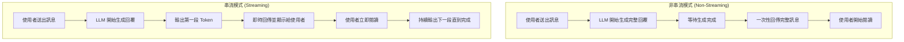

# 串流聊天模型（Streaming Chat Models）完整教學

在使用 ChatGPT、Claude、Gemini 等大型語言模型（LLM）時，你可能會注意到文字是**逐字或逐段顯示**，像真人打字般出現。這種方式稱為 **串流 (Streaming)**，已經成為對話型應用的主流模式。

本文將帶你深入了解：

1. 什麼是串流聊天模型
2. 現行主流做法
3. 非串流 vs 串流流程比較
4. 差異總表
5. Python 實作範例
6. 工程實務考量
7. 實務應用場景建議
8. 三大供應商串流支援比較

---

## 1️⃣ 什麼是串流聊天模型？

* **非串流 (Non-Streaming)**：模型生成完整回覆後，**一次性**回傳。
* **串流 (Streaming)**：模型在生成過程中，將文字 **逐段 (chunk)** 傳回用戶端。使用者不用等待整段完成，就能即時看到輸出。

範例（以 LangChain v0.2+ 為例）：

```python
for chunk in llm.stream("請用一句話解釋什麼是串流"):
    print(chunk, end="", flush=True)
```

---

## 2️⃣ 現行主流做法

* **前端互動**：ChatGPT、Claude、Gemini 等聊天應用 **幾乎都使用串流**，因為能大幅降低等待感，體驗接近「真人回覆」。
* **後端應用**：若需求是 JSON、SQL、報表等需要完整結構輸出的任務，仍會採用 **非串流**，避免半成品難以解析。

👉 **結論**：

* **前端 UI / 即時交互 = 串流**
* **後端批次 / 嚴格結構 = 非串流**（或「串流生成 → 完成後再解析」的混合策略）

---

## 3️⃣ 非串流 vs 串流流程



---

## 4️⃣ 差異總表

| 面向        | 非串流 (Non-Streaming) | 串流 (Streaming)                     |
| --------- | ------------------- | ---------------------------------- |
| **傳輸型態**  | 完成後一次性回傳            | Token/Chunk 逐段回傳 (SSE / WebSocket) |
| **體感延遲**  | 高（需等待整段）            | 低（TTFT 快，可邊看邊出）                    |
| **結構化輸出** | 容易驗證（完整 JSON/SQL）   | 困難：需做增量驗證或最後再解析                    |
| **工程複雜度** | 低                   | 中～高（事件處理、取消、重試、緩衝）                 |
| **常見場景**  | 批次分析、報表、程式碼生成       | 聊天 UI、即時客服、RAG、語音/視訊互動             |
| **主要挑戰**  | UX 差、容易超時、無法早停省費    | 需處理「半成品」、事件流順序、觀測性與安全性             |

---

## 5️⃣ Python 實作範例

### 基本串流實作

#### 非串流模式

```python
from langchain_openai import ChatOpenAI
from langchain_core.messages import SystemMessage, HumanMessage

# 建立聊天模型
chat = ChatOpenAI(model="gpt-4o-mini", temperature=0.7)

messages = [
    SystemMessage(content="你是一位專業的技術講師。"),
    HumanMessage(content="請解釋什麼是非串流模式？")
]

# 非串流呼叫 - 等待完整回應
response = chat.invoke(messages)
print(response.content)
```

👉 使用者必須等待完整訊息才會一次性看到。

#### 串流模式

```python
from langchain_openai import ChatOpenAI
from langchain_core.messages import SystemMessage, HumanMessage, AIMessageChunk

# 建立聊天模型
chat = ChatOpenAI(model="gpt-4o-mini", temperature=0.7)

messages = [
    SystemMessage(content="你是一位專業的技術講師。"),
    HumanMessage(content="請詳細解釋什麼是串流模式？")
]

# 串流呼叫 - 即時顯示內容
print("AI 回應：", end="")
full_response = ""

for chunk in chat.stream(messages):
    if isinstance(chunk, AIMessageChunk) and chunk.content:
        print(chunk.content, end="", flush=True)
        full_response += chunk.content

print(f"\n\n完整回應收集完成，共 {len(full_response)} 字元")
```

👉 使用者可邊生成邊看到內容，體驗更即時。

### 進階串流處理

#### 串流狀態管理

```python
import time
from typing import List, Optional
from langchain_core.messages import AIMessageChunk

class StreamingHandler:
    def __init__(self):
        self.chunks: List[AIMessageChunk] = []
        self.start_time: Optional[float] = None
        self.first_token_time: Optional[float] = None
        self.total_tokens = 0
    
    def process_stream(self, chat, messages):
        """處理串流回應並收集統計資料"""
        self.start_time = time.time()
        self.chunks = []
        
        print("🤖 AI 開始回應：", end="")
        
        for i, chunk in enumerate(chat.stream(messages)):
            if isinstance(chunk, AIMessageChunk) and chunk.content:
                # 記錄首個 token 時間
                if self.first_token_time is None:
                    self.first_token_time = time.time()
                
                print(chunk.content, end="", flush=True)
                self.chunks.append(chunk)
                self.total_tokens += 1
        
        print("\n")  # 換行
        self._print_statistics()
    
    def _print_statistics(self):
        """印出串流統計資料"""
        if self.start_time and self.first_token_time:
            ttft = self.first_token_time - self.start_time  # Time to First Token
            total_time = time.time() - self.start_time
            tokens_per_second = self.total_tokens / total_time if total_time > 0 else 0
            
            print(f"\n📊 串流統計：")
            print(f"   首個 Token 延遲 (TTFT): {ttft:.2f}s")
            print(f"   總回應時間: {total_time:.2f}s")
            print(f"   輸出速度: {tokens_per_second:.1f} tokens/sec")
            print(f"   總 chunks: {len(self.chunks)}")
    
    def get_full_response(self) -> str:
        """組合完整回應"""
        return "".join(chunk.content for chunk in self.chunks if chunk.content)

# 使用範例
handler = StreamingHandler()
handler.process_stream(chat, messages)
full_text = handler.get_full_response()
```

#### 串流取消機制

```python
import threading
import time
from typing import Iterator
from langchain_core.messages import AIMessageChunk

class CancellableStream:
    def __init__(self):
        self.cancelled = False
        self._lock = threading.Lock()
    
    def cancel(self):
        """取消串流"""
        with self._lock:
            self.cancelled = True
            print("\n⚠️ 串流已被使用者取消")
    
    def stream_with_cancellation(self, chat, messages, max_chunks: int = 100):
        """支援取消的串流處理"""
        chunk_count = 0
        
        try:
            for chunk in chat.stream(messages):
                # 檢查是否被取消
                with self._lock:
                    if self.cancelled:
                        print("\n🛑 串流取消完成")
                        break
                
                if isinstance(chunk, AIMessageChunk) and chunk.content:
                    print(chunk.content, end="", flush=True)
                    chunk_count += 1
                    
                    # 模擬長回應的分段處理
                    time.sleep(0.05)  # 模擬網路延遲
                    
                    # 安全機制：避免無限長的回應
                    if chunk_count >= max_chunks:
                        print(f"\n⚠️ 達到最大 chunks 限制 ({max_chunks})，自動停止")
                        break
                        
        except Exception as e:
            print(f"\n❌ 串流過程發生錯誤: {e}")
        
        print(f"\n✅ 串流完成，共處理 {chunk_count} chunks")

# 使用範例
cancellable_stream = CancellableStream()

# 在另一個線程中模擬使用者取消操作
def simulate_user_cancel():
    time.sleep(2)  # 2秒後取消
    cancellable_stream.cancel()

cancel_thread = threading.Thread(target=simulate_user_cancel)
cancel_thread.start()

# 開始串流
cancellable_stream.stream_with_cancellation(chat, messages)
cancel_thread.join()
```

---

## 6️⃣ 工程實務考量

### 1. 通訊協定差異

```python
# SSE (Server-Sent Events) 範例 - 適用於 OpenAI, Anthropic
class SSEHandler:
    def __init__(self):
        self.event_source = None
    
    def handle_sse_stream(self, url: str, headers: dict):
        """處理 SSE 串流"""
        import sseclient  # pip install sseclient-py
        
        response = requests.get(url, headers=headers, stream=True)
        client = sseclient.SSEClient(response)
        
        for event in client.events():
            if event.data != '[DONE]':
                try:
                    data = json.loads(event.data)
                    chunk_content = data['choices'][0]['delta'].get('content', '')
                    if chunk_content:
                        yield chunk_content
                except json.JSONDecodeError:
                    continue

# WebSocket 範例 - 適用於 Gemini Live API
class WebSocketHandler:
    def __init__(self):
        self.ws = None
    
    async def handle_websocket_stream(self, uri: str):
        """處理 WebSocket 串流"""
        import websockets  # pip install websockets
        
        async with websockets.connect(uri) as websocket:
            self.ws = websocket
            
            # 發送初始訊息
            await websocket.send(json.dumps({
                "type": "message",
                "content": "Hello from streaming client"
            }))
            
            # 接收串流回應
            async for message in websocket:
                data = json.loads(message)
                if data.get('type') == 'content':
                    yield data.get('text', '')
```

### 2. 結構化輸出處理

```python
import json
from typing import Dict, Any, Optional

class StructuredStreamParser:
    def __init__(self):
        self.buffer = ""
        self.json_depth = 0
        self.in_string = False
        self.escape_next = False
    
    def parse_json_stream(self, chunk: str) -> Optional[Dict[str, Any]]:
        """嘗試解析串流中的 JSON 片段"""
        self.buffer += chunk
        
        # 簡化的 JSON 解析邏輯
        for char in chunk:
            if self.escape_next:
                self.escape_next = False
                continue
                
            if char == '\\':
                self.escape_next = True
                continue
                
            if char == '"' and not self.escape_next:
                self.in_string = not self.in_string
                continue
                
            if not self.in_string:
                if char == '{':
                    self.json_depth += 1
                elif char == '}':
                    self.json_depth -= 1
                    
                    # 嘗試解析完整的 JSON
                    if self.json_depth == 0:
                        try:
                            result = json.loads(self.buffer.strip())
                            self.buffer = ""  # 清空緩衝區
                            return result
                        except json.JSONDecodeError:
                            # JSON 還不完整，繼續累積
                            pass
        
        return None  # JSON 還未完成

# 使用範例
parser = StructuredStreamParser()

for chunk in chat.stream("請以JSON格式回傳用戶資料：姓名、年齡、職業"):
    if chunk.content:
        parsed_json = parser.parse_json_stream(chunk.content)
        if parsed_json:
            print(f"✅ 解析到完整 JSON: {parsed_json}")
            break
        else:
            print(chunk.content, end="", flush=True)
```

### 3. 錯誤處理與重試

```python
import asyncio
import logging
from tenacity import retry, stop_after_attempt, wait_exponential

class RobustStreamHandler:
    def __init__(self):
        self.logger = logging.getLogger(__name__)
    
    @retry(
        stop=stop_after_attempt(3),
        wait=wait_exponential(multiplier=1, min=4, max=10)
    )
    async def reliable_stream(self, chat, messages):
        """具備重試機制的可靠串流"""
        chunks_received = 0
        
        try:
            async for chunk in chat.astream(messages):
                if chunk.content:
                    print(chunk.content, end="", flush=True)
                    chunks_received += 1
                    
                    # 模擬網路問題
                    if chunks_received == 10:  # 假設第10個chunk時發生問題
                        raise ConnectionError("模擬網路中斷")
                        
        except Exception as e:
            self.logger.error(f"串流中斷: {e}，準備重試...")
            raise  # 讓 tenacity 處理重試
        
        print(f"\n✅ 串流完成，共接收 {chunks_received} chunks")

# 使用範例
async def main():
    handler = RobustStreamHandler()
    try:
        await handler.reliable_stream(chat, messages)
    except Exception as e:
        print(f"❌ 重試後仍然失敗: {e}")

# asyncio.run(main())
```

### 4. 安全與內容過濾

```python
import re
from typing import List, Set

class StreamContentFilter:
    def __init__(self):
        # 敏感詞彙清單（實際使用時應該更完善）
        self.blocked_words: Set[str] = {
            "密碼", "token", "api_key", "secret", 
            "信用卡", "身分證", "手機號碼"
        }
        self.buffer_window = 50  # 緩衝視窗大小
        self.content_buffer = ""
    
    def filter_stream_chunk(self, chunk: str) -> str:
        """過濾串流內容"""
        self.content_buffer += chunk
        
        # 保持緩衝區大小
        if len(self.content_buffer) > self.buffer_window:
            self.content_buffer = self.content_buffer[-self.buffer_window:]
        
        # 檢查敏感內容
        for blocked_word in self.blocked_words:
            if blocked_word in self.content_buffer:
                # 簡單的遮蔽策略
                chunk = chunk.replace(blocked_word, "*" * len(blocked_word))
                self.content_buffer = self.content_buffer.replace(blocked_word, "*" * len(blocked_word))
        
        return chunk
    
    def validate_chunk_safety(self, chunk: str) -> bool:
        """驗證chunk是否安全"""
        # 檢查是否包含可能的程式碼注入
        dangerous_patterns = [
            r'eval\s*\(',
            r'exec\s*\(',
            r'__import__\s*\(',
            r'<script\s*>',
        ]
        
        for pattern in dangerous_patterns:
            if re.search(pattern, chunk, re.IGNORECASE):
                return False
        
        return True

# 安全串流處理
content_filter = StreamContentFilter()

print("🔒 安全串流模式：", end="")
for chunk in chat.stream("請解釋如何安全地處理用戶密碼"):
    if chunk.content:
        # 安全檢查
        if not content_filter.validate_chunk_safety(chunk.content):
            print("[內容被過濾]", end="")
            continue
        
        # 敏感詞過濾
        filtered_content = content_filter.filter_stream_chunk(chunk.content)
        print(filtered_content, end="", flush=True)
```

### 5. 觀測性與監控

```python
import time
from dataclasses import dataclass
from typing import Optional
import logging

@dataclass
class StreamMetrics:
    """串流指標資料結構"""
    session_id: str
    start_time: float
    first_token_time: Optional[float] = None
    end_time: Optional[float] = None
    total_chunks: int = 0
    total_characters: int = 0
    errors: int = 0
    cancelled: bool = False

class StreamMonitor:
    def __init__(self):
        self.metrics = {}
        self.logger = logging.getLogger(__name__)
    
    def create_session(self, session_id: str) -> StreamMetrics:
        """創建監控會話"""
        metrics = StreamMetrics(
            session_id=session_id,
            start_time=time.time()
        )
        self.metrics[session_id] = metrics
        return metrics
    
    def record_first_token(self, session_id: str):
        """記錄首個 token 時間"""
        if session_id in self.metrics:
            self.metrics[session_id].first_token_time = time.time()
    
    def record_chunk(self, session_id: str, chunk_size: int):
        """記錄 chunk 資訊"""
        if session_id in self.metrics:
            metrics = self.metrics[session_id]
            metrics.total_chunks += 1
            metrics.total_characters += chunk_size
    
    def record_error(self, session_id: str):
        """記錄錯誤"""
        if session_id in self.metrics:
            self.metrics[session_id].errors += 1
    
    def finish_session(self, session_id: str, cancelled: bool = False):
        """結束會話並產生報告"""
        if session_id not in self.metrics:
            return
        
        metrics = self.metrics[session_id]
        metrics.end_time = time.time()
        metrics.cancelled = cancelled
        
        # 計算關鍵指標
        ttft = (metrics.first_token_time - metrics.start_time 
                if metrics.first_token_time else None)
        total_time = metrics.end_time - metrics.start_time
        throughput = (metrics.total_characters / total_time 
                     if total_time > 0 else 0)
        
        # 記錄指標
        self.logger.info(f"串流會話完成 {session_id}")
        self.logger.info(f"  TTFT: {ttft:.3f}s" if ttft else "  TTFT: 未記錄")
        self.logger.info(f"  總時間: {total_time:.3f}s")
        self.logger.info(f"  吞吐量: {throughput:.1f} 字元/秒")
        self.logger.info(f"  Chunks: {metrics.total_chunks}")
        self.logger.info(f"  錯誤: {metrics.errors}")
        self.logger.info(f"  是否取消: {metrics.cancelled}")
        
        # 清理
        del self.metrics[session_id]
        
        return {
            "ttft": ttft,
            "total_time": total_time,
            "throughput": throughput,
            "chunks": metrics.total_chunks,
            "errors": metrics.errors,
            "cancelled": metrics.cancelled
        }

# 監控串流會話
monitor = StreamMonitor()
session_id = "session_123"

# 開始監控
metrics = monitor.create_session(session_id)

print("📊 監控中的串流：", end="")
first_chunk = True

try:
    for chunk in chat.stream("請詳細說明機器學習的發展歷史"):
        if chunk.content:
            if first_chunk:
                monitor.record_first_token(session_id)
                first_chunk = False
            
            monitor.record_chunk(session_id, len(chunk.content))
            print(chunk.content, end="", flush=True)
            
except Exception as e:
    monitor.record_error(session_id)
    print(f"\n❌ 錯誤: {e}")
finally:
    # 完成會話
    final_metrics = monitor.finish_session(session_id)
    print(f"\n📈 會話指標: {final_metrics}")
```

---

## 7️⃣ 實務應用場景建議

| 情境                  | 建議模式          | 理由          | 實作要點 |
| ------------------- | ------------- | ----------- | ------ |
| 一般聊天、客服、教育對話        | 串流            | 體驗好，減少等待感   | SSE、取消機制、內容過濾 |
| 教學或逐步推理展示           | 串流            | 可展示中繼思路     | 分段顯示、步驟標記 |
| RAG（檢索增強生成）         | 串流            | 即時顯示檢索結果與回答 | 分階段輸出、來源標註 |
| JSON / SQL / API 輸出 | 非串流 / 串流+後處理  | 確保結構完整性     | 緩衝解析、驗證機制 |
| 語音助理、視訊互動           | 串流（WebSocket） | 低延遲雙向通訊     | WebSocket、音訊同步 |
| 報表分析、批次生成           | 非串流           | 完整性比互動性重要   | 批次處理、結果驗證 |

### 實際應用範例

#### 聊天介面串流

```python
class ChatInterface:
    def __init__(self):
        self.chat = ChatOpenAI(model="gpt-4o-mini")
        self.conversation_history = []
    
    def stream_chat_response(self, user_message: str):
        """串流聊天回應"""
        # 加入用戶訊息到歷史
        self.conversation_history.append(
            HumanMessage(content=user_message)
        )
        
        print(f"👤 用戶: {user_message}")
        print("🤖 AI: ", end="")
        
        # 串流 AI 回應
        ai_response = ""
        for chunk in self.chat.stream(self.conversation_history):
            if chunk.content:
                print(chunk.content, end="", flush=True)
                ai_response += chunk.content
        
        # 加入 AI 回應到歷史
        self.conversation_history.append(
            AIMessage(content=ai_response)
        )
        print("\n" + "─" * 50)

# 使用聊天介面
chat_ui = ChatInterface()
chat_ui.stream_chat_response("你好，請介紹一下 Python")
chat_ui.stream_chat_response("能給我一個簡單的程式範例嗎？")
```

#### RAG 串流實作

```python
class RAGStreamingSystem:
    def __init__(self):
        self.chat = ChatOpenAI(model="gpt-4o-mini")
        self.retriever = self._setup_retriever()  # 假設已設置
    
    def stream_rag_response(self, question: str):
        """RAG 串流回應"""
        print(f"🔍 正在搜尋相關文檔...")
        
        # 檢索相關文檔
        docs = self.retriever.retrieve(question)
        context = "\n".join([doc.page_content for doc in docs[:3]])
        
        print(f"📚 找到 {len(docs)} 個相關文檔")
        print("🤖 AI 回應: ", end="")
        
        # 建立 RAG prompt
        rag_prompt = f"""基於以下文檔內容回答問題：

文檔內容：
{context}

問題：{question}

請根據文檔內容提供準確回答："""
        
        messages = [
            SystemMessage(content="你是一位專業的知識助手，請基於提供的文檔內容準確回答問題。"),
            HumanMessage(content=rag_prompt)
        ]
        
        # 串流回應
        response = ""
        for chunk in self.chat.stream(messages):
            if chunk.content:
                print(chunk.content, end="", flush=True)
                response += chunk.content
        
        print("\n📖 參考文檔:")
        for i, doc in enumerate(docs[:3], 1):
            print(f"  {i}. {doc.metadata.get('title', '未知文檔')}")
```

---

## 8️⃣ 三大供應商串流支援比較

| 特性 | OpenAI | Anthropic Claude | Google Gemini |
|------|--------|------------------|---------------|
| **串流協定** | SSE (Server-Sent Events) | SSE | SSE + WebSocket (Live API) |
| **API 支援** | `/chat/completions` 參數 `stream=true` | Messages API 參數 `stream=true` | `generateContentStream()` |
| **LangChain 整合** | ✅ 原生支援 `.stream()` | ✅ 原生支援 `.stream()` | ✅ 原生支援 `.stream()` |
| **工具呼叫串流** | ✅ 支援增量工具呼叫 | ✅ 支援工具使用串流 | ✅ 支援函數呼叫串流 |
| **多模態串流** | ❌ 文字模型不支援 | ❌ 文字模型不支援 | ✅ 支援影像+文字串流 |
| **語音串流** | ❌ 需要另外的 Whisper API | ❌ 需要第三方整合 | ✅ Gemini Live API 支援 |
| **最大內容長度** | 128K tokens (GPT-4) | 200K tokens (Claude-3) | 1M tokens (Gemini-1.5) |
| **延遲表現** | 中等 (~200-500ms TTFT) | 低 (~150-300ms TTFT) | 低 (~100-200ms TTFT) |
| **成本計算** | 按實際生成 tokens 計費 | 按實際生成 tokens 計費 | 按實際生成 tokens 計費 |
| **取消支援** | ✅ 關閉 SSE 連線即可 | ✅ 關閉 SSE 連線即可 | ✅ 關閉連線即可 |
| **錯誤處理** | HTTP 狀態碼 + 錯誤事件 | HTTP 狀態碼 + 錯誤事件 | gRPC 狀態碼 + 錯誤回調 |

### 供應商特定實作範例

#### OpenAI 串流

```python
from langchain_openai import ChatOpenAI

# OpenAI 配置
openai_chat = ChatOpenAI(
    model="gpt-4o-mini",
    temperature=0.7,
    streaming=True  # 啟用串流
)

print("🟢 OpenAI 串流：", end="")
for chunk in openai_chat.stream("請說明 OpenAI 的技術特色"):
    if chunk.content:
        print(chunk.content, end="", flush=True)
print("\n")
```

#### Anthropic Claude 串流

```python
from langchain_anthropic import ChatAnthropic

# Claude 配置
claude_chat = ChatAnthropic(
    model="claude-3-sonnet-20240229",
    temperature=0.7
)

print("🟡 Claude 串流：", end="")
for chunk in claude_chat.stream("請說明 Anthropic Claude 的技術特色"):
    if chunk.content:
        print(chunk.content, end="", flush=True)
print("\n")
```

#### Google Gemini 串流

```python
from langchain_google_genai import ChatGoogleGenerativeAI

# Gemini 配置
gemini_chat = ChatGoogleGenerativeAI(
    model="gemini-pro",
    temperature=0.7
)

print("🔵 Gemini 串流：", end="")
for chunk in gemini_chat.stream("請說明 Google Gemini 的技術特色"):
    if chunk.content:
        print(chunk.content, end="", flush=True)
print("\n")
```

### 供應商選擇建議

```python
def choose_streaming_provider(use_case: str):
    """根據使用場景選擇最適合的供應商"""
    
    recommendations = {
        "general_chat": {
            "primary": "OpenAI",
            "reason": "生態系統完整，文檔豐富，穩定性高"
        },
        "low_latency": {
            "primary": "Google Gemini", 
            "reason": "TTFT 最低，適合即時互動"
        },
        "long_context": {
            "primary": "Google Gemini",
            "reason": "支援 1M tokens，適合長文檔分析"
        },
        "multimodal": {
            "primary": "Google Gemini",
            "reason": "原生支援文字+影像串流"
        },
        "voice_interaction": {
            "primary": "Google Gemini",
            "reason": "Gemini Live API 支援低延遲語音"
        },
        "cost_sensitive": {
            "primary": "Anthropic Claude",
            "reason": "性價比較高，品質穩定"
        }
    }
    
    return recommendations.get(use_case, {
        "primary": "OpenAI",
        "reason": "通用選擇，適合大多數場景"
    })

# 使用範例
recommendation = choose_streaming_provider("low_latency")
print(f"建議供應商: {recommendation['primary']}")
print(f"理由: {recommendation['reason']}")
```

---

## ✅ 總結

* 串流模式是 **前端聊天應用的主流**，帶來更佳體驗。
* 非串流模式仍有價值，尤其在 **嚴格結構輸出或後端批次任務**。
* 工程實務上，串流需特別處理：**取消、錯誤、結構化輸出、安全、觀測性**。
* 選擇模式時，應根據 **使用情境** 與 **業務需求**做取捨。
* **三大供應商各有優勢**：
  - **OpenAI**：生態系統完整，穩定可靠
  - **Anthropic Claude**：高品質輸出，良好的性價比  
  - **Google Gemini**：低延遲，長上下文，多模態支援

### 實務部署檢查清單

- [ ] 選擇合適的供應商和協定（SSE vs WebSocket）
- [ ] 實施取消機制（避免不必要的成本）
- [ ] 加入錯誤處理和重試邏輯
- [ ] 設置內容過濾和安全檢查
- [ ] 建立觀測性指標（TTFT、吞吐量、錯誤率）
- [ ] 處理結構化輸出的特殊需求
- [ ] 測試不同網路環境下的表現
- [ ] 設置合理的超時和限制機制

---

::: tip 下一步學習建議
掌握了串流聊天模型後，建議深入學習：

1. [監控與可觀測性](/tutorials/monitoring) - 學習 LangSmith 整合監控串流性能
2. [記憶機制與對話管理](/tutorials/memory-systems) - 在串流環境中管理對話狀態
3. [進階應用案例](/tutorials/advanced-examples) - 查看企業級串流實作範例
4. [LCEL 表達式語言](/tutorials/lcel) - 學習如何在串流中組合複雜的處理鏈
:::

::: warning ⚠️ 生產環境注意事項

**性能優化**：
- 監控 TTFT (Time to First Token) 和整體延遲
- 實施合適的緩衝和批次策略
- 考慮 CDN 和邊緣計算優化

**成本控制**：
- 實施智能取消機制節省成本
- 監控 token 使用量，避免意外高額費用
- 根據使用場景選擇成本效益最佳的模型

**安全性**：
- 實施內容過濾，避免有害內容即時顯示
- 保護 API 金鑰，避免在前端暴露
- 實施適當的速率限制和使用者驗證
:::